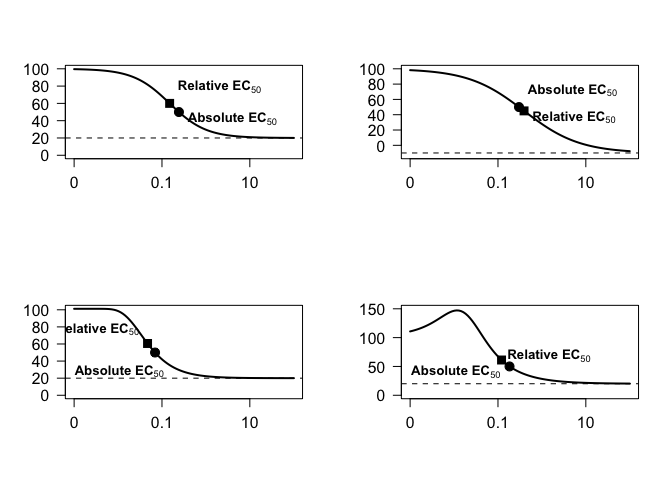
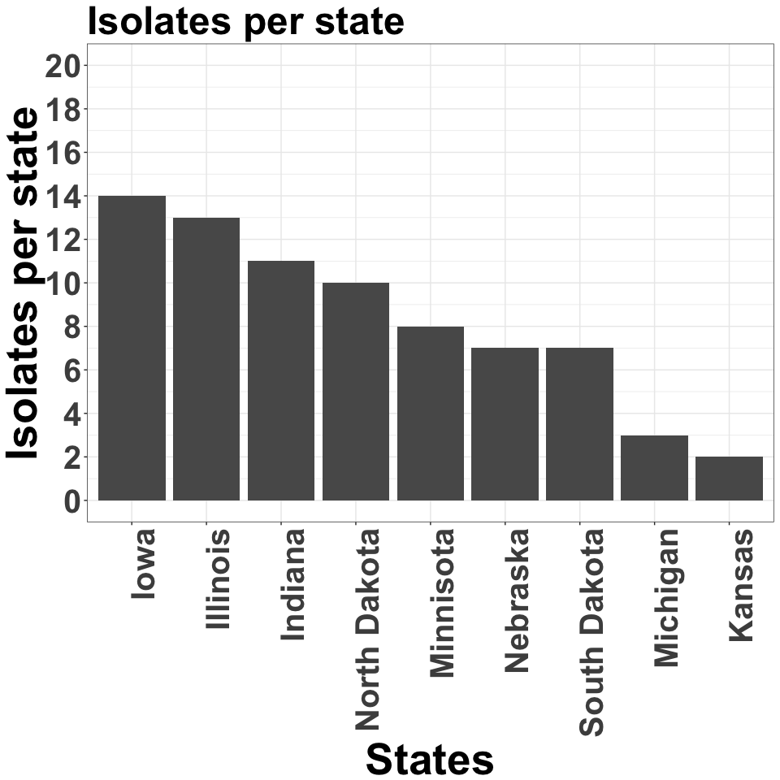
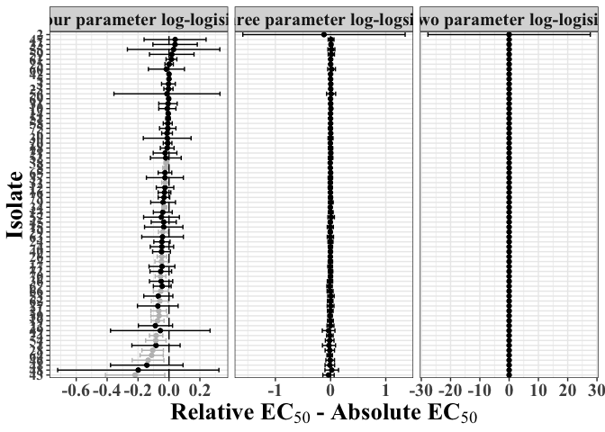
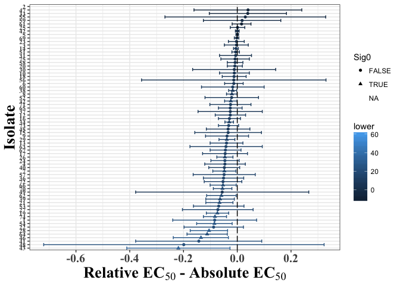
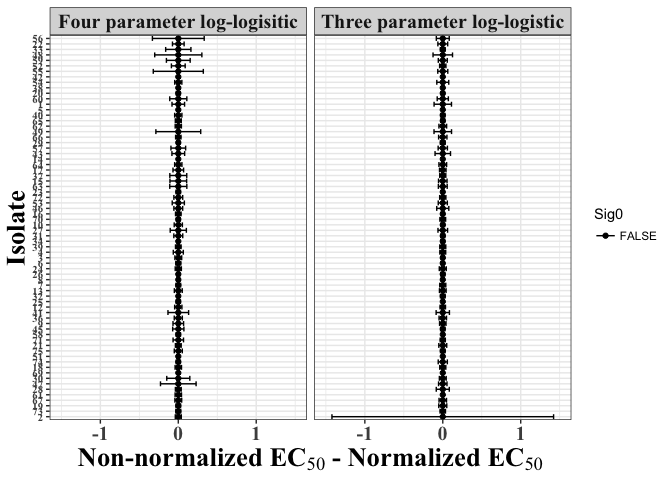
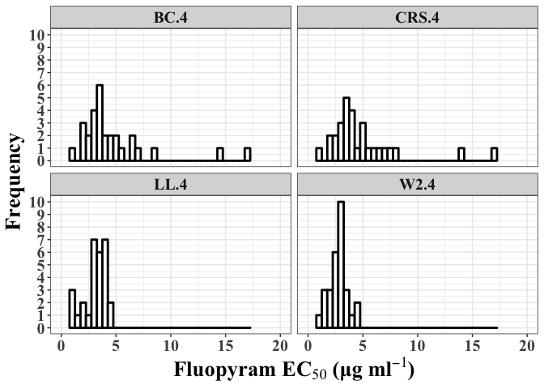

#### Intro:

The following code was written to analyze dose response data from fungal and oomycete fungicide sensitivity studies. It is written in an attempt to point out some issues, we've come accross, when dealing with these data and how we have dealt with them.

#### Purpose:

The purpose of this project was to (1) point out some inconsistencies with the way the package 'drc' in R calculates EC50, by default, and the way FRAC (Fungicide Resistance Action Commitee) defines EC50, and (2) examine hormetic-effect models in practical application for the phytopathology community.

##### Start:

##### Lets just make some plots to show what some dose response curves look like

``` r
curve.type <- data.frame(read.csv("curvetypes.csv", na.strings = "na"))
library(drc)
```

    ## Loading required package: MASS

    ## 
    ## 'drc' has been loaded.

    ## Please cite R and 'drc' if used for a publication,

    ## for references type 'citation()' and 'citation('drc')'.

    ## 
    ## Attaching package: 'drc'

    ## The following objects are masked from 'package:stats':
    ## 
    ##     gaussian, getInitial

``` r
drc.example.ll4 <- drm(curve.type$response[curve.type$curve_type == "Symmetric "] ~ 
                        curve.type$dose[curve.type$curve_type == "Symmetric "],  
                    fct = LL.4(fixed = c(NA, 
                                         20, 
                                         100, 
                                         NA),  
                               names = c("Slope", 
                                         "Lower", 
                                         "Upper", 
                                         "EC50")),
                    na.action = na.omit)
rel.ll4 <- data.frame(ED(drc.example.ll4,respLev = c(50), type = "relative"))
```

    ## 
    ## Estimated effective doses
    ## 
    ##        Estimate Std. Error
    ## e:1:50  0.14949    0.04857

``` r
abs.ll4 <- data.frame(ED(drc.example.ll4,respLev = c(50), type = "absolute"))
```

    ## 
    ## Estimated effective doses
    ## 
    ##        Estimate Std. Error
    ## e:1:50 0.243233   0.074461

``` r
rel.ll4.ec50 <- as.numeric(rel.ll4[1])
abs.ll4.ec50 <- as.numeric(abs.ll4[1])
drc.example.w2.4 <- drm(curve.type$response[curve.type$curve_type == "Asymmetric"] ~ 
                        curve.type$dose[curve.type$curve_type == "Asymmetric"],  
                    fct = W2.4(fixed = c(NA, 
                                         20, 
                                         NA, 
                                         NA),  
                               names = c("Slope", 
                                         "Lower", 
                                         "Upper", 
                                         "EC50")),
                    na.action = na.omit)
rel.w2.4 <- data.frame(ED(drc.example.w2.4,respLev = c(50), type = "relative"))
```

    ## 
    ## Estimated effective doses
    ## 
    ##        Estimate Std. Error
    ## e:1:50 0.046964   0.017179

``` r
abs.w2.4 <- data.frame(ED(drc.example.w2.4,respLev = c(50), type = "absolute"))
```

    ## 
    ## Estimated effective doses
    ## 
    ##        Estimate Std. Error
    ## e:1:50 0.069588   0.023382

``` r
rel.w2.4.ec50 <- as.numeric(rel.w2.4[1])
abs.w2.4.ec50 <- as.numeric(abs.w2.4[1])

#Predicting and ploting
pred.rel.w2.4 <- predict(drc.example.w2.4, data.frame(dose=rel.w2.4.ec50, CURVE=c("1")), se.fit = TRUE)
pred.rel.ll4 <- predict(drc.example.ll4, data.frame(dose=rel.ll4.ec50, CURVE=c("1")), se.fit = TRUE)

#LL.4 negative lower bound
drc.example.ll4.2 <- drm(curve.type$response[curve.type$curve_type == "Symmetric "] ~ 
                        curve.type$dose[curve.type$curve_type == "Symmetric "],  
                    fct = LL.4(fixed = c(NA, 
                                         -10, 
                                         100, 
                                         NA),  
                               names = c("Slope", 
                                         "Lower", 
                                         "Upper", 
                                         "EC50")),
                    na.action = na.omit)
rel.ll4.2 <- data.frame(ED(drc.example.ll4.2,respLev = c(50), type = "relative"))
```

    ## 
    ## Estimated effective doses
    ## 
    ##        Estimate Std. Error
    ## e:1:50 0.392345   0.052131

``` r
abs.ll4.2 <- data.frame(ED(drc.example.ll4.2,respLev = c(50), type = "absolute"))
```

    ## 
    ## Estimated effective doses
    ## 
    ##        Estimate Std. Error
    ## e:1:50 0.300994   0.041506

``` r
rel.ll4.ec50.2 <- as.numeric(rel.ll4.2[1])
abs.ll4.ec50.2 <- as.numeric(abs.ll4.2[1])
pred.rel.ll4.2 <- predict(drc.example.ll4.2, data.frame(dose=rel.ll4.ec50.2, CURVE=c("1")), se.fit = TRUE)

#Hormetic model examples
drc.example.bc4 <- drm(curve.type$response[curve.type$curve_type == "Asymmetric hormetic"] ~ 
                        curve.type$dose[curve.type$curve_type == "Asymmetric hormetic"],  
                    fct = BC.5(fixed = c(NA, 
                                         20, 
                                         NA, 
                                         NA, 
                                         NA)),
                    na.action = na.omit)
rel.bc4 <- data.frame(ED(drc.example.bc4,respLev = c(50), type = "relative"))
```

    ## 
    ## Estimated effective doses
    ## 
    ##        Estimate Std. Error
    ## e:1:50 0.120618   0.027071

``` r
abs.bc4 <- data.frame(ED(drc.example.bc4,respLev = c(50), type = "absolute"))
```

    ## 
    ## Estimated effective doses
    ## 
    ##        Estimate Std. Error
    ## e:1:50 0.120618   0.027071

``` r
rel.bc4.ec50 <- as.numeric(rel.bc4[1])
abs.bc4.ec50 <- as.numeric(abs.bc4[1])
pred.rel.bc4 <- predict(drc.example.bc4, data.frame(dose=rel.bc4.ec50, CURVE=c("1")), se.fit = TRUE)
pred.abs.bc4 <- predict(drc.example.bc4, data.frame(dose=0.1832, CURVE=c("1")), se.fit = TRUE)

par(mfrow = c(2,2))

plot(drc.example.ll4, 
     #xlab = expression(bold("log fungicide concentration (μg ml"^-1~")")),
     #ylab = expression(bold("Percent growth, relative to control")),
     xlab = "",
     ylab = "",
     lwd = 2, type = "n", pch = 19, xaxt = "n", yaxt = "n", legend = F, cex.axis = 1.2)
points(abs.ll4.ec50, 50, pch = 19, cex = 1.5)
points(rel.ll4.ec50, pred.rel.ll4[1], pch = 15, cex = 1.5)
text(abs.ll4.ec50, 50, labels=expression(bold("Absolute EC"[50])), cex= 1, adj = c(-0.1, 1))
text(rel.ll4.ec50, pred.rel.ll4[1], labels=expression(bold("Relative EC"[50])), cex= 1, adj = c(-0.1, -0.9))
#arrows(x0 = 10, y0 = 15, x1 = 10, y1 = 0, code=1, lwd = 2)
abline(h = 20, lty = 2)

plot(drc.example.ll4.2, 
     #xlab = expression(bold("log fungicide concentration (μg ml"^-1~")")),
     #ylab = expression(bold("Percent growth, relative to control")),
     xlab = "",
     ylab = "",
     lwd = 2, type = "n", pch = 19, xaxt = "n", yaxt = "n", legend = F, cex.axis = 1.2, ylim = c(-13, 100))
points(abs.ll4.ec50.2, 50, pch = 19, cex = 1.5)
points(rel.ll4.ec50.2, pred.rel.ll4.2[1], pch = 15, cex = 1.5)
text(abs.ll4.ec50.2, 50, labels=expression(bold("Absolute EC"[50])), cex= 1, adj = c(-0.1, -0.9))
text(rel.ll4.ec50.2, pred.rel.ll4.2[1], labels=expression(bold("Relative EC"[50])), cex= 1, adj = c(-0.1, 1))
abline(h = -10, lty = 2)
#arrows(x0 = 10, y0 = 15, x1 = 10, y1 = 0, code=1, lwd = 2)

plot(drc.example.w2.4, 
     #xlab = expression(bold("log fungicide concentration (μg ml"^-1~")")),
     #ylab = expression(bold("Percent growth, relative to control")),
     xlab = "",
     ylab = "",
     lwd = 2, type = "n", pch = 19, xaxt = "n", yaxt = "n", legend = F, cex.axis = 1.2)
#arrows(x0 = 10, y0 = 15, x1 = 10, y1 = 0, code=1, lwd = 2)
points(abs.w2.4.ec50, 50, pch = 19, cex = 1.5)
points(rel.w2.4.ec50, pred.rel.w2.4[1], pch = 15, cex = 1.5)
text(abs.w2.4.ec50, 50, labels=expression(bold("Absolute EC"[50])), cex= 1, adj = c(0.9, 2))
text(rel.w2.4.ec50, pred.rel.w2.4[1], labels=expression(bold("Relative EC"[50])), cex= 1, adj = c(1.1, -0.7))
abline(h = 20, lty = 2)

plot(drc.example.bc4, 
     #xlab = expression(bold("log fungicide concentration (μg ml"^-1~")")),
     #ylab = expression(bold("Percent growth, relative to control")),
     xlab = "",
     ylab = "",
     lwd = 2, type = "n", pch = 19, xaxt = "n", yaxt = "n", legend = F, cex.axis = 1.2)
points(0.1832, 50, pch = 19, cex = 1.5)
points(rel.bc4.ec50, pred.rel.bc4[1], pch = 15, cex = 1.5)
text(0.1832, 50, labels=expression(bold("Absolute EC"[50])), cex= 1, adj = c(1.1, 0.9))
text(rel.bc4.ec50, pred.rel.bc4[1], labels=expression(bold("Relative EC"[50])), cex= 1, adj = c(-0.07, 0.1))
#arrows(x0 = 10, y0 = 15, x1 = 10, y1 = 0, code=1, lwd = 2)
abline(h = 20, lty = 2)
```



The following code will load in the data as a .csv file. The data you read in will be called growth.un for "growth uneditted". It is called this because we have not edditted the data at all i.e. ommited observations, or specific isolates that we may not want to anaylize.

It is useful to have this object in memory that way you can rename it once edited and always go back to the original dataframe.

We will have one data frame called growth.un.mef for mefenoxam data.

``` r
growth.un.mef <- data.frame(read.csv("EC50.all.csv", na.strings = "na"))
growth.un.mef <- data.frame(na.omit(growth.un.mef)) #omits missing values
```

###### Data edditing step

Step 1. We do not want to analyze any isolate that had grown accross the entire plate at the non-ammended control, so lets get rid of those isolates.The size of the plate is 85 mm so if conc = 0 and coldiam = 85, lets get rid of the isolate.

``` r
length(levels(growth.un.mef$is)) # Number of isolates before subset
```

    ## [1] 89

``` r
bad.isolates <- as.character(unique(growth.un.mef$is[growth.un.mef$coldiam == 85 & growth.un.mef$conc == 0]))
growth.un.mef <- growth.un.mef[!growth.un.mef$is %in% bad.isolates,]
growth.un.mef$is <- factor(growth.un.mef$is) 
length(levels(growth.un.mef$is)) # Number of isolates after subset
```

    ## [1] 84

Step 2. We also do not really want to evaluate anything from trial 2 since it was not completely repeated.

``` r
growth.un.mef <- growth.un.mef[!growth.un.mef$trial == 2,]
```

Step 3. Finally we also do not want to analyze any of the repeated reference isolates. We will use the grep function to select all the reference isolates.

``` r
REF.levels <- grep(pattern = "IASO_1-16.3rt", x = levels(growth.un.mef$is), value = TRUE)

growth.un.mef <- growth.un.mef[!growth.un.mef$is %in% REF.levels,]
growth.un.mef$is <- factor(growth.un.mef$is)

length(levels(growth.un.mef$is)) # Number of isolates after subset
```

    ## [1] 75

Step 4. Subtract the plug size from the colony diamter.

``` r
growth.un.mef$coldiam <- growth.un.mef$coldiam - 3.7
```

Now that we have the dataset with all 75 isolates we want to analyze, lets do some data exploration, first lets plot the number of isolates in this dataset by state.



###### Data analysis step

Now that we have got rid of the levels we do not want to analyze we will average the two colony measurements together

``` r
growth.mef <- data.frame(
  setNames(aggregate(cbind(growth.un.mef$coldiamplug,
                           growth.un.mef$relgrowth),
                     list(growth.un.mef$is,
                          growth.un.mef$rep,
                          growth.un.mef$location,
                          growth.un.mef$lat,
                          growth.un.mef$conc), 
                      mean), c("is",
                               "rep",
                               "location",
                               "lat",
                               "conc",
                               "meancoldiam",
                               "relgrowth")))
```

The loop will run a regression for each individual isolate and will print out the summary statistics. It will also generate a table at the end, entitled EC50 ordered by species, showing the EC50, and some various summary statistics pulled out from the loop as it was running.

This loop uses LL.4

``` r
library(drc)
EC50.ll4 <- NULL
rel.grow <- NULL
nm <- levels(growth.mef$is)
for (i in seq_along(nm)) {
    growth.mef.drc <- drm(100 * growth.mef$relgrowth[growth.mef$is == nm[[i]]] ~ 
        growth.mef$conc[growth.mef$is == nm[[i]]], fct = LL.4(fixed = c(NA, 
        NA, NA, NA), names = c("Slope", "Lower", "Upper", "EC50")), na.action = na.omit)
    # outputs the summary of the paramters including the estimate, standard
    # error, t-value, and p-value outputs it into a data frame called
    # summary.mef.fit for 'summary of fit'
    summary.mef.fit <- data.frame(summary(growth.mef.drc)[[3]])
    lower <- summary.mef.fit$Estimate[2]
    # outputs the summary of just the EC50 data including the estimate, standard
    # error, upper and lower bounds of the 95% confidence intervals around the
    # EC50
    print(nm[[i]])
    EC50.rel.mef <- data.frame(ED(growth.mef.drc, respLev = c(50), type = "relative", 
        interval = "delta"), level = 0.95)
    EC50.abs.mef <- data.frame(ED(growth.mef.drc, respLev = c(50), type = "absolute", 
        interval = "delta"), level = 0.95)
    print(summary.mef.fit)
    fit <- modelFit(growth.mef.drc)
    lackfitpvalue <- fit[5]$`p value`[2]
    pvalue <- summary.mef.fit[4, 4][[1]]
    print(fit)
    
    # relative EC50
    rel.ec50 <- EC50.rel.mef[1][[1]]
    rel.stderr <- EC50.rel.mef[2][[1]]
    rel.lower <- EC50.rel.mef[3][[1]]
    rel.upper <- EC50.rel.mef[4][[1]]
    
    # absolute EC50
    abs.ec50 <- EC50.abs.mef[1][[1]]
    abs.stderr <- EC50.abs.mef[2][[1]]
    abs.lower <- EC50.abs.mef[3][[1]]
    abs.upper <- EC50.abs.mef[4][[1]]
    
    compED <- comped(c(rel.ec50, abs.ec50), se = c(rel.stderr, abs.stderr), 
        interval = TRUE, operator = "-", level = 0.95)
    
    EC50_i <- data.frame(cbind(nm[[i]], as.numeric(as.character(lower)), as.numeric(as.character(rel.ec50)), 
        as.numeric(as.character(rel.stderr)), as.numeric(as.character(rel.lower)), 
        as.numeric(as.character(rel.upper)), as.numeric(as.character(abs.ec50)), 
        as.numeric(as.character(abs.stderr)), as.numeric(as.character(abs.lower)), 
        as.numeric(as.character(abs.upper)), as.numeric(as.character(pvalue)), 
        as.numeric(as.character(lackfitpvalue)), as.numeric(as.character(compED[1])), 
        as.numeric(as.character(compED[2])), as.numeric(as.character(compED[3])), 
        as.numeric(as.character(compED[4]))))
    EC50.ll4 <- data.frame(rbind(as.data.frame(EC50.ll4), as.data.frame(EC50_i)))
}
colnames(EC50.ll4) <- c("Isolate", "lower", "RelEC50", "RelStdErr", "RelUpper95", 
    "RelLower95", "AbsEC50", "AbsStdErr", "AbsUpper95", "AbsLower95", "Pvalue", 
    "LackFitPvalue", "CompED.est", "CompED.stderr", "CompED.lower", "CompED.upper")
EC50.ll4$lower <- round(as.numeric(as.character(EC50.ll4$lower)), 3)
EC50.ll4$RelEC50 <- round(as.numeric(as.character(EC50.ll4$RelEC50)), 3)
EC50.ll4$RelStdErr <- round(as.numeric(as.character(EC50.ll4$RelStdErr)), 3)
EC50.ll4$RelUpper95 <- round(as.numeric(as.character(EC50.ll4$RelUpper95)), 
    3)
EC50.ll4$RelLower95 <- round(as.numeric(as.character(EC50.ll4$RelLower95)), 
    3)
EC50.ll4$AbsEC50 <- round(as.numeric(as.character(EC50.ll4$AbsEC50)), 3)
EC50.ll4$AbsStdErr <- round(as.numeric(as.character(EC50.ll4$AbsStdErr)), 3)
EC50.ll4$AbsUpper95 <- round(as.numeric(as.character(EC50.ll4$AbsUpper95)), 
    3)
EC50.ll4$AbsLower95 <- round(as.numeric(as.character(EC50.ll4$AbsLower95)), 
    3)
EC50.ll4$Pvalue <- round(as.numeric(as.character(EC50.ll4$Pvalue)), 3)
EC50.ll4$LackFitPvalue <- round(as.numeric(as.character(EC50.ll4$LackFitPvalue)), 
    3)
EC50.ll4$CompED.est <- round(as.numeric(as.character(EC50.ll4$CompED.est)), 
    3)
EC50.ll4$CompED.stderr <- round(as.numeric(as.character(EC50.ll4$CompED.stderr)), 
    3)
EC50.ll4$CompED.upper <- round(as.numeric(as.character(EC50.ll4$CompED.upper)), 
    3)
EC50.ll4$CompED.lower <- round(as.numeric(as.character(EC50.ll4$CompED.lower)), 
    3)
EC50.ll4$Type <- "Four parameter log-logisitc"
EC50.ll4$ID <- rep(1:75)
EC50.ll4 <- EC50.ll4[order(EC50.ll4$ID), ]  #ordering the table by species
```

This loop uses LL.3; lower parameter fixed at 0

``` r
library(drc)
EC50.ll3 <- NULL
rel.grow <- NULL
nm <- levels(growth.mef$is)
for (i in seq_along(nm)) {
    growth.mef.drc <- drm(100 * growth.mef$relgrowth[growth.mef$is == nm[[i]]] ~ 
        growth.mef$conc[growth.mef$is == nm[[i]]], fct = LL.3(fixed = c(NA, 
        NA, NA), names = c("Slope", "Upper", "EC50")), na.action = na.omit)
    # outputs the summary of the paramters including the estimate, standard
    # error, t-value, and p-value outputs it into a data frame called
    # summary.mef.fit for 'summary of fit'
    summary.mef.fit <- data.frame(summary(growth.mef.drc)[[3]])
    lower <- summary.mef.fit$Estimate[2]
    # outputs the summary of just the EC50 data including the estimate, standard
    # error, upper and lower bounds of the 95% confidence intervals around the
    # EC50
    print(nm[[i]])
    EC50.rel.mef <- data.frame(ED(growth.mef.drc, respLev = c(50), type = "relative", 
        interval = "delta"), level = 0.95)
    EC50.abs.mef <- data.frame(ED(growth.mef.drc, respLev = c(50), type = "absolute", 
        interval = "delta"), level = 0.95)
    print(summary.mef.fit)
    fit <- modelFit(growth.mef.drc)
    lackfitpvalue <- fit[5]$`p value`[2]
    pvalue <- summary.mef.fit[4, 4][[1]]
    print(fit)
    
    # relative EC50
    rel.ec50 <- EC50.rel.mef[1][[1]]
    rel.stderr <- EC50.rel.mef[2][[1]]
    rel.lower <- EC50.rel.mef[3][[1]]
    rel.upper <- EC50.rel.mef[4][[1]]
    
    # absolute EC50
    abs.ec50 <- EC50.abs.mef[1][[1]]
    abs.stderr <- EC50.abs.mef[2][[1]]
    abs.lower <- EC50.abs.mef[3][[1]]
    abs.upper <- EC50.abs.mef[4][[1]]
    
    compED <- comped(c(rel.ec50, abs.ec50), se = c(rel.stderr, abs.stderr), 
        interval = TRUE, operator = "-", level = 0.95)
    
    EC50_i <- data.frame(cbind(nm[[i]], as.numeric(as.character(lower)), as.numeric(as.character(rel.ec50)), 
        as.numeric(as.character(rel.stderr)), as.numeric(as.character(rel.lower)), 
        as.numeric(as.character(rel.upper)), as.numeric(as.character(abs.ec50)), 
        as.numeric(as.character(abs.stderr)), as.numeric(as.character(abs.lower)), 
        as.numeric(as.character(abs.upper)), as.numeric(as.character(pvalue)), 
        as.numeric(as.character(lackfitpvalue)), as.numeric(as.character(compED[1])), 
        as.numeric(as.character(compED[2])), as.numeric(as.character(compED[3])), 
        as.numeric(as.character(compED[4]))))
    EC50.ll3 <- data.frame(rbind(as.data.frame(EC50.ll3), as.data.frame(EC50_i)))
}
colnames(EC50.ll3) <- c("Isolate", "lower", "RelEC50", "RelStdErr", "RelUpper95", 
    "RelLower95", "AbsEC50", "AbsStdErr", "AbsUpper95", "AbsLower95", "Pvalue", 
    "LackFitPvalue", "CompED.est", "CompED.stderr", "CompED.lower", "CompED.upper")
EC50.ll4$lower <- round(as.numeric(as.character(EC50.ll4$lower)), 3)
EC50.ll3$RelEC50 <- round(as.numeric(as.character(EC50.ll3$RelEC50)), 3)
EC50.ll3$RelStdErr <- round(as.numeric(as.character(EC50.ll3$RelStdErr)), 3)
EC50.ll3$RelUpper95 <- round(as.numeric(as.character(EC50.ll3$RelUpper95)), 
    3)
EC50.ll3$RelLower95 <- round(as.numeric(as.character(EC50.ll3$RelLower95)), 
    3)
EC50.ll3$AbsEC50 <- round(as.numeric(as.character(EC50.ll3$AbsEC50)), 3)
EC50.ll3$AbsStdErr <- round(as.numeric(as.character(EC50.ll3$AbsStdErr)), 3)
EC50.ll3$AbsUpper95 <- round(as.numeric(as.character(EC50.ll3$AbsUpper95)), 
    3)
EC50.ll3$AbsLower95 <- round(as.numeric(as.character(EC50.ll3$AbsLower95)), 
    3)
EC50.ll3$Pvalue <- round(as.numeric(as.character(EC50.ll3$Pvalue)), 3)
EC50.ll3$LackFitPvalue <- round(as.numeric(as.character(EC50.ll3$LackFitPvalue)), 
    3)
EC50.ll3$CompED.est <- round(as.numeric(as.character(EC50.ll3$CompED.est)), 
    3)
EC50.ll3$CompED.stderr <- round(as.numeric(as.character(EC50.ll3$CompED.stderr)), 
    3)
EC50.ll3$CompED.upper <- round(as.numeric(as.character(EC50.ll3$CompED.upper)), 
    3)
EC50.ll3$CompED.lower <- round(as.numeric(as.character(EC50.ll3$CompED.lower)), 
    3)
EC50.ll3$Type <- "Three parameter log-logsitic"
EC50.ll3$ID <- rep(1:75)
EC50.ll3 <- EC50.ll3[order(EC50.ll3$ID), ]  #ordering the table by species
```

This loop uses the LL.2; lower parameter fixed at 0, and upper parameter fixed at 100

``` r
library(drc)
EC50.ll2 <- NULL
rel.grow <- NULL
nm <- levels(growth.mef$is)
for (i in seq_along(nm)) {
    growth.mef.drc <- drm(100 * growth.mef$relgrowth[growth.mef$is == nm[[i]]] ~ 
        growth.mef$conc[growth.mef$is == nm[[i]]], fct = LL.2(upper = 100, fixed = c(NA, 
        NA), names = c("Slope", "EC50")), na.action = na.omit)
    # outputs the summary of the paramters including the estimate, standard
    # error, t-value, and p-value outputs it into a data frame called
    # summary.mef.fit for 'summary of fit'
    summary.mef.fit <- data.frame(summary(growth.mef.drc)[[3]])
    lower <- summary.mef.fit$Estimate[2]
    # outputs the summary of just the EC50 data including the estimate, standard
    # error, upper and lower bounds of the 95% confidence intervals around the
    # EC50
    print(nm[[i]])
    EC50.rel.mef <- data.frame(ED(growth.mef.drc, respLev = c(50), type = "relative", 
        interval = "delta"), level = 0.95)
    EC50.abs.mef <- data.frame(ED(growth.mef.drc, respLev = c(50), type = "absolute", 
        interval = "delta"), level = 0.95)
    print(summary.mef.fit)
    fit <- modelFit(growth.mef.drc)
    lackfitpvalue <- fit[5]$`p value`[2]
    pvalue <- summary.mef.fit[4, 4][[1]]
    print(fit)
    
    # relative EC50
    rel.ec50 <- EC50.rel.mef[1][[1]]
    rel.stderr <- EC50.rel.mef[2][[1]]
    rel.lower <- EC50.rel.mef[3][[1]]
    rel.upper <- EC50.rel.mef[4][[1]]
    
    # absolute EC50
    abs.ec50 <- EC50.abs.mef[1][[1]]
    abs.stderr <- EC50.abs.mef[2][[1]]
    abs.lower <- EC50.abs.mef[3][[1]]
    abs.upper <- EC50.abs.mef[4][[1]]
    
    compED <- comped(c(rel.ec50, abs.ec50), se = c(rel.stderr, abs.stderr), 
        interval = TRUE, operator = "-", level = 0.95)
    
    EC50_i <- data.frame(cbind(nm[[i]], as.numeric(as.character(lower)), as.numeric(as.character(rel.ec50)), 
        as.numeric(as.character(rel.stderr)), as.numeric(as.character(rel.lower)), 
        as.numeric(as.character(rel.upper)), as.numeric(as.character(abs.ec50)), 
        as.numeric(as.character(abs.stderr)), as.numeric(as.character(abs.lower)), 
        as.numeric(as.character(abs.upper)), as.numeric(as.character(pvalue)), 
        as.numeric(as.character(lackfitpvalue)), as.numeric(as.character(compED[1])), 
        as.numeric(as.character(compED[2])), as.numeric(as.character(compED[3])), 
        as.numeric(as.character(compED[4]))))
    EC50.ll2 <- data.frame(rbind(as.data.frame(EC50.ll2), as.data.frame(EC50_i)))
}
colnames(EC50.ll2) <- c("Isolate", "lower", "RelEC50", "RelStdErr", "RelUpper95", 
    "RelLower95", "AbsEC50", "AbsStdErr", "AbsUpper95", "AbsLower95", "Pvalue", 
    "LackFitPvalue", "CompED.est", "CompED.stderr", "CompED.lower", "CompED.upper")

EC50.ll4$lower <- round(as.numeric(as.character(EC50.ll4$lower)), 3)
EC50.ll2$RelEC50 <- round(as.numeric(as.character(EC50.ll2$RelEC50)), 3)
EC50.ll2$RelStdErr <- round(as.numeric(as.character(EC50.ll2$RelStdErr)), 3)
EC50.ll2$RelUpper95 <- round(as.numeric(as.character(EC50.ll2$RelUpper95)), 
    3)
EC50.ll2$RelLower95 <- round(as.numeric(as.character(EC50.ll2$RelLower95)), 
    3)
EC50.ll2$AbsEC50 <- round(as.numeric(as.character(EC50.ll2$AbsEC50)), 3)
EC50.ll2$AbsStdErr <- round(as.numeric(as.character(EC50.ll2$AbsStdErr)), 3)
EC50.ll2$AbsUpper95 <- round(as.numeric(as.character(EC50.ll2$AbsUpper95)), 
    3)
EC50.ll2$AbsLower95 <- round(as.numeric(as.character(EC50.ll2$AbsLower95)), 
    3)
EC50.ll2$Pvalue <- round(as.numeric(as.character(EC50.ll2$Pvalue)), 3)
EC50.ll2$LackFitPvalue <- round(as.numeric(as.character(EC50.ll2$LackFitPvalue)), 
    3)
EC50.ll2$CompED.est <- round(as.numeric(as.character(EC50.ll2$CompED.est)), 
    3)
EC50.ll2$CompED.stderr <- round(as.numeric(as.character(EC50.ll2$CompED.stderr)), 
    3)
EC50.ll2$CompED.upper <- round(as.numeric(as.character(EC50.ll2$CompED.upper)), 
    3)
EC50.ll2$CompED.lower <- round(as.numeric(as.character(EC50.ll2$CompED.lower)), 
    3)
EC50.ll2$Type <- "Two parameter log-logisitc"
EC50.ll2$ID <- rep(1:75)
EC50.ll2 <- EC50.ll2[order(EC50.ll2$ID), ]  #ordering the table by species
```

Combining the three dataframes into one for a facet wrap

``` r
EC50 <- data.frame(rbind(EC50.ll4, EC50.ll3, EC50.ll2))
```

Lets plot everything

``` r
library(extrafont)
```

    ## Registering fonts with R

``` r
font_import()
```

    ## Importing fonts may take a few minutes, depending on the number of fonts and the speed of the system.
    ## Continue? [y/n]

    ## Exiting.

``` r
EC50$Sig0 <- ifelse(EC50$CompED.lower < 0 & EC50$CompED.upper < 0, TRUE, FALSE)

EC50 <- EC50[!EC50$Isolate == "ILSO_6-34c",]
EC50 <- EC50[!EC50$ID == 11,]
EC50 <- EC50[!EC50$ID == 68,]
EC50 <- EC50[!EC50$ID == 50,]
EC50 <- EC50[!EC50$ID == 44,]

library(ggplot2)
ggplot(data = EC50, aes(x = CompED.est, y = reorder(ID, CompED.est), color = Sig0)) + 
  geom_point() + 
  scale_colour_manual(values = c("black", "grey")) +
  geom_errorbarh(aes(xmax = CompED.upper, xmin = CompED.lower)) +
  geom_vline(xintercept = 0, linetype = "longdash") +
  #scale_x_continuous(limits = c(-2.5, 2.5)) +
  facet_wrap(~ Type, nrow = 1, scales = "free_x") +
  xlab(expression(bold("Relative EC"[50] ~ "- Absolute EC"[50]))) +
  ylab("Isolate") +
  theme_bw() +
  theme(axis.text.y = element_text(family = "Times New Roman", size = 12, face = "bold"),
        axis.text.x = element_text(family = "Times New Roman", size = 15, face = "bold"),
        axis.title.x = element_text(family = "Times New Roman",size = 20, face = "bold"),
        axis.title.y = element_text(family = "Times New Roman",size = 20, face = "bold"),
        strip.text.x = element_text(family = "Times New Roman",size = 15, face = "bold"),
        legend.position="none") 
```



``` r
library(knitr)
kable(EC50, digits = 3, row.names = FALSE)
```

| Isolate          | lower              |  RelEC50|  RelStdErr|  RelUpper95|  RelLower95|  AbsEC50|  AbsStdErr|  AbsUpper95|  AbsLower95|  Pvalue|  LackFitPvalue|  CompED.est|  CompED.stderr|  CompED.lower|  CompED.upper| Type                         |   ID| Sig0  |
|:-----------------|:-------------------|--------:|----------:|-----------:|-----------:|--------:|----------:|-----------:|-----------:|-------:|--------------:|-----------:|--------------:|-------------:|-------------:|:-----------------------------|----:|:------|
| C-MISO2\_1-19    | 23.759             |    0.107|      0.029|       0.044|       0.169|    0.191|      0.074|       0.032|       0.349|   0.003|          0.072|      -0.084|          0.079|        -0.240|         0.072| Four parameter log-logisitc  |    1| FALSE |
| C-MNSO\_6-4      | 64.221             |    0.117|      0.014|       0.087|       0.147|      NaN|        NaN|         NaN|         NaN|   0.000|          0.100|         NaN|            NaN|           NaN|           NaN| Four parameter log-logisitc  |    2| NA    |
| C-MNSO2\_1-1     | 2.42               |    0.177|      0.016|       0.143|       0.211|    0.180|      0.016|       0.145|       0.215|   0.000|          0.001|      -0.003|          0.023|        -0.048|         0.041| Four parameter log-logisitc  |    3| FALSE |
| C-MNSO2\_1-19    | 11.34              |    0.234|      0.023|       0.185|       0.284|    0.280|      0.031|       0.214|       0.346|   0.000|          0.069|      -0.046|          0.039|        -0.121|         0.030| Four parameter log-logisitc  |    4| FALSE |
| C-MNSO2\_2-10    | -0.434             |    0.017|      0.002|       0.013|       0.021|    0.017|      0.002|       0.013|       0.021|   0.000|          0.861|       0.000|          0.003|        -0.005|         0.005| Four parameter log-logisitc  |    5| FALSE |
| C-SDSO2\_5-16    | 6.173              |    0.147|      0.011|       0.123|       0.172|    0.160|      0.013|       0.131|       0.188|   0.000|          0.041|      -0.013|          0.018|        -0.047|         0.022| Four parameter log-logisitc  |    6| FALSE |
| C-SDSO2\_5-17    | 18.6               |    0.138|      0.011|       0.114|       0.161|    0.186|      0.019|       0.144|       0.227|   0.000|          0.033|      -0.048|          0.022|        -0.091|        -0.005| Four parameter log-logisitc  |    7| TRUE  |
| C-SDSO2\_5-29    | 9.427              |    0.119|      0.006|       0.106|       0.132|    0.139|      0.008|       0.122|       0.157|   0.000|          0.008|      -0.020|          0.010|        -0.040|        -0.001| Four parameter log-logisitc  |    8| TRUE  |
| C-SDSO2\_5-8     | 11.693             |    0.206|      0.025|       0.154|       0.259|    0.244|      0.032|       0.175|       0.314|   0.000|          0.003|      -0.038|          0.041|        -0.118|         0.042| Four parameter log-logisitc  |    9| FALSE |
| C-SDSO2\_5-9     | 5.016              |    0.176|      0.019|       0.135|       0.216|    0.186|      0.021|       0.141|       0.231|   0.000|          0.007|      -0.011|          0.028|        -0.066|         0.045| Four parameter log-logisitc  |   10| FALSE |
| IASO\_1-16.1h    | 9.765              |    0.118|      0.017|       0.082|       0.154|    0.144|      0.023|       0.094|       0.194|   0.000|          0.234|      -0.026|          0.029|        -0.082|         0.031| Four parameter log-logisitc  |   12| FALSE |
| IASO\_1-16.2r    | 13.842             |    0.190|      0.018|       0.151|       0.229|    0.230|      0.025|       0.175|       0.284|   0.000|          0.008|      -0.040|          0.031|        -0.101|         0.021| Four parameter log-logisitc  |   13| FALSE |
| IASO\_1-20.44rt  | 9.084              |    0.048|      0.003|       0.041|       0.055|    0.054|      0.003|       0.046|       0.061|   0.000|          0.001|      -0.005|          0.005|        -0.014|         0.004| Four parameter log-logisitc  |   14| FALSE |
| IASO\_10-28.24rt | 8.753              |    0.190|      0.039|       0.107|       0.273|    0.224|      0.050|       0.116|       0.331|   0.000|          0.040|      -0.034|          0.063|        -0.158|         0.090| Four parameter log-logisitc  |   15| FALSE |
| IASO\_2-11.8     | 8.922              |    0.166|      0.013|       0.138|       0.193|    0.195|      0.017|       0.159|       0.231|   0.000|          0.753|      -0.029|          0.021|        -0.070|         0.012| Four parameter log-logisitc  |   16| FALSE |
| IASO\_6-10.15h   | 11.602             |    0.183|      0.025|       0.131|       0.236|    0.229|      0.035|       0.154|       0.304|   0.000|          0.000|      -0.045|          0.043|        -0.129|         0.038| Four parameter log-logisitc  |   17| FALSE |
| IASO\_6-34.31r   | 7.623              |    0.130|      0.015|       0.098|       0.162|    0.142|      0.017|       0.104|       0.179|   0.000|          0.023|      -0.012|          0.023|        -0.056|         0.033| Four parameter log-logisitc  |   18| FALSE |
| IASO\_9-10.4h    | 21.908             |    0.192|      0.010|       0.169|       0.214|    0.265|      0.018|       0.226|       0.305|   0.000|          0.218|      -0.074|          0.021|        -0.115|        -0.032| Four parameter log-logisitc  |   19| TRUE  |
| IASO\_9-11.1h    | 4.556              |    0.123|      0.009|       0.103|       0.143|    0.132|      0.011|       0.109|       0.156|   0.000|          0.189|      -0.009|          0.014|        -0.037|         0.019| Four parameter log-logisitc  |   20| FALSE |
| IASO\_9-24.27rd  | 19.942             |    0.194|      0.013|       0.165|       0.222|    0.260|      0.022|       0.212|       0.307|   0.000|          0.000|      -0.066|          0.026|        -0.117|        -0.016| Four parameter log-logisitc  |   21| TRUE  |
| IASO\_9-29.33h   | 20.182             |    0.198|      0.027|       0.140|       0.256|    0.286|      0.049|       0.180|       0.391|   0.000|          0.000|      -0.088|          0.056|        -0.198|         0.023| Four parameter log-logisitc  |   22| FALSE |
| IASO\_9-31.37h   | 3.213              |    0.111|      0.010|       0.090|       0.133|    0.115|      0.011|       0.092|       0.138|   0.000|          0.020|      -0.003|          0.015|        -0.033|         0.026| Four parameter log-logisitc  |   23| FALSE |
| IASO\_9-36.42rd  | 17.505             |    0.159|      0.014|       0.129|       0.190|    0.205|      0.023|       0.157|       0.254|   0.000|          0.558|      -0.046|          0.027|        -0.098|         0.007| Four parameter log-logisitc  |   24| FALSE |
| IASO\_9-4.8h     | -0.035             |    0.137|      0.010|       0.116|       0.158|    0.136|      0.010|       0.116|       0.157|   0.000|          0.007|       0.001|          0.014|        -0.026|         0.028| Four parameter log-logisitc  |   25| FALSE |
| ILSO\_5-41c      | 15.285             |    0.107|      0.007|       0.091|       0.123|    0.153|      0.013|       0.125|       0.182|   0.000|          0.261|      -0.046|          0.015|        -0.076|        -0.016| Four parameter log-logisitc  |   26| TRUE  |
| ILSO\_5-42c      | 16.304             |    0.249|      0.037|       0.168|       0.329|    0.321|      0.056|       0.201|       0.440|   0.000|          0.660|      -0.072|          0.067|        -0.204|         0.059| Four parameter log-logisitc  |   27| FALSE |
| ILSO\_5-49b      | 29.398             |    0.168|      0.013|       0.139|       0.196|    0.273|      0.033|       0.203|       0.343|   0.000|          0.063|      -0.105|          0.035|        -0.175|        -0.036| Four parameter log-logisitc  |   28| TRUE  |
| ILSO\_6-1        | 15.397             |    0.108|      0.008|       0.092|       0.125|    0.147|      0.013|       0.119|       0.175|   0.000|          0.043|      -0.039|          0.015|        -0.068|        -0.009| Four parameter log-logisitc  |   29| TRUE  |
| ILSO\_6-12B      | 2.411              |    0.184|      0.053|       0.070|       0.299|    0.196|      0.058|       0.071|       0.320|   0.004|          0.000|      -0.011|          0.079|        -0.166|         0.143| Four parameter log-logisitc  |   30| FALSE |
| ILSO\_6-15b      | 3.066              |    0.123|      0.021|       0.079|       0.168|    0.130|      0.022|       0.082|       0.178|   0.000|          0.179|      -0.006|          0.030|        -0.066|         0.053| Four parameter log-logisitc  |   31| FALSE |
| ILSO\_6-28C      | 13.965             |    0.100|      0.006|       0.086|       0.114|    0.124|      0.010|       0.103|       0.145|   0.000|          0.491|      -0.024|          0.012|        -0.047|        -0.001| Four parameter log-logisitc  |   32| TRUE  |
| ILSO\_6-2b       | -7.275             |    0.227|      0.058|       0.102|       0.353|    0.188|      0.044|       0.093|       0.283|   0.002|          0.000|       0.039|          0.073|        -0.104|         0.183| Four parameter log-logisitc  |   33| FALSE |
| ILSO\_6-33C      | 13.59              |    0.102|      0.004|       0.092|       0.111|    0.132|      0.007|       0.117|       0.147|   0.000|          0.001|      -0.030|          0.008|        -0.046|        -0.014| Four parameter log-logisitc  |   34| TRUE  |
| ILSO\_6-35b      | 15.494             |    0.114|      0.019|       0.074|       0.154|    0.165|      0.033|       0.093|       0.236|   0.000|          0.030|      -0.051|          0.038|        -0.126|         0.024| Four parameter log-logisitc  |   36| FALSE |
| ILSO\_6-36b      | 5.542              |    0.217|      0.039|       0.133|       0.301|    0.244|      0.047|       0.144|       0.344|   0.000|          0.011|      -0.026|          0.061|        -0.146|         0.093| Four parameter log-logisitc  |   37| FALSE |
| ILSO\_6-39C      | 8.372              |    0.110|      0.005|       0.101|       0.120|    0.127|      0.006|       0.114|       0.140|   0.000|          0.011|      -0.017|          0.008|        -0.032|        -0.002| Four parameter log-logisitc  |   38| TRUE  |
| INSO\_1-13D      | 17.348             |    0.143|      0.013|       0.116|       0.171|    0.207|      0.024|       0.157|       0.258|   0.000|          0.009|      -0.064|          0.027|        -0.117|        -0.011| Four parameter log-logisitc  |   39| TRUE  |
| INSO\_1-17C      | 11.587             |    0.183|      0.017|       0.147|       0.220|    0.232|      0.024|       0.180|       0.284|   0.000|          0.018|      -0.048|          0.029|        -0.106|         0.009| Four parameter log-logisitc  |   40| FALSE |
| INSO\_1-17D      | 21.451             |    0.187|      0.048|       0.084|       0.289|    0.330|      0.110|       0.095|       0.566|   0.002|          0.043|      -0.143|          0.120|        -0.378|         0.091| Four parameter log-logisitc  |   41| FALSE |
| INSO\_1-23-C     | -0.826             |    0.030|      0.003|       0.024|       0.035|    0.030|      0.003|       0.024|       0.035|   0.000|          0.000|       0.000|          0.004|        -0.007|         0.007| Four parameter log-logisitc  |   42| FALSE |
| INSO\_1-28-C     | 32.611             |    0.200|      0.029|       0.137|       0.264|    0.420|      0.093|       0.220|       0.620|   0.000|          0.025|      -0.219|          0.098|        -0.411|        -0.027| Four parameter log-logisitc  |   43| TRUE  |
| INSO\_1-52-B     | 7.02               |    0.227|      0.026|       0.171|       0.283|    0.261|      0.032|       0.192|       0.330|   0.000|          0.480|      -0.034|          0.041|        -0.115|         0.047| Four parameter log-logisitc  |   45| FALSE |
| INSO\_1-53A      | 27.739             |    0.200|      0.020|       0.156|       0.244|    0.336|      0.048|       0.232|       0.439|   0.000|          0.002|      -0.135|          0.052|        -0.238|        -0.033| Four parameter log-logisitc  |   46| TRUE  |
| INSO\_2-57       | -8.589             |    0.224|      0.082|       0.047|       0.401|    0.184|      0.061|       0.054|       0.314|   0.017|          0.108|       0.040|          0.102|        -0.161|         0.240| Four parameter log-logisitc  |   47| FALSE |
| INSO\_3-45       | 23.57              |    0.288|      0.109|       0.054|       0.522|    0.487|      0.243|      -0.034|       1.007|   0.019|          0.000|      -0.199|          0.266|        -0.720|         0.323| Four parameter log-logisitc  |   48| FALSE |
| INSO\_3-49       | 4.579              |    0.369|      0.104|       0.147|       0.592|    0.425|      0.127|       0.152|       0.699|   0.003|          0.034|      -0.056|          0.164|        -0.378|         0.266| Four parameter log-logisitc  |   49| FALSE |
| KSSO\_5-21       | 3.728              |    0.099|      0.005|       0.089|       0.109|    0.105|      0.005|       0.094|       0.117|   0.000|          0.031|      -0.006|          0.007|        -0.020|         0.008| Four parameter log-logisitc  |   51| FALSE |
| MISO\_5-9        | 7.555              |    0.156|      0.032|       0.088|       0.224|    0.177|      0.040|       0.092|       0.261|   0.000|          0.178|      -0.021|          0.051|        -0.120|         0.079| Four parameter log-logisitc  |   52| FALSE |
| MISO\_8-23       | 16.922             |    0.308|      0.028|       0.248|       0.368|    0.377|      0.039|       0.294|       0.461|   0.000|          0.003|      -0.069|          0.048|        -0.163|         0.025| Four parameter log-logisitc  |   53| FALSE |
| MNSO\_2-11       | 25.203             |    0.202|      0.016|       0.166|       0.237|    0.287|      0.029|       0.223|       0.350|   0.000|          0.204|      -0.085|          0.034|        -0.151|        -0.019| Four parameter log-logisitc  |   54| TRUE  |
| MNSO\_2-31       | -2.759             |    0.307|      0.116|       0.059|       0.555|    0.277|      0.099|       0.064|       0.490|   0.019|          0.000|       0.030|          0.153|        -0.269|         0.329| Four parameter log-logisitc  |   55| FALSE |
| MNSO\_2-52       | 3.746              |    0.290|      0.120|       0.031|       0.548|    0.302|      0.128|       0.027|       0.578|   0.031|          0.000|      -0.013|          0.175|        -0.356|         0.330| Four parameter log-logisitc  |   56| FALSE |
| MNSO\_5-20       | 14.857             |    0.213|      0.034|       0.140|       0.286|    0.262|      0.048|       0.159|       0.365|   0.000|          0.001|      -0.049|          0.059|        -0.164|         0.067| Four parameter log-logisitc  |   57| FALSE |
| NDSO\_4-1        | 3.272              |    0.135|      0.010|       0.114|       0.157|    0.143|      0.011|       0.119|       0.167|   0.000|          0.218|      -0.008|          0.015|        -0.037|         0.021| Four parameter log-logisitc  |   58| FALSE |
| NDSO\_4-18       | -1.253             |    0.248|      0.055|       0.130|       0.366|    0.230|      0.049|       0.126|       0.335|   0.000|          0.000|       0.018|          0.073|        -0.126|         0.162| Four parameter log-logisitc  |   59| FALSE |
| NDSO\_4-2        | 10.403             |    0.235|      0.040|       0.150|       0.320|    0.252|      0.044|       0.157|       0.347|   0.000|          0.001|      -0.017|          0.059|        -0.133|         0.100| Four parameter log-logisitc  |   60| FALSE |
| NDSO\_4-43       | -11.044            |    0.067|      0.015|       0.035|       0.099|    0.051|      0.010|       0.029|       0.072|   0.000|          0.155|       0.016|          0.018|        -0.019|         0.051| Four parameter log-logisitc  |   61| FALSE |
| NDSO\_4-45       | 19.066             |    0.174|      0.014|       0.144|       0.205|    0.234|      0.024|       0.182|       0.285|   0.000|          0.387|      -0.059|          0.028|        -0.114|        -0.004| Four parameter log-logisitc  |   62| TRUE  |
| NDSO\_5-22       | 13.215             |    0.182|      0.040|       0.097|       0.267|    0.224|      0.056|       0.103|       0.344|   0.000|          0.001|      -0.042|          0.069|        -0.176|         0.093| Four parameter log-logisitc  |   63| FALSE |
| NDSO\_5-36       | 21.706             |    0.196|      0.017|       0.160|       0.232|    0.307|      0.034|       0.234|       0.381|   0.000|          0.026|      -0.112|          0.038|        -0.187|        -0.037| Four parameter log-logisitc  |   64| TRUE  |
| NDSO\_5-46       | 9.585              |    0.168|      0.014|       0.139|       0.198|    0.195|      0.018|       0.157|       0.233|   0.000|          0.013|      -0.026|          0.022|        -0.070|         0.018| Four parameter log-logisitc  |   65| FALSE |
| NDSO\_5-49       | 19.544             |    0.155|      0.012|       0.127|       0.182|    0.207|      0.021|       0.161|       0.254|   0.000|          0.318|      -0.053|          0.025|        -0.101|        -0.004| Four parameter log-logisitc  |   66| TRUE  |
| NDSO\_5-9        | 15.94              |    0.163|      0.016|       0.129|       0.197|    0.207|      0.025|       0.153|       0.260|   0.000|          0.000|      -0.044|          0.029|        -0.101|         0.014| Four parameter log-logisitc  |   67| FALSE |
| NESO\_3-20       | 0.928              |    0.090|      0.003|       0.084|       0.097|    0.092|      0.003|       0.085|       0.099|   0.000|          0.009|      -0.002|          0.004|        -0.011|         0.006| Four parameter log-logisitc  |   69| FALSE |
| NESO\_4-20       | 18.147             |    0.157|      0.009|       0.138|       0.176|    0.212|      0.015|       0.179|       0.244|   0.000|          0.021|      -0.055|          0.018|        -0.089|        -0.020| Four parameter log-logisitc  |   70| TRUE  |
| NESO\_4-38       | 8.763              |    0.163|      0.024|       0.111|       0.215|    0.188|      0.031|       0.122|       0.254|   0.000|          0.040|      -0.025|          0.039|        -0.102|         0.051| Four parameter log-logisitc  |   71| FALSE |
| NESO\_4-40       | 14.197             |    0.209|      0.020|       0.165|       0.253|    0.262|      0.029|       0.199|       0.325|   0.000|          0.390|      -0.053|          0.036|        -0.123|         0.017| Four parameter log-logisitc  |   72| FALSE |
| NESO\_4-42       | 13.368             |    0.179|      0.011|       0.155|       0.204|    0.211|      0.015|       0.178|       0.244|   0.000|          0.044|      -0.032|          0.019|        -0.070|         0.005| Four parameter log-logisitc  |   73| FALSE |
| NESO\_4-47       | 23.919             |    0.159|      0.010|       0.138|       0.180|    0.241|      0.020|       0.199|       0.284|   0.000|          0.076|      -0.083|          0.022|        -0.126|        -0.040| Four parameter log-logisitc  |   74| TRUE  |
| V-SDSO2\_5-41    | 2.43               |    0.211|      0.019|       0.171|       0.251|    0.219|      0.020|       0.177|       0.261|   0.000|          0.306|      -0.008|          0.027|        -0.061|         0.045| Four parameter log-logisitc  |   75| FALSE |
| C-MISO2\_1-19    | 105.123417093193   |    0.223|      0.040|       0.138|       0.309|    0.252|      0.045|       0.157|       0.348|      NA|          0.050|      -0.029|          0.060|        -0.147|         0.090| Three parameter log-logsitic |    1| FALSE |
| C-MNSO\_6-4      | 101.272248742802   |    2.425|      0.513|       1.332|       3.519|    2.545|      0.548|       1.377|       3.712|      NA|          0.001|      -0.119|          0.750|        -1.590|         1.351| Three parameter log-logsitic |    2| FALSE |
| C-MNSO2\_1-1     | 99.0378339167228   |    0.187|      0.008|       0.171|       0.203|    0.184|      0.008|       0.168|       0.200|      NA|          0.001|       0.003|          0.011|        -0.018|         0.024| Three parameter log-logsitic |    3| FALSE |
| C-MNSO2\_1-19    | 100.520758081168   |    0.302|      0.014|       0.273|       0.330|    0.304|      0.014|       0.275|       0.333|      NA|          0.022|      -0.003|          0.019|        -0.040|         0.035| Three parameter log-logsitic |    4| FALSE |
| C-MNSO2\_2-10    | 100.034351240478   |    0.017|      0.002|       0.014|       0.020|    0.017|      0.002|       0.014|       0.020|      NA|          0.952|       0.000|          0.002|        -0.004|         0.004| Three parameter log-logsitic |    5| FALSE |
| C-SDSO2\_5-16    | 99.4898106819904   |    0.171|      0.007|       0.156|       0.185|    0.169|      0.007|       0.154|       0.184|      NA|          0.026|       0.002|          0.010|        -0.018|         0.021| Three parameter log-logsitic |    6| FALSE |
| C-SDSO2\_5-17    | 100.688393968312   |    0.228|      0.014|       0.198|       0.257|    0.231|      0.014|       0.201|       0.261|      NA|          0.000|      -0.003|          0.020|        -0.042|         0.036| Three parameter log-logsitic |    7| FALSE |
| C-SDSO2\_5-29    | 101.759821912655   |    0.150|      0.007|       0.135|       0.164|    0.154|      0.007|       0.139|       0.170|      NA|          0.000|      -0.005|          0.010|        -0.024|         0.015| Three parameter log-logsitic |    8| FALSE |
| C-SDSO2\_5-8     | 99.2663305902273   |    0.271|      0.015|       0.240|       0.303|    0.268|      0.015|       0.236|       0.299|      NA|          0.002|       0.004|          0.021|        -0.037|         0.045| Three parameter log-logsitic |    9| FALSE |
| C-SDSO2\_5-9     | 98.7093957260966   |    0.198|      0.009|       0.180|       0.217|    0.194|      0.009|       0.175|       0.212|      NA|          0.009|       0.005|          0.012|        -0.019|         0.029| Three parameter log-logsitic |   10| FALSE |
| IASO\_1-16.1h    | 101.640251253852   |    0.153|      0.013|       0.127|       0.180|    0.159|      0.013|       0.131|       0.186|      NA|          0.166|      -0.005|          0.018|        -0.041|         0.030| Three parameter log-logsitic |   12| FALSE |
| IASO\_1-16.2r    | 99.5315924322143   |    0.262|      0.015|       0.229|       0.296|    0.260|      0.015|       0.228|       0.293|      NA|          0.001|       0.002|          0.022|        -0.040|         0.045| Three parameter log-logsitic |   13| FALSE |
| IASO\_1-20.44rt  | 101.203338806843   |    0.053|      0.005|       0.043|       0.064|    0.054|      0.005|       0.044|       0.065|      NA|          0.000|      -0.001|          0.007|        -0.015|         0.013| Three parameter log-logsitic |   14| FALSE |
| IASO\_10-28.24rt | 101.132638831473   |    0.235|      0.020|       0.193|       0.277|    0.240|      0.020|       0.197|       0.283|      NA|          0.058|      -0.005|          0.028|        -0.060|         0.050| Three parameter log-logsitic |   15| FALSE |
| IASO\_2-11.8     | 100.744273510494   |    0.208|      0.008|       0.191|       0.224|    0.211|      0.008|       0.194|       0.228|      NA|          0.132|      -0.003|          0.011|        -0.025|         0.019| Three parameter log-logsitic |   16| FALSE |
| IASO\_6-10.15h   | 101.43599804845    |    0.245|      0.015|       0.213|       0.277|    0.251|      0.015|       0.219|       0.284|      NA|          0.000|      -0.007|          0.022|        -0.049|         0.035| Three parameter log-logsitic |   17| FALSE |
| IASO\_6-34.31r   | 100.327924520355   |    0.153|      0.014|       0.123|       0.183|    0.154|      0.014|       0.124|       0.184|      NA|          0.021|      -0.001|          0.020|        -0.040|         0.038| Three parameter log-logsitic |   18| FALSE |
| IASO\_9-10.4h    | 100.533568387814   |    0.327|      0.019|       0.287|       0.366|    0.330|      0.019|       0.290|       0.370|      NA|          0.000|      -0.003|          0.026|        -0.055|         0.049| Three parameter log-logsitic |   19| FALSE |
| IASO\_9-11.1h    | 102.308873744771   |    0.136|      0.008|       0.119|       0.153|    0.140|      0.008|       0.123|       0.157|      NA|          0.158|      -0.004|          0.011|        -0.026|         0.018| Three parameter log-logsitic |   20| FALSE |
| IASO\_9-24.27rd  | 100.848905155983   |    0.309|      0.018|       0.270|       0.348|    0.314|      0.019|       0.275|       0.353|      NA|          0.000|      -0.005|          0.026|        -0.056|         0.046| Three parameter log-logsitic |   21| FALSE |
| IASO\_9-29.33h   | 100.325183251601   |    0.331|      0.023|       0.283|       0.379|    0.333|      0.023|       0.285|       0.382|      NA|          0.000|      -0.002|          0.032|        -0.065|         0.061| Three parameter log-logsitic |   22| FALSE |
| IASO\_9-31.37h   | 98.997337181239    |    0.120|      0.006|       0.107|       0.133|    0.118|      0.006|       0.105|       0.130|      NA|          0.033|       0.002|          0.008|        -0.014|         0.019| Three parameter log-logsitic |   23| FALSE |
| IASO\_9-36.42rd  | 100.437652103093   |    0.249|      0.016|       0.214|       0.283|    0.250|      0.016|       0.216|       0.285|      NA|          0.014|      -0.002|          0.023|        -0.047|         0.043| Three parameter log-logsitic |   24| FALSE |
| IASO\_9-4.8h     | 99.6492388085618   |    0.137|      0.005|       0.127|       0.147|    0.136|      0.005|       0.126|       0.147|      NA|          0.016|       0.001|          0.007|        -0.013|         0.014| Three parameter log-logsitic |   25| FALSE |
| ILSO\_5-41c      | 101.060089709844   |    0.171|      0.010|       0.151|       0.192|    0.176|      0.010|       0.155|       0.197|      NA|          0.002|      -0.005|          0.014|        -0.032|         0.022| Three parameter log-logsitic |   26| FALSE |
| ILSO\_5-42c      | 99.9112797784958   |    0.359|      0.022|       0.312|       0.407|    0.359|      0.022|       0.312|       0.406|      NA|          0.240|       0.001|          0.031|        -0.061|         0.062| Three parameter log-logsitic |   27| FALSE |
| ILSO\_5-49b      | 101.865928140102   |    0.364|      0.030|       0.299|       0.428|    0.377|      0.031|       0.311|       0.444|      NA|          0.000|      -0.014|          0.043|        -0.099|         0.071| Three parameter log-logsitic |   28| FALSE |
| ILSO\_6-1        | 101.486859447238   |    0.166|      0.011|       0.143|       0.190|    0.172|      0.011|       0.148|       0.196|      NA|          0.001|      -0.006|          0.016|        -0.037|         0.025| Three parameter log-logsitic |   29| FALSE |
| ILSO\_6-12B      | 100.2345256912     |    0.198|      0.016|       0.164|       0.231|    0.199|      0.016|       0.165|       0.233|      NA|          0.001|      -0.001|          0.022|        -0.045|         0.043| Three parameter log-logsitic |   30| FALSE |
| ILSO\_6-15b      | 99.6295687460831   |    0.134|      0.010|       0.113|       0.154|    0.132|      0.010|       0.112|       0.153|      NA|          0.286|       0.001|          0.014|        -0.026|         0.028| Three parameter log-logsitic |   31| FALSE |
| ILSO\_6-28C      | 101.682630188397   |    0.141|      0.011|       0.118|       0.164|    0.146|      0.011|       0.122|       0.170|      NA|          0.010|      -0.005|          0.015|        -0.035|         0.026| Three parameter log-logsitic |   32| FALSE |
| ILSO\_6-2b       | 98.1569787518911   |    0.188|      0.011|       0.165|       0.212|    0.181|      0.011|       0.158|       0.204|      NA|          0.000|       0.007|          0.015|        -0.023|         0.038| Three parameter log-logsitic |   33| FALSE |
| ILSO\_6-33C      | 101.606035553788   |    0.147|      0.008|       0.129|       0.164|    0.152|      0.009|       0.134|       0.170|      NA|          0.000|      -0.005|          0.012|        -0.029|         0.018| Three parameter log-logsitic |   34| FALSE |
| ILSO\_6-35b      | 102.337973645018   |    0.181|      0.017|       0.144|       0.218|    0.191|      0.018|       0.153|       0.230|      NA|          0.013|      -0.010|          0.025|        -0.059|         0.038| Three parameter log-logsitic |   36| FALSE |
| ILSO\_6-36b      | 100.702716239815   |    0.250|      0.014|       0.220|       0.280|    0.253|      0.014|       0.223|       0.283|      NA|          0.021|      -0.003|          0.020|        -0.043|         0.036| Three parameter log-logsitic |   37| FALSE |
| ILSO\_6-39C      | 102.385856584234   |    0.135|      0.006|       0.123|       0.147|    0.140|      0.006|       0.128|       0.153|      NA|          0.000|      -0.006|          0.008|        -0.021|         0.010| Three parameter log-logsitic |   38| FALSE |
| INSO\_1-13D      | 101.671487586635   |    0.234|      0.014|       0.205|       0.264|    0.243|      0.014|       0.213|       0.274|      NA|          0.000|      -0.009|          0.020|        -0.048|         0.030| Three parameter log-logsitic |   39| FALSE |
| INSO\_1-17C      | 100.354496942188   |    0.250|      0.010|       0.229|       0.271|    0.252|      0.010|       0.230|       0.273|      NA|          0.003|      -0.002|          0.014|        -0.030|         0.026| Three parameter log-logsitic |   40| FALSE |
| INSO\_1-17D      | 101.394546091157   |    0.363|      0.031|       0.297|       0.428|    0.376|      0.032|       0.309|       0.444|      NA|          0.027|      -0.013|          0.044|        -0.100|         0.073| Three parameter log-logsitic |   41| FALSE |
| INSO\_1-23-C     | 100.599505910596   |    0.029|      0.002|       0.025|       0.034|    0.030|      0.002|       0.025|       0.034|      NA|          0.001|       0.000|          0.003|        -0.006|         0.006| Three parameter log-logsitic |   42| FALSE |
| INSO\_1-28-C     | 103.672369241243   |    0.482|      0.036|       0.406|       0.559|    0.520|      0.038|       0.439|       0.601|      NA|          0.001|      -0.037|          0.052|        -0.140|         0.065| Three parameter log-logsitic |   43| FALSE |
| INSO\_1-52-B     | 101.095861157703   |    0.269|      0.010|       0.247|       0.291|    0.274|      0.010|       0.252|       0.296|      NA|          0.369|      -0.005|          0.014|        -0.034|         0.023| Three parameter log-logsitic |   45| FALSE |
| INSO\_1-53A      | 100.810479364391   |    0.410|      0.028|       0.351|       0.470|    0.417|      0.028|       0.357|       0.477|      NA|          0.000|      -0.007|          0.040|        -0.085|         0.071| Three parameter log-logsitic |   46| FALSE |
| INSO\_2-57       | 97.0205657932783   |    0.185|      0.019|       0.143|       0.227|    0.176|      0.019|       0.136|       0.216|      NA|          0.172|       0.009|          0.027|        -0.044|         0.062| Three parameter log-logsitic |   47| FALSE |
| INSO\_3-45       | 98.4060937270425   |    0.551|      0.045|       0.455|       0.647|    0.530|      0.044|       0.437|       0.623|      NA|          0.000|       0.021|          0.063|        -0.102|         0.144| Three parameter log-logsitic |   48| FALSE |
| INSO\_3-49       | 106.837805937094   |    0.398|      0.041|       0.312|       0.484|    0.433|      0.042|       0.344|       0.523|      NA|          0.069|      -0.035|          0.058|        -0.150|         0.079| Three parameter log-logsitic |   49| FALSE |
| KSSO\_5-21       | 100.750188273122   |    0.108|      0.003|       0.100|       0.115|    0.109|      0.004|       0.101|       0.116|      NA|          0.020|      -0.001|          0.005|        -0.011|         0.008| Three parameter log-logsitic |   51| FALSE |
| MISO\_5-9        | 100.190744220878   |    0.189|      0.015|       0.158|       0.220|    0.190|      0.015|       0.159|       0.221|      NA|          0.236|      -0.001|          0.021|        -0.041|         0.040| Three parameter log-logsitic |   52| FALSE |
| MISO\_8-23       | 98.8394485733489   |    0.418|      0.021|       0.373|       0.462|    0.410|      0.021|       0.366|       0.455|      NA|          0.001|       0.007|          0.030|        -0.051|         0.065| Three parameter log-logsitic |   53| FALSE |
| MNSO\_2-11       | 102.820139320122   |    0.355|      0.028|       0.295|       0.414|    0.371|      0.028|       0.310|       0.432|      NA|          0.000|      -0.016|          0.040|        -0.094|         0.062| Three parameter log-logsitic |   54| FALSE |
| MNSO\_2-31       | 97.35393522796     |    0.288|      0.023|       0.239|       0.337|    0.273|      0.022|       0.226|       0.321|      NA|          0.000|       0.015|          0.032|        -0.049|         0.078| Three parameter log-logsitic |   55| FALSE |
| MNSO\_2-52       | 98.5244932611781   |    0.318|      0.030|       0.254|       0.382|    0.308|      0.029|       0.245|       0.371|      NA|          0.000|       0.010|          0.042|        -0.072|         0.092| Three parameter log-logsitic |   56| FALSE |
| MNSO\_5-20       | 98.2018888499839   |    0.303|      0.021|       0.257|       0.348|    0.293|      0.021|       0.248|       0.337|      NA|          0.001|       0.010|          0.030|        -0.049|         0.069| Three parameter log-logsitic |   57| FALSE |
| NDSO\_4-1        | 99.8857439220615   |    0.147|      0.005|       0.137|       0.157|    0.147|      0.005|       0.137|       0.156|      NA|          0.235|       0.000|          0.006|        -0.012|         0.013| Three parameter log-logsitic |   58| FALSE |
| NDSO\_4-18       | 96.3711045479724   |    0.242|      0.021|       0.198|       0.286|    0.229|      0.020|       0.186|       0.271|      NA|          0.001|       0.013|          0.029|        -0.043|         0.070| Three parameter log-logsitic |   59| FALSE |
| NDSO\_4-2        | 95.7406044428872   |    0.289|      0.026|       0.234|       0.344|    0.271|      0.025|       0.218|       0.324|      NA|          0.002|       0.018|          0.036|        -0.052|         0.088| Three parameter log-logsitic |   60| FALSE |
| NDSO\_4-43       | 99.2474035715972   |    0.049|      0.005|       0.038|       0.060|    0.048|      0.005|       0.037|       0.059|      NA|          0.056|       0.001|          0.007|        -0.013|         0.015| Three parameter log-logsitic |   61| FALSE |
| NDSO\_4-45       | 101.393955259421   |    0.279|      0.018|       0.241|       0.317|    0.286|      0.018|       0.247|       0.325|      NA|          0.004|      -0.007|          0.025|        -0.057|         0.043| Three parameter log-logsitic |   62| FALSE |
| NDSO\_5-22       | 100.863943464351   |    0.254|      0.020|       0.211|       0.298|    0.258|      0.021|       0.214|       0.302|      NA|          0.001|      -0.004|          0.029|        -0.060|         0.053| Three parameter log-logsitic |   63| FALSE |
| NDSO\_5-36       | 102.147223471241   |    0.348|      0.018|       0.310|       0.386|    0.364|      0.018|       0.324|       0.403|      NA|          0.000|      -0.016|          0.026|        -0.066|         0.034| Three parameter log-logsitic |   64| FALSE |
| NDSO\_5-46       | 99.8837299675745   |    0.213|      0.009|       0.193|       0.233|    0.212|      0.009|       0.192|       0.232|      NA|          0.003|       0.000|          0.013|        -0.025|         0.026| Three parameter log-logsitic |   65| FALSE |
| NDSO\_5-49       | 102.007439226243   |    0.257|      0.019|       0.216|       0.299|    0.266|      0.020|       0.223|       0.310|      NA|          0.004|      -0.009|          0.028|        -0.063|         0.045| Three parameter log-logsitic |   66| FALSE |
| NDSO\_5-9        | 105.257378237217   |    0.239|      0.017|       0.202|       0.275|    0.257|      0.018|       0.218|       0.296|      NA|          0.000|      -0.018|          0.025|        -0.068|         0.031| Three parameter log-logsitic |   67| FALSE |
| NESO\_3-20       | 100.835852051864   |    0.092|      0.002|       0.087|       0.096|    0.093|      0.002|       0.088|       0.098|      NA|          0.018|      -0.001|          0.003|        -0.007|         0.005| Three parameter log-logsitic |   69| FALSE |
| NESO\_4-20       | 100.383779191399   |    0.253|      0.013|       0.225|       0.281|    0.255|      0.013|       0.227|       0.283|      NA|          0.000|      -0.002|          0.019|        -0.039|         0.035| Three parameter log-logsitic |   70| FALSE |
| NESO\_4-38       | 99.2139062268976   |    0.205|      0.012|       0.180|       0.230|    0.202|      0.012|       0.177|       0.227|      NA|          0.042|       0.003|          0.017|        -0.029|         0.036| Three parameter log-logsitic |   71| FALSE |
| NESO\_4-40       | 100.233522545116   |    0.293|      0.014|       0.262|       0.324|    0.294|      0.014|       0.263|       0.325|      NA|          0.046|      -0.001|          0.020|        -0.041|         0.039| Three parameter log-logsitic |   72| FALSE |
| NESO\_4-42       | 100.267339667489   |    0.246|      0.012|       0.219|       0.273|    0.247|      0.012|       0.220|       0.274|      NA|          0.000|      -0.001|          0.018|        -0.036|         0.034| Three parameter log-logsitic |   73| FALSE |
| NESO\_4-47       | 102.006258719223   |    0.302|      0.021|       0.257|       0.347|    0.314|      0.022|       0.268|       0.361|      NA|          0.000|      -0.012|          0.030|        -0.072|         0.047| Three parameter log-logsitic |   74| FALSE |
| V-SDSO2\_5-41    | 101.173810587009   |    0.222|      0.011|       0.199|       0.245|    0.225|      0.011|       0.202|       0.248|      NA|          0.414|      -0.003|          0.015|        -0.033|         0.027| Three parameter log-logsitic |   75| FALSE |
| C-MISO2\_1-19    | 0.261333400570591  |    0.261|      0.037|       0.184|       0.339|    0.261|      0.037|       0.184|       0.339|      NA|          0.049|       0.000|          0.052|        -0.101|         0.101| Two parameter log-logisitc   |    1| FALSE |
| C-MNSO\_6-4      | 7.26315891556682   |    7.263|     10.000|     -13.936|      28.462|    7.263|     10.000|     -13.936|      28.462|      NA|          0.000|       0.000|         14.142|       -27.718|        27.718| Two parameter log-logisitc   |    2| FALSE |
| C-MNSO2\_1-1     | 0.182677936866735  |    0.183|      0.006|       0.170|       0.195|    0.183|      0.006|       0.170|       0.195|      NA|          0.002|       0.000|          0.008|        -0.016|         0.016| Two parameter log-logisitc   |    3| FALSE |
| C-MNSO2\_1-19    | 0.305793895392001  |    0.306|      0.010|       0.284|       0.328|    0.306|      0.010|       0.284|       0.328|      NA|          0.038|       0.000|          0.015|        -0.029|         0.029| Two parameter log-logisitc   |    4| FALSE |
| C-MNSO2\_2-10    | 0.0171137813706406 |    0.017|      0.001|       0.015|       0.020|    0.017|      0.001|       0.015|       0.020|      NA|          0.986|       0.000|          0.002|        -0.003|         0.003| Two parameter log-logisitc   |    5| FALSE |
| C-SDSO2\_5-16    | 0.168368950182832  |    0.168|      0.005|       0.157|       0.180|    0.168|      0.005|       0.157|       0.180|      NA|          0.044|       0.000|          0.007|        -0.015|         0.015| Two parameter log-logisitc   |    6| FALSE |
| C-SDSO2\_5-17    | 0.232106208865537  |    0.232|      0.011|       0.210|       0.255|    0.232|      0.011|       0.210|       0.255|      NA|          0.001|       0.000|          0.015|        -0.029|         0.029| Two parameter log-logisitc   |    7| FALSE |
| C-SDSO2\_5-29    | 0.156060060320761  |    0.156|      0.006|       0.143|       0.169|    0.156|      0.006|       0.143|       0.169|      NA|          0.000|       0.000|          0.008|        -0.017|         0.017| Two parameter log-logisitc   |    8| FALSE |
| C-SDSO2\_5-8     | 0.26591973190474   |    0.266|      0.011|       0.243|       0.289|    0.266|      0.011|       0.243|       0.289|      NA|          0.003|       0.000|          0.016|        -0.030|         0.030| Two parameter log-logisitc   |    9| FALSE |
| C-SDSO2\_5-9     | 0.191622818265171  |    0.192|      0.007|       0.178|       0.205|    0.192|      0.007|       0.178|       0.205|      NA|          0.011|       0.000|          0.009|        -0.018|         0.018| Two parameter log-logisitc   |   10| FALSE |
| IASO\_1-16.1h    | 0.160334483011873  |    0.160|      0.010|       0.139|       0.181|    0.160|      0.010|       0.139|       0.181|      NA|          0.209|       0.000|          0.014|        -0.027|         0.027| Two parameter log-logisitc   |   12| FALSE |
| IASO\_1-16.2r    | 0.25933849625222   |    0.259|      0.011|       0.235|       0.283|    0.259|      0.011|       0.235|       0.283|      NA|          0.002|       0.000|          0.016|        -0.031|         0.031| Two parameter log-logisitc   |   13| FALSE |
| IASO\_1-20.44rt  | 0.0545968820605424 |    0.055|      0.004|       0.047|       0.063|    0.055|      0.004|       0.047|       0.063|      NA|          0.000|       0.000|          0.005|        -0.010|         0.010| Two parameter log-logisitc   |   14| FALSE |
| IASO\_10-28.24rt | 0.242392981620701  |    0.242|      0.015|       0.210|       0.275|    0.242|      0.015|       0.210|       0.275|      NA|          0.091|       0.000|          0.022|        -0.042|         0.042| Two parameter log-logisitc   |   15| FALSE |
| IASO\_2-11.8     | 0.212131356460726  |    0.212|      0.006|       0.199|       0.225|    0.212|      0.006|       0.199|       0.225|      NA|          0.171|       0.000|          0.009|        -0.017|         0.017| Two parameter log-logisitc   |   16| FALSE |
| IASO\_6-10.15h   | 0.254537964325167  |    0.255|      0.012|       0.229|       0.280|    0.255|      0.012|       0.229|       0.280|      NA|          0.000|       0.000|          0.017|        -0.033|         0.033| Two parameter log-logisitc   |   17| FALSE |
| IASO\_6-34.31r   | 0.154377543253157  |    0.154|      0.011|       0.130|       0.179|    0.154|      0.011|       0.130|       0.179|      NA|          0.039|       0.000|          0.016|        -0.032|         0.032| Two parameter log-logisitc   |   18| FALSE |
| IASO\_9-10.4h    | 0.331406756400446  |    0.331|      0.014|       0.301|       0.362|    0.331|      0.014|       0.301|       0.362|      NA|          0.000|       0.000|          0.020|        -0.040|         0.040| Two parameter log-logisitc   |   19| FALSE |
| IASO\_9-11.1h    | 0.141301238048223  |    0.141|      0.008|       0.125|       0.157|    0.141|      0.008|       0.125|       0.157|      NA|          0.138|       0.000|          0.011|        -0.021|         0.021| Two parameter log-logisitc   |   20| FALSE |
| IASO\_9-24.27rd  | 0.316322317425396  |    0.316|      0.014|       0.286|       0.347|    0.316|      0.014|       0.286|       0.347|      NA|          0.000|       0.000|          0.020|        -0.040|         0.040| Two parameter log-logisitc   |   21| FALSE |
| IASO\_9-29.33h   | 0.334267053604745  |    0.334|      0.017|       0.298|       0.370|    0.334|      0.017|       0.298|       0.370|      NA|          0.000|       0.000|          0.024|        -0.047|         0.047| Two parameter log-logisitc   |   22| FALSE |
| IASO\_9-31.37h   | 0.116949749255699  |    0.117|      0.004|       0.108|       0.126|    0.117|      0.004|       0.108|       0.126|      NA|          0.049|       0.000|          0.006|        -0.012|         0.012| Two parameter log-logisitc   |   23| FALSE |
| IASO\_9-36.42rd  | 0.251403034334333  |    0.251|      0.012|       0.225|       0.278|    0.251|      0.012|       0.225|       0.278|      NA|          0.026|       0.000|          0.018|        -0.034|         0.034| Two parameter log-logisitc   |   24| FALSE |
| IASO\_9-4.8h     | 0.136134432282095  |    0.136|      0.004|       0.128|       0.144|    0.136|      0.004|       0.128|       0.144|      NA|          0.029|       0.000|          0.005|        -0.010|         0.010| Two parameter log-logisitc   |   25| FALSE |
| ILSO\_5-41c      | 0.17754927209593   |    0.178|      0.007|       0.162|       0.193|    0.178|      0.007|       0.162|       0.193|      NA|          0.003|       0.000|          0.010|        -0.020|         0.020| Two parameter log-logisitc   |   26| FALSE |
| ILSO\_5-42c      | 0.358659398029487  |    0.359|      0.017|       0.323|       0.394|    0.359|      0.017|       0.323|       0.394|      NA|          0.359|       0.000|          0.024|        -0.047|         0.047| Two parameter log-logisitc   |   27| FALSE |
| ILSO\_5-49b      | 0.382388122170054  |    0.382|      0.025|       0.330|       0.435|    0.382|      0.025|       0.330|       0.435|      NA|          0.000|       0.000|          0.035|        -0.069|         0.069| Two parameter log-logisitc   |   28| FALSE |
| ILSO\_6-1        | 0.174026955979557  |    0.174|      0.009|       0.156|       0.192|    0.174|      0.009|       0.156|       0.192|      NA|          0.001|       0.000|          0.012|        -0.024|         0.024| Two parameter log-logisitc   |   29| FALSE |
| ILSO\_6-12B      | 0.199039087156466  |    0.199|      0.011|       0.175|       0.223|    0.199|      0.011|       0.175|       0.223|      NA|          0.002|       0.000|          0.016|        -0.031|         0.031| Two parameter log-logisitc   |   30| FALSE |
| ILSO\_6-15b      | 0.132136977101324  |    0.132|      0.007|       0.118|       0.146|    0.132|      0.007|       0.118|       0.146|      NA|          0.410|       0.000|          0.010|        -0.019|         0.019| Two parameter log-logisitc   |   31| FALSE |
| ILSO\_6-28C      | 0.147625767974181  |    0.148|      0.009|       0.129|       0.166|    0.148|      0.009|       0.129|       0.166|      NA|          0.015|       0.000|          0.012|        -0.024|         0.024| Two parameter log-logisitc   |   32| FALSE |
| ILSO\_6-2b       | 0.178113537250339  |    0.178|      0.008|       0.162|       0.195|    0.178|      0.008|       0.162|       0.195|      NA|          0.000|       0.000|          0.011|        -0.022|         0.022| Two parameter log-logisitc   |   33| FALSE |
| ILSO\_6-33C      | 0.153616456885103  |    0.154|      0.007|       0.140|       0.168|    0.154|      0.007|       0.140|       0.168|      NA|          0.000|       0.000|          0.009|        -0.018|         0.018| Two parameter log-logisitc   |   34| FALSE |
| ILSO\_6-35b      | 0.194669732406656  |    0.195|      0.014|       0.165|       0.224|    0.195|      0.014|       0.165|       0.224|      NA|          0.016|       0.000|          0.020|        -0.038|         0.038| Two parameter log-logisitc   |   36| FALSE |
| ILSO\_6-36b      | 0.254720997215529  |    0.255|      0.011|       0.232|       0.277|    0.255|      0.011|       0.232|       0.277|      NA|          0.035|       0.000|          0.015|        -0.029|         0.029| Two parameter log-logisitc   |   37| FALSE |
| ILSO\_6-39C      | 0.142234963404142  |    0.142|      0.005|       0.131|       0.154|    0.142|      0.005|       0.131|       0.154|      NA|          0.000|       0.000|          0.008|        -0.015|         0.015| Two parameter log-logisitc   |   38| FALSE |
| INSO\_1-13D      | 0.246327015265321  |    0.246|      0.011|       0.223|       0.270|    0.246|      0.011|       0.223|       0.270|      NA|          0.000|       0.000|          0.016|        -0.031|         0.031| Two parameter log-logisitc   |   39| FALSE |
| INSO\_1-17C      | 0.252586750518865  |    0.253|      0.007|       0.238|       0.267|    0.253|      0.007|       0.238|       0.267|      NA|          0.006|       0.000|          0.010|        -0.019|         0.019| Two parameter log-logisitc   |   40| FALSE |
| INSO\_1-17D      | 0.379484420829941  |    0.379|      0.024|       0.329|       0.430|    0.379|      0.024|       0.329|       0.430|      NA|          0.040|       0.000|          0.034|        -0.066|         0.066| Two parameter log-logisitc   |   41| FALSE |
| INSO\_1-23-C     | 0.0297955485377794 |    0.030|      0.002|       0.026|       0.033|    0.030|      0.002|       0.026|       0.033|      NA|          0.002|       0.000|          0.002|        -0.005|         0.005| Two parameter log-logisitc   |   42| FALSE |
| INSO\_1-28-C     | 0.52996019936536   |    0.530|      0.035|       0.456|       0.604|    0.530|      0.035|       0.456|       0.604|      NA|          0.000|       0.000|          0.049|        -0.096|         0.096| Two parameter log-logisitc   |   43| FALSE |
| INSO\_1-52-B     | 0.277189438562984  |    0.277|      0.008|       0.260|       0.295|    0.277|      0.008|       0.260|       0.295|      NA|          0.339|       0.000|          0.012|        -0.023|         0.023| Two parameter log-logisitc   |   45| FALSE |
| INSO\_1-53A      | 0.419463937182482  |    0.419|      0.022|       0.373|       0.466|    0.419|      0.022|       0.373|       0.466|      NA|          0.000|       0.000|          0.031|        -0.060|         0.060| Two parameter log-logisitc   |   46| FALSE |
| INSO\_2-57       | 0.17106895305741   |    0.171|      0.014|       0.142|       0.200|    0.171|      0.014|       0.142|       0.200|      NA|          0.181|       0.000|          0.019|        -0.038|         0.038| Two parameter log-logisitc   |   47| FALSE |
| INSO\_3-45       | 0.527047882430438  |    0.527|      0.035|       0.452|       0.602|    0.527|      0.035|       0.452|       0.602|      NA|          0.000|       0.000|          0.050|        -0.098|         0.098| Two parameter log-logisitc   |   48| FALSE |
| INSO\_3-49       | 0.457519681955891  |    0.458|      0.042|       0.368|       0.547|    0.458|      0.042|       0.368|       0.547|      NA|          0.014|       0.000|          0.060|        -0.117|         0.117| Two parameter log-logisitc   |   49| FALSE |
| KSSO\_5-21       | 0.109328354326901  |    0.109|      0.003|       0.103|       0.115|    0.109|      0.003|       0.103|       0.115|      NA|          0.029|       0.000|          0.004|        -0.008|         0.008| Two parameter log-logisitc   |   51| FALSE |
| MISO\_5-9        | 0.19025619891033   |    0.190|      0.011|       0.167|       0.214|    0.190|      0.011|       0.167|       0.214|      NA|          0.353|       0.000|          0.016|        -0.031|         0.031| Two parameter log-logisitc   |   52| FALSE |
| MISO\_8-23       | 0.405830586895733  |    0.406|      0.017|       0.371|       0.441|    0.406|      0.017|       0.371|       0.441|      NA|          0.001|       0.000|          0.023|        -0.046|         0.046| Two parameter log-logisitc   |   53| FALSE |
| MNSO\_2-11       | 0.37912335200908   |    0.379|      0.025|       0.326|       0.432|    0.379|      0.025|       0.326|       0.432|      NA|          0.000|       0.000|          0.035|        -0.069|         0.069| Two parameter log-logisitc   |   54| FALSE |
| MNSO\_2-31       | 0.266374321341291  |    0.266|      0.016|       0.232|       0.301|    0.266|      0.016|       0.232|       0.301|      NA|          0.000|       0.000|          0.023|        -0.046|         0.046| Two parameter log-logisitc   |   55| FALSE |
| MNSO\_2-52       | 0.303202691264985  |    0.303|      0.021|       0.259|       0.348|    0.303|      0.021|       0.259|       0.348|      NA|          0.000|       0.000|          0.029|        -0.058|         0.058| Two parameter log-logisitc   |   56| FALSE |
| MNSO\_5-20       | 0.287707815334279  |    0.288|      0.016|       0.254|       0.321|    0.288|      0.016|       0.254|       0.321|      NA|          0.001|       0.000|          0.022|        -0.043|         0.043| Two parameter log-logisitc   |   57| FALSE |
| NDSO\_4-1        | 0.146609644572329  |    0.147|      0.003|       0.140|       0.154|    0.147|      0.003|       0.140|       0.154|      NA|          0.350|       0.000|          0.005|        -0.009|         0.009| Two parameter log-logisitc   |   58| FALSE |
| NDSO\_4-18       | 0.219690601656089  |    0.220|      0.015|       0.187|       0.252|    0.220|      0.015|       0.187|       0.252|      NA|          0.000|       0.000|          0.022|        -0.042|         0.042| Two parameter log-logisitc   |   59| FALSE |
| NDSO\_4-2        | 0.258164545054603  |    0.258|      0.020|       0.217|       0.300|    0.258|      0.020|       0.217|       0.300|      NA|          0.001|       0.000|          0.028|        -0.054|         0.054| Two parameter log-logisitc   |   60| FALSE |
| NDSO\_4-43       | 0.0479996379231675 |    0.048|      0.004|       0.040|       0.056|    0.048|      0.004|       0.040|       0.056|      NA|          0.095|       0.000|          0.005|        -0.010|         0.010| Two parameter log-logisitc   |   61| FALSE |
| NDSO\_4-45       | 0.289278553345251  |    0.289|      0.014|       0.259|       0.320|    0.289|      0.014|       0.259|       0.320|      NA|          0.006|       0.000|          0.020|        -0.040|         0.040| Two parameter log-logisitc   |   62| FALSE |
| NDSO\_5-22       | 0.259971764513376  |    0.260|      0.016|       0.226|       0.294|    0.260|      0.016|       0.226|       0.294|      NA|          0.002|       0.000|          0.023|        -0.045|         0.045| Two parameter log-logisitc   |   63| FALSE |
| NDSO\_5-36       | 0.369574291586723  |    0.370|      0.016|       0.337|       0.403|    0.370|      0.016|       0.337|       0.403|      NA|          0.000|       0.000|          0.022|        -0.043|         0.043| Two parameter log-logisitc   |   64| FALSE |
| NDSO\_5-46       | 0.212040727255759  |    0.212|      0.007|       0.197|       0.227|    0.212|      0.007|       0.197|       0.227|      NA|          0.006|       0.000|          0.010|        -0.019|         0.019| Two parameter log-logisitc   |   65| FALSE |
| NDSO\_5-49       | 0.271304136144025  |    0.271|      0.017|       0.234|       0.309|    0.271|      0.017|       0.234|       0.309|      NA|          0.004|       0.000|          0.025|        -0.048|         0.048| Two parameter log-logisitc   |   66| FALSE |
| NDSO\_5-9        | 0.268445071798518  |    0.268|      0.020|       0.227|       0.310|    0.268|      0.020|       0.227|       0.310|      NA|          0.000|       0.000|          0.028|        -0.055|         0.055| Two parameter log-logisitc   |   67| FALSE |
| NESO\_3-20       | 0.0931770253935672 |    0.093|      0.002|       0.089|       0.097|    0.093|      0.002|       0.089|       0.097|      NA|          0.021|       0.000|          0.003|        -0.005|         0.005| Two parameter log-logisitc   |   69| FALSE |
| NESO\_4-20       | 0.255726710252517  |    0.256|      0.010|       0.235|       0.277|    0.256|      0.010|       0.235|       0.277|      NA|          0.000|       0.000|          0.014|        -0.027|         0.027| Two parameter log-logisitc   |   70| FALSE |
| NESO\_4-38       | 0.200476082310684  |    0.200|      0.008|       0.183|       0.218|    0.200|      0.008|       0.183|       0.218|      NA|          0.066|       0.000|          0.012|        -0.023|         0.023| Two parameter log-logisitc   |   71| FALSE |
| NESO\_4-40       | 0.294757552992205  |    0.295|      0.011|       0.272|       0.318|    0.295|      0.011|       0.272|       0.318|      NA|          0.081|       0.000|          0.015|        -0.030|         0.030| Two parameter log-logisitc   |   72| FALSE |
| NESO\_4-42       | 0.24760542243588   |    0.248|      0.009|       0.227|       0.268|    0.248|      0.009|       0.227|       0.268|      NA|          0.001|       0.000|          0.013|        -0.026|         0.026| Two parameter log-logisitc   |   73| FALSE |
| NESO\_4-47       | 0.319666068611469  |    0.320|      0.018|       0.282|       0.357|    0.320|      0.018|       0.282|       0.357|      NA|          0.000|       0.000|          0.025|        -0.049|         0.049| Two parameter log-logisitc   |   74| FALSE |
| V-SDSO2\_5-41    | 0.227557954243113  |    0.228|      0.009|       0.208|       0.247|    0.228|      0.009|       0.208|       0.247|      NA|          0.437|       0.000|          0.013|        -0.026|         0.026| Two parameter log-logisitc   |   75| FALSE |

``` r
library(extrafont)
font_import()
```

    ## Importing fonts may take a few minutes, depending on the number of fonts and the speed of the system.
    ## Continue? [y/n]

    ## Exiting.

``` r
EC50.ll4$Sig0 <- ifelse(EC50.ll4$CompED.lower < 0 & EC50.ll4$CompED.upper < 0, TRUE, FALSE)

EC50.ll4 <- EC50.ll4[!EC50.ll4$Isolate == "ILSO_6-34c",]
EC50.ll4 <- EC50.ll4[!EC50.ll4$ID == 11,]
EC50.ll4 <- EC50.ll4[!EC50.ll4$ID == 68,]
EC50.ll4 <- EC50.ll4[!EC50.ll4$ID == 50,]
EC50.ll4 <- EC50.ll4[!EC50.ll4$ID == 44,]

EC50.ll4[EC50.ll4$ID == 43,]
```

    ##        Isolate  lower RelEC50 RelStdErr RelUpper95 RelLower95 AbsEC50
    ## 43 INSO_1-28-C 32.611     0.2     0.029      0.137      0.264    0.42
    ##    AbsStdErr AbsUpper95 AbsLower95 Pvalue LackFitPvalue CompED.est
    ## 43     0.093       0.22       0.62      0         0.025     -0.219
    ##    CompED.stderr CompED.lower CompED.upper                        Type ID
    ## 43         0.098       -0.411       -0.027 Four parameter log-logisitc 43
    ##    Sig0
    ## 43 TRUE

``` r
library(ggplot2)
ggplot(data = EC50.ll4, aes(x = CompED.est, y = reorder(ID, CompED.est), shape = Sig0, colour = lower)) + 
  geom_point(fill = lower) + 
  #scale_colour_gradient2(low = "red", high = "blue") +
  geom_errorbarh(aes(xmax = CompED.upper, xmin = CompED.lower)) +
  geom_vline(xintercept = 0, linetype = "longdash") +
  #scale_x_continuous(limits = c(-2.5, 2.5)) +
  #facet_wrap(~ Type, nrow = 1, scales = "free_x") +
  xlab(expression(bold("Relative EC"[50] ~ "- Absolute EC"[50]))) +
  ylab("Isolate") +
  theme_bw() +
  theme(axis.text.y = element_text(family = "Times New Roman", size = 8, face = "bold"),
        axis.text.x = element_text(family = "Times New Roman", size = 15, face = "bold"),
        axis.title.x = element_text(family = "Times New Roman",size = 20, face = "bold"),
        axis.title.y = element_text(family = "Times New Roman",size = 20, face = "bold"),
        strip.text.x = element_text(family = "Times New Roman",size = 15, face = "bold")) 
```

    ## Warning: Removed 1 rows containing missing values (geom_point).

    ## Warning: Removed 1 rows containing missing values (geom_errorbarh).



##### From these results above lets look at a the special case from the isolate C-MNSO\_6-4

``` r
#specify a LL.4 model, more complex model, the alternative model
growth.mef.LL4 <- drm(100*growth.mef$relgrowth[growth.mef$is == "C-MNSO_6-4"] ~ 
                        growth.mef$conc[growth.mef$is == "C-MNSO_6-4"],
                      fct = LL.4(fixed = c(NA,NA,NA,NA),
                                 names = c("Slope","Lower","Upper","EC50")),
                      na.action = na.omit)
#specify a LL.3 model, a reduction in the model, the null model
growth.mef.LL3 <- drm(100*growth.mef$relgrowth[growth.mef$is == "C-MNSO_6-4"] ~ 
                        growth.mef$conc[growth.mef$is == "C-MNSO_6-4"],
                      fct = LL.3(fixed = c(NA,NA,NA),
                                 names = c("Slope","Upper","EC50")),
                      na.action = na.omit)
```

Absolute EC50

``` r
# LL.4 absolute EC50
ec50.LL4.abs <- ED(growth.mef.LL4, 50, type = "absolute")
```

    ## Warning in log((100 - p)/100): NaNs produced

    ## 
    ## Estimated effective doses
    ## 
    ##        Estimate Std. Error
    ## e:1:50       NA         NA

``` r
# LL.3 absolute EC50
ec50.LL3.abs <- ED(growth.mef.LL3, 50, type = "absolute")
```

    ## 
    ## Estimated effective doses
    ## 
    ##        Estimate Std. Error
    ## e:1:50  2.54457    0.54758

Notice how the absolute EC50 for the LL4 is undefined, but the LL3 is defined. This is because in the LL3 we are fixing the lower parameter of the curve at 0 manually. Therefore there is an absolute EC50, because the curve will always cross 50% in an LL3 model, but not nessesarily in an LL4.

Relative EC50

``` r
# LL.4 relative EC50
ec50.LL4.rel <- ED(growth.mef.LL4, 50, type = "relative")
```

    ## 
    ## Estimated effective doses
    ## 
    ##        Estimate Std. Error
    ## e:1:50 0.117014   0.013864

``` r
# LL.3 relative EC50
ec50.LL3.abs <- ED(growth.mef.LL3, 50, type = "absolute")
```

    ## 
    ## Estimated effective doses
    ## 
    ##        Estimate Std. Error
    ## e:1:50  2.54457    0.54758

However, the relative EC50 is defined for both models, but it is different. This is because the LL4 model relative EC50 is halfway between the lower and upper bound. Same with the LL3 model, but again, we are fixing the lower bound at 0.

Summary of model parameters

``` r
# Tells us if the parameters from LL.4 are significantly different than 0
summary(growth.mef.LL4)
```

    ## 
    ## Model fitted: Log-logistic (ED50 as parameter) (4 parms)
    ## 
    ## Parameter estimates:
    ## 
    ##                    Estimate Std. Error   t-value p-value
    ## Slope:(Intercept)  1.832885   0.424030  4.322532  0.0007
    ## Lower:(Intercept) 64.220947   1.570381 40.895142  0.0000
    ## Upper:(Intercept) 98.568311   1.080754 91.203295  0.0000
    ## EC50:(Intercept)   0.117014   0.013864  8.439951  0.0000
    ## 
    ## Residual standard error:
    ## 
    ##  2.380304 (14 degrees of freedom)

``` r
# Tells us if the parameters from LL.3 are significantly different than 0
summary(growth.mef.LL3)
```

    ## 
    ## Model fitted: Log-logistic (ED50 as parameter) with lower limit at 0 (3 parms)
    ## 
    ## Parameter estimates:
    ## 
    ##                     Estimate Std. Error    t-value p-value
    ## Slope:(Intercept)   0.523136   0.064596   8.098578  0.0000
    ## Upper:(Intercept) 101.272249   1.961284  51.635695  0.0000
    ## EC50:(Intercept)    2.425244   0.513023   4.727359  0.0003
    ## 
    ## Residual standard error:
    ## 
    ##  3.82698 (15 degrees of freedom)

All model parameters are significantly different from zero, this is a good thing for model fitting.

Lack of fit tests for both models

``` r
# LL.4 Lack of fit test, if significant; means model is not a good fit to data
modelFit(growth.mef.LL4)
```

    ## Lack-of-fit test
    ## 
    ##           ModelDf    RSS Df F value p value
    ## ANOVA          12 54.027                   
    ## DRC model      14 79.322  2  2.8092  0.0998

``` r
# LL.3 Lack of fit test, if significant; means model is not a good fit to data
modelFit(growth.mef.LL3)
```

    ## Lack-of-fit test
    ## 
    ##           ModelDf     RSS Df F value p value
    ## ANOVA          12  54.027                   
    ## DRC model      15 219.687  3 12.2650  0.0006

There is no lack of fit for the LL4 model, but there is an indication of lack of fit for the LL3 model. This is not supprizing since there are not many points too describe the bottom of the curve.

AIC

``` r
# LL.4 Akiaki information criterion
AIC(growth.mef.LL4)
```

    ## [1] 87.77834

``` r
# LL.3 Akiaki information criterion
AIC(growth.mef.LL3)
```

    ## [1] 104.1147

The AIC values support that the LL4 is the better model.

Perform a LRT, null model = LL3, alternative model = LL4

``` r
anova(growth.mef.LL4, growth.mef.LL3, details = FALSE)
```

    ## ANOVA table
    ## 
    ##           ModelDf     RSS Df F value p value
    ## 2nd model      15 219.687                   
    ## 1st model      14  79.322  1 24.7738  0.0002

The lack of fit test is difinitive to say that we cannot reduce the model to an LL3 and we should be using an LL4 model.

This is puzzeling though because we know that the absolute EC50 is undefined. So, even though the model choice is clearly an LL4 model, we cannot use the relative EC50 since the lower bound is above 50% relative growth. Instead for this isolate the more accurate and practical estimation of the EC50 is the absolute EC50. This problem could obviously be fixed by providing more points at higher concentrations of the fungicide that would eventually totally inhibit the growth to 0. This would be ideal, but in a practical sense, especially when screening for resistant isolates, it may not be advisable to add more concentrations.

Regardless lets plot these isolates and see what they look like.

for isolate 2, C-mnso2\_6-4

    ## 
    ## Estimated effective doses
    ## 
    ##        Estimate Std. Error
    ## e:1:50       NA         NA

    ## 
    ## Estimated effective doses
    ## 
    ##        Estimate Std. Error
    ## e:1:50 0.117014   0.013864

    ## 
    ## Estimated effective doses
    ## 
    ##        Estimate Std. Error
    ## e:1:50  2.54457    0.54758

    ## 
    ## Estimated effective doses
    ## 
    ##        Estimate Std. Error
    ## e:1:50  2.42524    0.51302

    ## Lack-of-fit test
    ## 
    ##           ModelDf    RSS Df F value p value
    ## ANOVA          12 54.027                   
    ## DRC model      14 79.322  2  2.8092  0.0998

    ## Lack-of-fit test
    ## 
    ##           ModelDf     RSS Df F value p value
    ## ANOVA          12  54.027                   
    ## DRC model      15 219.687  3 12.2650  0.0006

    ## [1] "RESULTS of LL.4"

    ## 
    ## Model fitted: Log-logistic (ED50 as parameter) (4 parms)
    ## 
    ## Parameter estimates:
    ## 
    ##                    Estimate Std. Error   t-value p-value
    ## Slope:(Intercept)  1.832885   0.424030  4.322532  0.0007
    ## Lower:(Intercept) 64.220947   1.570381 40.895142  0.0000
    ## Upper:(Intercept) 98.568311   1.080754 91.203295  0.0000
    ## EC50:(Intercept)   0.117014   0.013864  8.439951  0.0000
    ## 
    ## Residual standard error:
    ## 
    ##  2.380304 (14 degrees of freedom)

    ## [1] "AIC"

    ## [1] 87.77834

    ## [1] "LogLiklihood"

    ## 'log Lik.' -38.88917 (df=5)

    ## [1] "RESULTS of LL.3"

    ## 
    ## Model fitted: Log-logistic (ED50 as parameter) with lower limit at 0 (3 parms)
    ## 
    ## Parameter estimates:
    ## 
    ##                     Estimate Std. Error    t-value p-value
    ## Slope:(Intercept)   0.523136   0.064596   8.098578  0.0000
    ## Upper:(Intercept) 101.272249   1.961284  51.635695  0.0000
    ## EC50:(Intercept)    2.425244   0.513023   4.727359  0.0003
    ## 
    ## Residual standard error:
    ## 
    ##  3.82698 (15 degrees of freedom)

    ## [1] "AIC"

    ## [1] 104.1147

    ## [1] "LogLiklihood"

    ## 'log Lik.' -48.05737 (df=4)

    ## [1] "ANOVA between models"

    ## ANOVA table
    ## 
    ##           ModelDf     RSS Df F value p value
    ## 2nd model      15 219.687                   
    ## 1st model      14  79.322  1 24.7738  0.0002

    ## null device 
    ##           1

repeated code as above, but with c-mnso2\_2-10

``` r
  library(drc)
  library(plotrix)
growth.mef.single <- drm(100*growth.mef$relgrowth[growth.mef$is == "C-MNSO2_2-10"] ~ growth.mef$conc[growth.mef$is == "C-MNSO2_2-10"],
                    fct = LL.3(fixed = c(NA,
                                         NA, 
                                         NA),  
                               names = c("Slope",
                                         "Upper", 
                                         "EC50")),
                    na.action = na.omit)
growth.mef.single.LL4 <- drm(100*growth.mef$relgrowth[growth.mef$is == "C-MNSO2_2-10"] ~ growth.mef$conc[growth.mef$is == "C-MNSO2_2-10"],
                    fct = LL.4(fixed = c(NA,
                                         NA,
                                         NA, 
                                         NA),  
                               names = c("Slope",
                                         "Lower",
                                         "Upper", 
                                         "EC50")),
                    na.action = na.omit)
ec50.abs.ll4 <- ED(growth.mef.single.LL4, 50, type = "absolute")
```

    ## 
    ## Estimated effective doses
    ## 
    ##         Estimate Std. Error
    ## e:1:50 0.0171711  0.0017947

``` r
ec50.rel.ll4 <- ED(growth.mef.single.LL4, 50, type = "relative")
```

    ## 
    ## Estimated effective doses
    ## 
    ##         Estimate Std. Error
    ## e:1:50 0.0172677  0.0018059

``` r
ec50.abs.ll3 <- ED(growth.mef.single, 50, type = "absolute")
```

    ## 
    ## Estimated effective doses
    ## 
    ##         Estimate Std. Error
    ## e:1:50 0.0171114  0.0015221

``` r
ec50.rel.ll3 <- ED(growth.mef.single, 50, type = "relative")
```

    ## 
    ## Estimated effective doses
    ## 
    ##         Estimate Std. Error
    ## e:1:50 0.0171029  0.0015215

``` r
print(modelFit(growth.mef.single.LL4))
```

    ## Lack-of-fit test
    ## 
    ##           ModelDf    RSS Df F value p value
    ## ANOVA          12 335.63                   
    ## DRC model      14 344.08  2  0.1510  0.8614

``` r
print(modelFit(growth.mef.single))
```

    ## Lack-of-fit test
    ## 
    ##           ModelDf    RSS Df F value p value
    ## ANOVA          12 335.63                   
    ## DRC model      15 345.00  3  0.1117  0.9516

``` r
print("RESULTS of LL.4")
```

    ## [1] "RESULTS of LL.4"

``` r
print(summary(growth.mef.single.LL4))
```

    ## 
    ## Model fitted: Log-logistic (ED50 as parameter) (4 parms)
    ## 
    ## Parameter estimates:
    ## 
    ##                      Estimate  Std. Error     t-value p-value
    ## Slope:(Intercept)   1.3561532   0.1503208   9.0217259  0.0000
    ## Lower:(Intercept)  -0.4342725   2.2430947  -0.1936042  0.8493
    ## Upper:(Intercept) 100.0520379   2.8571672  35.0179154  0.0000
    ## EC50:(Intercept)    0.0172677   0.0018059   9.5618614  0.0000
    ## 
    ## Residual standard error:
    ## 
    ##  4.957508 (14 degrees of freedom)

``` r
print("AIC")
```

    ## [1] "AIC"

``` r
print(AIC(growth.mef.single.LL4))
```

    ## [1] 114.1906

``` r
print("LogLiklihood")
```

    ## [1] "LogLiklihood"

``` r
print(logLik(growth.mef.single.LL4))
```

    ## 'log Lik.' -52.09532 (df=5)

``` r
print("RESULTS of LL.3")
```

    ## [1] "RESULTS of LL.3"

``` r
print(summary(growth.mef.single))
```

    ## 
    ## Model fitted: Log-logistic (ED50 as parameter) with lower limit at 0 (3 parms)
    ## 
    ## Parameter estimates:
    ## 
    ##                      Estimate  Std. Error     t-value p-value
    ## Slope:(Intercept)   1.3736018   0.1188652  11.5559579       0
    ## Upper:(Intercept) 100.0343512   2.7634235  36.1994288       0
    ## EC50:(Intercept)    0.0171029   0.0015215  11.2410369       0
    ## 
    ## Residual standard error:
    ## 
    ##  4.79586 (15 degrees of freedom)

``` r
print("AIC")
```

    ## [1] "AIC"

``` r
print(AIC(growth.mef.single))
```

    ## [1] 112.2391

``` r
print("LogLiklihood")
```

    ## [1] "LogLiklihood"

``` r
print(logLik(growth.mef.single))
```

    ## 'log Lik.' -52.11955 (df=4)

``` r
print("ANOVA between models")
```

    ## [1] "ANOVA between models"

``` r
print(anova(growth.mef.single.LL4, growth.mef.single, details = FALSE))# reduction to 'LL.3' not possible (highly significant)
```

    ## ANOVA table
    ## 
    ##           ModelDf    RSS Df F value p value
    ## 2nd model      15 345.00                   
    ## 1st model      14 344.08  1  0.0377  0.8487

``` r
ec50 <- data.frame(c(ec50.abs.ll4[[1]], ec50.rel.ll4[[1]], ec50.rel.ll3[[1]], ec50.abs.ll3[[1]]),
                   c(ec50.abs.ll4[[2]], ec50.rel.ll4[[2]], ec50.rel.ll3[[2]], ec50.abs.ll3[[2]]),
                   c("absoluteLL4", "relativeLL4", "absoluteLL3", "relativeLL3"))
colnames(ec50) <- c("EC50", "stderr", "type")


dev.off()
```

    ## null device 
    ##           1

``` r
plot(growth.mef.single.LL4, 
     xlab = expression(bold("Mefenoxam concentration (μg ml"^-1~")")),
     ylab = expression(bold("Percent growth, relative to control")),
     lwd = 2, type = "all", pch = 19, xaxt = "n", yaxt = "n", legend = F, broken = T, ylim = c(0, 100), xlim = c(0, 10), 
     xt = c(0, 0.01, 0.05, 0.1, 0.5, 1), normal = F, cex = 0.75)
```

    ## Warning in title(...): font metrics unknown for Unicode character U+03bc

    ## Warning in title(...): conversion failure on 'Mefenoxam concentration (μg
    ## ml' in 'mbcsToSbcs': dot substituted for <ce>

    ## Warning in title(...): conversion failure on 'Mefenoxam concentration (μg
    ## ml' in 'mbcsToSbcs': dot substituted for <bc>

    ## Warning in title(...): font metrics unknown for Unicode character U+03bc

    ## Warning in title(...): conversion failure on 'Mefenoxam concentration (μg
    ## ml' in 'mbcsToSbcs': dot substituted for <ce>

    ## Warning in title(...): conversion failure on 'Mefenoxam concentration (μg
    ## ml' in 'mbcsToSbcs': dot substituted for <bc>

    ## Warning in title(...): conversion failure on 'Mefenoxam concentration (μg
    ## ml' in 'mbcsToSbcs': dot substituted for <ce>

    ## Warning in title(...): conversion failure on 'Mefenoxam concentration (μg
    ## ml' in 'mbcsToSbcs': dot substituted for <bc>

``` r
plot(growth.mef.single, add = T, lty = 2, type = "n", lwd = 3, xaxt = "n", yaxt = "n", legend = F)
#points(ec50$EC50[1], 50, pch = 15, cex = 1.5)
#points(ec50$EC50[2], predict(growth.mef.single.LL4, data.frame(dose=ec50$EC50[2]), se.fit = F), pch = 17, cex = 1, col = "grey")
#points(ec50$EC50[3], 50, pch = 19, cex = 1)
#points(ec50$EC50[4], predict(growth.mef.single, data.frame(dose=ec50$EC50[2]), se.fit = F), pch = 18, cex = 1, col = "grey")
```

Normalized vs. non-normalized data
----------------------------------

However we have not calculated the non normalized EC50 yet. All we did was change the drm function to meancolony diameter.

``` r
library(drc)
EC50.ll4 <- NULL
rel.grow <- NULL
nm <- levels(growth.mef$is)
for (i in seq_along(nm)) {
ll4 <- drm(growth.mef$meancoldiam[growth.mef$is == nm[[i]]] ~ 
                      growth.mef$conc[growth.mef$is == nm[[i]]],  
                    fct = LL.4(fixed = c(NA, 
                                         NA, 
                                         NA, 
                                         NA),  
                               names = c("Slope", 
                                         "Lower", 
                                         "Upper", 
                                         "EC50")),
                    na.action = na.omit)
ll4norm <- drm(100*growth.mef$relgrowth[growth.mef$is == nm[[i]]] ~ 
                      growth.mef$conc[growth.mef$is == nm[[i]]],  
                    fct = LL.4(fixed = c(NA, 
                                         NA, 
                                         NA, 
                                         NA),  
                               names = c("Slope", 
                                         "Lower", 
                                         "Upper", 
                                         "EC50")),
                    na.action = na.omit)
EC50.rel <- data.frame(ED(ll4, 
                             respLev = c(50), 
                             type = "relative",
                             interval = "delta"),
                          level = 0.95)
EC50.rel.norm <- data.frame(ED(ll4norm, 
                             respLev = c(50), 
                             type = "relative",
                             interval = "delta"),
                          level = 0.95)
#Not normalized relative EC50
rel.ec50 <- EC50.rel[1][[1]]
rel.stderr <- EC50.rel[2][[1]]
#Normalized EC50
rel.ec50.norm <- EC50.rel.norm[1][[1]]
rel.stderr.norm <- EC50.rel.norm[2][[1]]

compED <- comped(c(rel.ec50, rel.ec50.norm), se = c(rel.stderr, rel.stderr.norm), interval = TRUE, 
       operator = "-", level = 0.95)

EC50_i <- data.frame(cbind.data.frame(nm[[i]], 
                           as.numeric(as.character(rel.ec50)), 
                           as.numeric(as.character(rel.stderr)), 
                           as.numeric(as.character(rel.ec50.norm)),
                           as.numeric(as.character(rel.stderr.norm)),
                           as.numeric(as.character(compED[1])),
                           as.numeric(as.character(compED[2])),
                           as.numeric(as.character(compED[3])),
                           as.numeric(as.character(compED[4]))))
EC50.ll4 <- data.frame(rbind.data.frame(as.data.frame(EC50.ll4), as.data.frame(EC50_i)))
}
```

    ## 
    ## Estimated effective doses
    ## 
    ##        Estimate Std. Error    Lower    Upper
    ## e:1:50 0.106850   0.029090 0.044458 0.169241
    ## 
    ## Estimated effective doses
    ## 
    ##        Estimate Std. Error    Lower    Upper
    ## e:1:50 0.106860   0.029100 0.044447 0.169273
    ## 
    ## Estimated difference of effective doses
    ## 
    ##          Estimate   Std. Error        Lower  Upper
    ## [1,] -0.000010549  0.041146448 -0.080656106 0.0806
    ## 
    ## Estimated effective doses
    ## 
    ##        Estimate Std. Error    Lower    Upper
    ## e:1:50 0.117004   0.013859 0.087280 0.146727
    ## 
    ## Estimated effective doses
    ## 
    ##        Estimate Std. Error    Lower    Upper
    ## e:1:50 0.117014   0.013864 0.087278 0.146750
    ## 
    ## Estimated difference of effective doses
    ## 
    ##          Estimate   Std. Error        Lower  Upper
    ## [1,] -0.000010586  0.019603045 -0.038431849 0.0384
    ## 
    ## Estimated effective doses
    ## 
    ##        Estimate Std. Error    Lower    Upper
    ## e:1:50 0.177036   0.015728 0.143303 0.210769
    ## 
    ## Estimated effective doses
    ## 
    ##        Estimate Std. Error    Lower    Upper
    ## e:1:50 0.177036   0.015728 0.143303 0.210769
    ## 
    ## Estimated difference of effective doses
    ## 
    ##             Estimate      Std. Error           Lower  Upper
    ## [1,] -0.000000058354  0.022242703510 -0.043594956152 0.0436
    ## 
    ## Estimated effective doses
    ## 
    ##        Estimate Std. Error    Lower    Upper
    ## e:1:50 0.234269   0.023193 0.184525 0.284012
    ## 
    ## Estimated effective doses
    ## 
    ##        Estimate Std. Error    Lower    Upper
    ## e:1:50 0.234269   0.023193 0.184525 0.284012
    ## 
    ## Estimated difference of effective doses
    ## 
    ##            Estimate     Std. Error          Lower  Upper
    ## [1,]  0.00000004663  0.03279943186 -0.06428565854 0.0643
    ## 
    ## Estimated effective doses
    ## 
    ##         Estimate Std. Error     Lower     Upper
    ## e:1:50 0.0172709  0.0018063 0.0133967 0.0211451
    ## 
    ## Estimated effective doses
    ## 
    ##         Estimate Std. Error     Lower     Upper
    ## e:1:50 0.0172677  0.0018059 0.0133945 0.0211410
    ## 
    ## Estimated difference of effective doses
    ## 
    ##           Estimate    Std. Error         Lower Upper
    ## [1,]  0.0000031696  0.0025542326 -0.0050030343 0.005
    ## 
    ## Estimated effective doses
    ## 
    ##        Estimate Std. Error    Lower    Upper
    ## e:1:50 0.147113   0.011472 0.122507 0.171718
    ## 
    ## Estimated effective doses
    ## 
    ##        Estimate Std. Error    Lower    Upper
    ## e:1:50 0.147113   0.011472 0.122507 0.171718
    ## 
    ## Estimated difference of effective doses
    ## 
    ##             Estimate      Std. Error           Lower  Upper
    ## [1,] -0.000000019936  0.016224252448 -0.031798970410 0.0318
    ## 
    ## Estimated effective doses
    ## 
    ##        Estimate Std. Error    Lower    Upper
    ## e:1:50 0.137691   0.010849 0.114421 0.160960
    ## 
    ## Estimated effective doses
    ## 
    ##        Estimate Std. Error    Lower    Upper
    ## e:1:50 0.137691   0.010849 0.114421 0.160960
    ## 
    ## Estimated difference of effective doses
    ## 
    ##             Estimate      Std. Error           Lower  Upper
    ## [1,] -0.000000095257  0.015343275529 -0.030072362699 0.0301
    ## 
    ## Estimated effective doses
    ## 
    ##         Estimate Std. Error     Lower     Upper
    ## e:1:50 0.1188865  0.0060414 0.1059289 0.1318440
    ## 
    ## Estimated effective doses
    ## 
    ##         Estimate Std. Error     Lower     Upper
    ## e:1:50 0.1188865  0.0060414 0.1059289 0.1318441
    ## 
    ## Estimated difference of effective doses
    ## 
    ##             Estimate      Std. Error           Lower  Upper
    ## [1,] -0.000000071796  0.008543880487 -0.016745769838 0.0167
    ## 
    ## Estimated effective doses
    ## 
    ##        Estimate Std. Error    Lower    Upper
    ## e:1:50 0.206342   0.024516 0.153759 0.258924
    ## 
    ## Estimated effective doses
    ## 
    ##        Estimate Std. Error    Lower    Upper
    ## e:1:50 0.206342   0.024517 0.153759 0.258925
    ## 
    ## Estimated difference of effective doses
    ## 
    ##            Estimate     Std. Error          Lower Upper
    ## [1,] -0.00000061232  0.03467157593 -0.06795565244 0.068
    ## 
    ## Estimated effective doses
    ## 
    ##        Estimate Std. Error    Lower    Upper
    ## e:1:50 0.175509   0.018907 0.134957 0.216060
    ## 
    ## Estimated effective doses
    ## 
    ##        Estimate Std. Error    Lower    Upper
    ## e:1:50 0.175509   0.018907 0.134957 0.216060
    ## 
    ## Estimated difference of effective doses
    ## 
    ##             Estimate      Std. Error           Lower  Upper
    ## [1,]  0.000000084141  0.026738518241 -0.052406448612 0.0524
    ## 
    ## Estimated effective doses
    ## 
    ##        Estimate Std. Error    Lower    Upper
    ## e:1:50  0.64907    0.72534 -0.90662  2.20476
    ## 
    ## Estimated effective doses
    ## 
    ##        Estimate Std. Error    Lower    Upper
    ## e:1:50  0.65297    0.81888 -1.10335  2.40929
    ## 
    ## Estimated difference of effective doses
    ## 
    ##        Estimate Std. Error      Lower  Upper
    ## [1,] -0.0039049  1.0939254 -2.1479594 2.1401
    ## 
    ## Estimated effective doses
    ## 
    ##        Estimate Std. Error    Lower    Upper
    ## e:1:50 0.118436   0.016791 0.082422 0.154449
    ## 
    ## Estimated effective doses
    ## 
    ##        Estimate Std. Error    Lower    Upper
    ## e:1:50 0.118435   0.016791 0.082423 0.154448
    ## 
    ## Estimated difference of effective doses
    ## 
    ##            Estimate     Std. Error          Lower  Upper
    ## [1,]  0.00000019017  0.02374595664 -0.04654102961 0.0465
    ## 
    ## Estimated effective doses
    ## 
    ##        Estimate Std. Error    Lower    Upper
    ## e:1:50 0.189945   0.018228 0.150565 0.229325
    ## 
    ## Estimated effective doses
    ## 
    ##        Estimate Std. Error    Lower    Upper
    ## e:1:50 0.189945   0.018228 0.150565 0.229325
    ## 
    ## Estimated difference of effective doses
    ## 
    ##             Estimate      Std. Error           Lower  Upper
    ## [1,]  0.000000044744  0.025778845365 -0.050525563734 0.0505
    ## 
    ## Estimated effective doses
    ## 
    ##         Estimate Std. Error     Lower     Upper
    ## e:1:50 0.0483296  0.0032478 0.0413638 0.0552954
    ## 
    ## Estimated effective doses
    ## 
    ##         Estimate Std. Error     Lower     Upper
    ## e:1:50 0.0483288  0.0032477 0.0413631 0.0552946
    ## 
    ## Estimated difference of effective doses
    ## 
    ##            Estimate     Std. Error          Lower Upper
    ## [1,]  0.00000075064  0.00459302795 -0.00900141873 0.009
    ## 
    ## Estimated effective doses
    ## 
    ##        Estimate Std. Error    Lower    Upper
    ## e:1:50 0.190146   0.038621 0.107313 0.272980
    ## 
    ## Estimated effective doses
    ## 
    ##        Estimate Std. Error    Lower    Upper
    ## e:1:50 0.190146   0.038621 0.107312 0.272980
    ## 
    ## Estimated difference of effective doses
    ## 
    ##            Estimate     Std. Error          Lower  Upper
    ## [1,]  0.00000023794  0.05461829008 -0.10704964352 0.1071
    ## 
    ## Estimated effective doses
    ## 
    ##        Estimate Std. Error    Lower    Upper
    ## e:1:50 0.165801   0.012806 0.138335 0.193267
    ## 
    ## Estimated effective doses
    ## 
    ##        Estimate Std. Error    Lower    Upper
    ## e:1:50 0.165801   0.012806 0.138335 0.193267
    ## 
    ## Estimated difference of effective doses
    ## 
    ##           Estimate    Std. Error         Lower  Upper
    ## [1,]  0.0000001341  0.0181105858 -0.0354959618 0.0355
    ## 
    ## Estimated effective doses
    ## 
    ##        Estimate Std. Error    Lower    Upper
    ## e:1:50 0.183297   0.024558 0.130625 0.235969
    ## 
    ## Estimated effective doses
    ## 
    ##        Estimate Std. Error    Lower    Upper
    ## e:1:50 0.183297   0.024558 0.130625 0.235969
    ## 
    ## Estimated difference of effective doses
    ## 
    ##              Estimate       Std. Error            Lower  Upper
    ## [1,]  0.0000000034302  0.0347303155689 -0.0680701642565 0.0681
    ## 
    ## Estimated effective doses
    ## 
    ##        Estimate Std. Error    Lower    Upper
    ## e:1:50 0.130147   0.014809 0.098385 0.161908
    ## 
    ## Estimated effective doses
    ## 
    ##        Estimate Std. Error    Lower    Upper
    ## e:1:50 0.130152   0.014811 0.098385 0.161919
    ## 
    ## Estimated difference of effective doses
    ## 
    ##           Estimate    Std. Error         Lower Upper
    ## [1,] -0.0000054492  0.0209444009 -0.0410557207 0.041
    ## 
    ## Estimated effective doses
    ## 
    ##        Estimate Std. Error   Lower   Upper
    ## e:1:50  0.19152    0.01047 0.16906 0.21397
    ## 
    ## Estimated effective doses
    ## 
    ##        Estimate Std. Error   Lower   Upper
    ## e:1:50  0.19152    0.01047 0.16906 0.21397
    ## 
    ## Estimated difference of effective doses
    ## 
    ##            Estimate     Std. Error          Lower Upper
    ## [1,] -0.00000016296  0.01480618915 -0.02901976043 0.029
    ## 
    ## Estimated effective doses
    ## 
    ##         Estimate Std. Error     Lower     Upper
    ## e:1:50 0.1230383  0.0093933 0.1028917 0.1431848
    ## 
    ## Estimated effective doses
    ## 
    ##         Estimate Std. Error     Lower     Upper
    ## e:1:50 0.1230291  0.0093902 0.1028891 0.1431692
    ## 
    ## Estimated difference of effective doses
    ## 
    ##           Estimate    Std. Error         Lower Upper
    ## [1,]  0.0000091573  0.0132819454 -0.0260229773 0.026
    ## 
    ## Estimated effective doses
    ## 
    ##        Estimate Std. Error    Lower    Upper
    ## e:1:50 0.193559   0.013305 0.165023 0.222096
    ## 
    ## Estimated effective doses
    ## 
    ##        Estimate Std. Error    Lower    Upper
    ## e:1:50 0.193559   0.013305 0.165023 0.222096
    ## 
    ## Estimated difference of effective doses
    ## 
    ##             Estimate      Std. Error           Lower  Upper
    ## [1,] -0.000000013991  0.018816151420 -0.036878993102 0.0369
    ## 
    ## Estimated effective doses
    ## 
    ##        Estimate Std. Error    Lower    Upper
    ## e:1:50 0.198010   0.026993 0.140117 0.255903
    ## 
    ## Estimated effective doses
    ## 
    ##        Estimate Std. Error   Lower   Upper
    ## e:1:50  0.19791    0.02696 0.14009 0.25574
    ## 
    ## Estimated difference of effective doses
    ## 
    ##          Estimate   Std. Error        Lower  Upper
    ## [1,]  0.000096795  0.038149906 -0.074675646 0.0749
    ## 
    ## Estimated effective doses
    ## 
    ##        Estimate Std. Error    Lower    Upper
    ## e:1:50 0.111448   0.010212 0.089545 0.133351
    ## 
    ## Estimated effective doses
    ## 
    ##        Estimate Std. Error    Lower    Upper
    ## e:1:50 0.111448   0.010212 0.089545 0.133351
    ## 
    ## Estimated difference of effective doses
    ## 
    ##            Estimate     Std. Error          Lower  Upper
    ## [1,]  0.00000016043  0.01444216819 -0.02830596909 0.0283
    ## 
    ## Estimated effective doses
    ## 
    ##        Estimate Std. Error    Lower    Upper
    ## e:1:50 0.159440   0.014237 0.128905 0.189975
    ## 
    ## Estimated effective doses
    ## 
    ##        Estimate Std. Error    Lower    Upper
    ## e:1:50 0.159440   0.014237 0.128905 0.189975
    ## 
    ## Estimated difference of effective doses
    ## 
    ##             Estimate      Std. Error           Lower  Upper
    ## [1,]  0.000000071553  0.020134057988 -0.039461956967 0.0395
    ## 
    ## Estimated effective doses
    ## 
    ##        Estimate Std. Error    Lower    Upper
    ## e:1:50 0.137265   0.009738 0.116379 0.158151
    ## 
    ## Estimated effective doses
    ## 
    ##        Estimate Std. Error    Lower    Upper
    ## e:1:50 0.137266   0.009738 0.116380 0.158152
    ## 
    ## Estimated difference of effective doses
    ## 
    ##            Estimate     Std. Error          Lower Upper
    ## [1,] -0.00000028139  0.01377161339 -0.02699214764 0.027
    ## 
    ## Estimated effective doses
    ## 
    ##         Estimate Std. Error     Lower     Upper
    ## e:1:50 0.1070316  0.0074575 0.0910368 0.1230264
    ## 
    ## Estimated effective doses
    ## 
    ##         Estimate Std. Error     Lower     Upper
    ## e:1:50 0.1070313  0.0074574 0.0910367 0.1230259
    ## 
    ## Estimated difference of effective doses
    ## 
    ##            Estimate     Std. Error          Lower  Upper
    ## [1,]  0.00000030027  0.01054644182 -0.02067034585 0.0207
    ## 
    ## Estimated effective doses
    ## 
    ##        Estimate Std. Error    Lower    Upper
    ## e:1:50 0.248656   0.037377 0.168491 0.328820
    ## 
    ## Estimated effective doses
    ## 
    ##        Estimate Std. Error    Lower    Upper
    ## e:1:50 0.248656   0.037377 0.168491 0.328821
    ## 
    ## Estimated difference of effective doses
    ## 
    ##             Estimate      Std. Error           Lower  Upper
    ## [1,] -0.000000046723  0.052858485816 -0.103600775200 0.1036
    ## 
    ## Estimated effective doses
    ## 
    ##        Estimate Std. Error    Lower    Upper
    ## e:1:50 0.167569   0.013413 0.138802 0.196336
    ## 
    ## Estimated effective doses
    ## 
    ##        Estimate Std. Error    Lower    Upper
    ## e:1:50 0.167569   0.013413 0.138802 0.196337
    ## 
    ## Estimated difference of effective doses
    ## 
    ##            Estimate     Std. Error          Lower  Upper
    ## [1,] -0.00000024611  0.01896840424 -0.03717763527 0.0372
    ## 
    ## Estimated effective doses
    ## 
    ##         Estimate Std. Error     Lower     Upper
    ## e:1:50 0.1082679  0.0076105 0.0919451 0.1245908
    ## 
    ## Estimated effective doses
    ## 
    ##         Estimate Std. Error     Lower     Upper
    ## e:1:50 0.1082677  0.0076104 0.0919450 0.1245904
    ## 
    ## Estimated difference of effective doses
    ## 
    ##            Estimate     Std. Error          Lower  Upper
    ## [1,]  0.00000022326  0.01076279107 -0.02109445962 0.0211
    ## 
    ## Estimated effective doses
    ## 
    ##        Estimate Std. Error    Lower    Upper
    ## e:1:50 0.184311   0.053375 0.069833 0.298790
    ## 
    ## Estimated effective doses
    ## 
    ##        Estimate Std. Error    Lower    Upper
    ## e:1:50 0.184326   0.053386 0.069824 0.298828
    ## 
    ## Estimated difference of effective doses
    ## 
    ##          Estimate   Std. Error        Lower  Upper
    ## [1,] -0.000014938  0.075491741 -0.147976032 0.1479
    ## 
    ## Estimated effective doses
    ## 
    ##        Estimate Std. Error    Lower    Upper
    ## e:1:50 0.123289   0.020641 0.079017 0.167560
    ## 
    ## Estimated effective doses
    ## 
    ##        Estimate Std. Error    Lower    Upper
    ## e:1:50 0.123288   0.020641 0.079017 0.167560
    ## 
    ## Estimated difference of effective doses
    ## 
    ##            Estimate     Std. Error          Lower  Upper
    ## [1,]  0.00000007776  0.02919142139 -0.05721405682 0.0572
    ## 
    ## Estimated effective doses
    ## 
    ##         Estimate Std. Error     Lower     Upper
    ## e:1:50 0.0998725  0.0064843 0.0859652 0.1137799
    ## 
    ## Estimated effective doses
    ## 
    ##         Estimate Std. Error     Lower     Upper
    ## e:1:50 0.0998727  0.0064843 0.0859652 0.1137802
    ## 
    ## Estimated difference of effective doses
    ## 
    ##            Estimate     Std. Error          Lower Upper
    ## [1,] -0.00000016168  0.00917017566 -0.01797337571 0.018
    ## 
    ## Estimated effective doses
    ## 
    ##        Estimate Std. Error    Lower    Upper
    ## e:1:50 0.227493   0.058485 0.102054 0.352932
    ## 
    ## Estimated effective doses
    ## 
    ##        Estimate Std. Error    Lower    Upper
    ## e:1:50 0.227396   0.058449 0.102035 0.352756
    ## 
    ## Estimated difference of effective doses
    ## 
    ##          Estimate   Std. Error        Lower  Upper
    ## [1,]  0.000097276  0.082685111 -0.161962565 0.1622
    ## 
    ## Estimated effective doses
    ## 
    ##         Estimate Std. Error     Lower     Upper
    ## e:1:50 0.1018626  0.0044574 0.0923025 0.1114227
    ## 
    ## Estimated effective doses
    ## 
    ##         Estimate Std. Error     Lower     Upper
    ## e:1:50 0.1018626  0.0044574 0.0923025 0.1114227
    ## 
    ## Estimated difference of effective doses
    ## 
    ##             Estimate      Std. Error           Lower  Upper
    ## [1,] -0.000000006174  0.006303659376 -0.012354951522 0.0124
    ## 
    ## Estimated effective doses
    ## 
    ##        Estimate Std. Error    Lower    Upper
    ## e:1:50  0.69833    0.54602 -0.47277  1.86943
    ## 
    ## Estimated effective doses
    ## 
    ##        Estimate Std. Error    Lower    Upper
    ## e:1:50  0.69945    0.54008 -0.45891  1.85781
    ## 
    ## Estimated difference of effective doses
    ## 
    ##        Estimate Std. Error      Lower  Upper
    ## [1,] -0.0011198  0.7680040 -1.5063800 1.5041
    ## 
    ## Estimated effective doses
    ## 
    ##        Estimate Std. Error    Lower    Upper
    ## e:1:50 0.113975   0.018660 0.073953 0.153997
    ## 
    ## Estimated effective doses
    ## 
    ##        Estimate Std. Error    Lower    Upper
    ## e:1:50 0.113976   0.018661 0.073952 0.153999
    ## 
    ## Estimated difference of effective doses
    ## 
    ##            Estimate     Std. Error          Lower  Upper
    ## [1,] -0.00000085689  0.02638977549 -0.05172386641 0.0517
    ## 
    ## Estimated effective doses
    ## 
    ##        Estimate Std. Error   Lower   Upper
    ## e:1:50  0.21743    0.03918 0.13340 0.30147
    ## 
    ## Estimated effective doses
    ## 
    ##        Estimate Std. Error   Lower   Upper
    ## e:1:50  0.21743    0.03918 0.13340 0.30147
    ## 
    ## Estimated difference of effective doses
    ## 
    ##            Estimate     Std. Error          Lower  Upper
    ## [1,]  0.00000017067  0.05540861357 -0.10859871635 0.1086
    ## 
    ## Estimated effective doses
    ## 
    ##         Estimate Std. Error     Lower     Upper
    ## e:1:50 0.1102763  0.0045384 0.1005424 0.1200103
    ## 
    ## Estimated effective doses
    ## 
    ##         Estimate Std. Error     Lower     Upper
    ## e:1:50 0.1102670  0.0045364 0.1005375 0.1199966
    ## 
    ## Estimated difference of effective doses
    ## 
    ##           Estimate    Std. Error         Lower  Upper
    ## [1,]  0.0000092982  0.0064168450 -0.0125674869 0.0126
    ## 
    ## Estimated effective doses
    ## 
    ##        Estimate Std. Error    Lower    Upper
    ## e:1:50 0.143233   0.012872 0.115626 0.170840
    ## 
    ## Estimated effective doses
    ## 
    ##        Estimate Std. Error    Lower    Upper
    ## e:1:50 0.143233   0.012872 0.115626 0.170840
    ## 
    ## Estimated difference of effective doses
    ## 
    ##            Estimate     Std. Error          Lower  Upper
    ## [1,]  0.00000011228  0.01820342312 -0.03567794143 0.0357
    ## 
    ## Estimated effective doses
    ## 
    ##        Estimate Std. Error    Lower    Upper
    ## e:1:50 0.183417   0.016752 0.147226 0.219609
    ## 
    ## Estimated effective doses
    ## 
    ##        Estimate Std. Error    Lower    Upper
    ## e:1:50 0.183419   0.016752 0.147228 0.219610
    ## 
    ## Estimated difference of effective doses
    ## 
    ##           Estimate    Std. Error         Lower  Upper
    ## [1,] -0.0000015679  0.0236914144 -0.0464358870 0.0464
    ## 
    ## Estimated effective doses
    ## 
    ##        Estimate Std. Error    Lower    Upper
    ## e:1:50 0.186928   0.047793 0.084422 0.289433
    ## 
    ## Estimated effective doses
    ## 
    ##        Estimate Std. Error    Lower    Upper
    ## e:1:50 0.186928   0.047794 0.084420 0.289436
    ## 
    ## Estimated difference of effective doses
    ## 
    ##            Estimate     Std. Error          Lower  Upper
    ## [1,] -0.00000055722  0.06759011277 -0.13247474395 0.1325
    ## 
    ## Estimated effective doses
    ## 
    ##         Estimate Std. Error     Lower     Upper
    ## e:1:50 0.0299220  0.0025519 0.0244487 0.0353954
    ## 
    ## Estimated effective doses
    ## 
    ##         Estimate Std. Error     Lower     Upper
    ## e:1:50 0.0299011  0.0025499 0.0244322 0.0353701
    ## 
    ## Estimated difference of effective doses
    ## 
    ##          Estimate   Std. Error        Lower  Upper
    ## [1,]  0.000020925  0.003607531 -0.007049707 0.0071
    ## 
    ## Estimated effective doses
    ## 
    ##        Estimate Std. Error    Lower    Upper
    ## e:1:50 0.200380   0.029468 0.137178 0.263582
    ## 
    ## Estimated effective doses
    ## 
    ##        Estimate Std. Error    Lower    Upper
    ## e:1:50 0.200379   0.029467 0.137178 0.263580
    ## 
    ## Estimated difference of effective doses
    ## 
    ##            Estimate     Std. Error          Lower  Upper
    ## [1,]  0.00000077736  0.04167347440 -0.08167773157 0.0817
    ## 
    ## Estimated effective doses
    ## 
    ##        Estimate Std. Error    Lower    Upper
    ## e:1:50  0.31323    0.36455 -0.46865  1.09510
    ## 
    ## Estimated effective doses
    ## 
    ##        Estimate Std. Error    Lower    Upper
    ## e:1:50  0.31134    0.35865 -0.45788  1.08057
    ## 
    ## Estimated difference of effective doses
    ## 
    ##        Estimate Std. Error      Lower  Upper
    ## [1,]  0.0018838  0.5113930 -1.0004281 1.0042
    ## 
    ## Estimated effective doses
    ## 
    ##        Estimate Std. Error   Lower   Upper
    ## e:1:50  0.22710    0.02599 0.17136 0.28285
    ## 
    ## Estimated effective doses
    ## 
    ##        Estimate Std. Error    Lower    Upper
    ## e:1:50 0.227103   0.025991 0.171358 0.282847
    ## 
    ## Estimated difference of effective doses
    ## 
    ##           Estimate    Std. Error         Lower Upper
    ## [1,] -0.0000008781  0.0367562181 -0.0720417418 0.072
    ## 
    ## Estimated effective doses
    ## 
    ##        Estimate Std. Error    Lower    Upper
    ## e:1:50 0.200088   0.020338 0.156468 0.243708
    ## 
    ## Estimated effective doses
    ## 
    ##        Estimate Std. Error    Lower    Upper
    ## e:1:50 0.200087   0.020337 0.156468 0.243706
    ## 
    ## Estimated difference of effective doses
    ## 
    ##            Estimate     Std. Error          Lower  Upper
    ## [1,]  0.00000066078  0.02876157541 -0.05637099117 0.0564
    ## 
    ## Estimated effective doses
    ## 
    ##        Estimate Std. Error    Lower    Upper
    ## e:1:50 0.223977   0.082417 0.047211 0.400743
    ## 
    ## Estimated effective doses
    ## 
    ##        Estimate Std. Error    Lower    Upper
    ## e:1:50 0.223990   0.082444 0.047166 0.400814
    ## 
    ## Estimated difference of effective doses
    ## 
    ##          Estimate   Std. Error        Lower  Upper
    ## [1,] -0.000012904  0.116573837 -0.228493426 0.2285
    ## 
    ## Estimated effective doses
    ## 
    ##        Estimate Std. Error    Lower    Upper
    ## e:1:50 0.288030   0.109175 0.053873 0.522187
    ## 
    ## Estimated effective doses
    ## 
    ##        Estimate Std. Error    Lower    Upper
    ## e:1:50 0.288001   0.109131 0.053937 0.522064
    ## 
    ## Estimated difference of effective doses
    ## 
    ##          Estimate   Std. Error        Lower  Upper
    ## [1,]  0.000029416  0.154365824 -0.302522040 0.3026
    ## 
    ## Estimated effective doses
    ## 
    ##        Estimate Std. Error   Lower   Upper
    ## e:1:50  0.36942    0.10375 0.14690 0.59195
    ## 
    ## Estimated effective doses
    ## 
    ##        Estimate Std. Error   Lower   Upper
    ## e:1:50  0.36942    0.10375 0.14690 0.59194
    ## 
    ## Estimated difference of effective doses
    ## 
    ##           Estimate    Std. Error         Lower  Upper
    ## [1,]  0.0000028583  0.1467246896 -0.2875722490 0.2876
    ## 
    ## Estimated effective doses
    ## 
    ##        Estimate Std. Error    Lower    Upper
    ## e:1:50 0.416197   0.186905 0.015327 0.817067
    ## 
    ## Estimated effective doses
    ## 
    ##        Estimate Std. Error    Lower    Upper
    ## e:1:50  0.42649    0.31911 -0.25794  1.11092
    ## 
    ## Estimated difference of effective doses
    ## 
    ##       Estimate Std. Error     Lower  Upper
    ## [1,] -0.010297   0.369820 -0.735130 0.7145
    ## 
    ## Estimated effective doses
    ## 
    ##         Estimate Std. Error     Lower     Upper
    ## e:1:50 0.0991601  0.0047011 0.0890772 0.1092430
    ## 
    ## Estimated effective doses
    ## 
    ##         Estimate Std. Error     Lower     Upper
    ## e:1:50 0.0991647  0.0047017 0.0890804 0.1092489
    ## 
    ## Estimated difference of effective doses
    ## 
    ##           Estimate    Std. Error         Lower Upper
    ## [1,] -0.0000045991  0.0066488344 -0.0130360751 0.013
    ## 
    ## Estimated effective doses
    ## 
    ##        Estimate Std. Error    Lower    Upper
    ## e:1:50 0.156127   0.031875 0.087761 0.224493
    ## 
    ## Estimated effective doses
    ## 
    ##        Estimate Std. Error    Lower    Upper
    ## e:1:50 0.156127   0.031875 0.087761 0.224493
    ## 
    ## Estimated difference of effective doses
    ## 
    ##            Estimate     Std. Error          Lower  Upper
    ## [1,] -0.00000020861  0.04507871538 -0.08835286723 0.0884
    ## 
    ## Estimated effective doses
    ## 
    ##        Estimate Std. Error    Lower    Upper
    ## e:1:50 0.308127   0.028095 0.247870 0.368384
    ## 
    ## Estimated effective doses
    ## 
    ##        Estimate Std. Error    Lower    Upper
    ## e:1:50 0.308127   0.028095 0.247871 0.368384
    ## 
    ## Estimated difference of effective doses
    ## 
    ##             Estimate      Std. Error           Lower  Upper
    ## [1,]  0.000000069398  0.039731676119 -0.077872584841 0.0779
    ## 
    ## Estimated effective doses
    ## 
    ##        Estimate Std. Error   Lower   Upper
    ## e:1:50  0.20176    0.01648 0.16616 0.23736
    ## 
    ## Estimated effective doses
    ## 
    ##        Estimate Std. Error   Lower   Upper
    ## e:1:50  0.20175    0.01648 0.16614 0.23735
    ## 
    ## Estimated difference of effective doses
    ## 
    ##          Estimate   Std. Error        Lower  Upper
    ## [1,]  0.000012393  0.023305931 -0.045666393 0.0457
    ## 
    ## Estimated effective doses
    ## 
    ##        Estimate Std. Error    Lower    Upper
    ## e:1:50 0.306972   0.115857 0.058484 0.555460
    ## 
    ## Estimated effective doses
    ## 
    ##        Estimate Std. Error    Lower    Upper
    ## e:1:50 0.306939   0.115809 0.058553 0.555326
    ## 
    ## Estimated difference of effective doses
    ## 
    ##          Estimate   Std. Error        Lower  Upper
    ## [1,]  0.000032748  0.163812740 -0.321034323 0.3211
    ## 
    ## Estimated effective doses
    ## 
    ##        Estimate Std. Error    Lower    Upper
    ## e:1:50 0.289772   0.120058 0.030402 0.549142
    ## 
    ## Estimated effective doses
    ## 
    ##        Estimate Std. Error    Lower    Upper
    ## e:1:50 0.289565   0.119731 0.030901 0.548228
    ## 
    ## Estimated difference of effective doses
    ## 
    ##         Estimate  Std. Error       Lower  Upper
    ## [1,]  0.00020732  0.16955691 -0.33211811 0.3325
    ## 
    ## Estimated effective doses
    ## 
    ##        Estimate Std. Error    Lower    Upper
    ## e:1:50 0.213190   0.033997 0.140274 0.286107
    ## 
    ## Estimated effective doses
    ## 
    ##        Estimate Std. Error    Lower    Upper
    ## e:1:50 0.213189   0.033996 0.140274 0.286104
    ## 
    ## Estimated difference of effective doses
    ## 
    ##           Estimate    Std. Error         Lower  Upper
    ## [1,]  0.0000014717  0.0480786478 -0.0942309465 0.0942
    ## 
    ## Estimated effective doses
    ## 
    ##        Estimate Std. Error    Lower    Upper
    ## e:1:50 0.135266   0.010006 0.113805 0.156727
    ## 
    ## Estimated effective doses
    ## 
    ##        Estimate Std. Error    Lower    Upper
    ## e:1:50 0.135267   0.010006 0.113806 0.156729
    ## 
    ## Estimated difference of effective doses
    ## 
    ##           Estimate    Std. Error         Lower  Upper
    ## [1,] -0.0000012733  0.0141508534 -0.0277364363 0.0277
    ## 
    ## Estimated effective doses
    ## 
    ##        Estimate Std. Error    Lower    Upper
    ## e:1:50 0.247797   0.055016 0.129798 0.365795
    ## 
    ## Estimated effective doses
    ## 
    ##        Estimate Std. Error    Lower    Upper
    ## e:1:50 0.247794   0.055014 0.129801 0.365786
    ## 
    ## Estimated difference of effective doses
    ## 
    ##           Estimate    Std. Error         Lower  Upper
    ## [1,]  0.0000028239  0.0778029633 -0.1524881821 0.1525
    ## 
    ## Estimated effective doses
    ## 
    ##        Estimate Std. Error    Lower    Upper
    ## e:1:50 0.235277   0.039558 0.150433 0.320122
    ## 
    ## Estimated effective doses
    ## 
    ##        Estimate Std. Error    Lower    Upper
    ## e:1:50 0.235269   0.039554 0.150433 0.320104
    ## 
    ## Estimated difference of effective doses
    ## 
    ##           Estimate    Std. Error         Lower  Upper
    ## [1,]  0.0000088488  0.0559410032 -0.1096335028 0.1097
    ## 
    ## Estimated effective doses
    ## 
    ##        Estimate Std. Error    Lower    Upper
    ## e:1:50 0.066925   0.014787 0.035210 0.098641
    ## 
    ## Estimated effective doses
    ## 
    ##        Estimate Std. Error    Lower    Upper
    ## e:1:50 0.066934   0.014793 0.035206 0.098662
    ## 
    ## Estimated difference of effective doses
    ## 
    ##           Estimate    Std. Error         Lower Upper
    ## [1,] -0.0000084921  0.0209165018 -0.0410040823 0.041
    ## 
    ## Estimated effective doses
    ## 
    ##        Estimate Std. Error   Lower   Upper
    ## e:1:50  0.17450    0.01437 0.14367 0.20531
    ## 
    ## Estimated effective doses
    ## 
    ##        Estimate Std. Error    Lower    Upper
    ## e:1:50 0.174492   0.014368 0.143676 0.205309
    ## 
    ## Estimated difference of effective doses
    ## 
    ##           Estimate    Std. Error         Lower  Upper
    ## [1,]  0.0000028732  0.0203207891 -0.0398251415 0.0398
    ## 
    ## Estimated effective doses
    ## 
    ##        Estimate Std. Error    Lower    Upper
    ## e:1:50 0.181951   0.039522 0.097184 0.266718
    ## 
    ## Estimated effective doses
    ## 
    ##        Estimate Std. Error    Lower    Upper
    ## e:1:50 0.181951   0.039522 0.097184 0.266718
    ## 
    ## Estimated difference of effective doses
    ## 
    ##             Estimate      Std. Error           Lower  Upper
    ## [1,]  0.000000067893  0.055893112319 -0.109548419235 0.1095
    ## 
    ## Estimated effective doses
    ## 
    ##        Estimate Std. Error    Lower    Upper
    ## e:1:50 0.195576   0.016818 0.159504 0.231648
    ## 
    ## Estimated effective doses
    ## 
    ##        Estimate Std. Error    Lower    Upper
    ## e:1:50 0.195576   0.016818 0.159505 0.231648
    ## 
    ## Estimated difference of effective doses
    ## 
    ##            Estimate     Std. Error          Lower  Upper
    ## [1,]  0.00000023844  0.02378470058 -0.04661691808 0.0466
    ## 
    ## Estimated effective doses
    ## 
    ##        Estimate Std. Error    Lower    Upper
    ## e:1:50 0.168410   0.013796 0.138822 0.197999
    ## 
    ## Estimated effective doses
    ## 
    ##        Estimate Std. Error    Lower    Upper
    ## e:1:50 0.168410   0.013796 0.138822 0.197999
    ## 
    ## Estimated difference of effective doses
    ## 
    ##            Estimate     Std. Error          Lower  Upper
    ## [1,] -0.00000015061  0.01950990343 -0.03823885867 0.0382
    ## 
    ## Estimated effective doses
    ## 
    ##        Estimate Std. Error    Lower    Upper
    ## e:1:50 0.154698   0.012404 0.127397 0.181999
    ## 
    ## Estimated effective doses
    ## 
    ##        Estimate Std. Error    Lower    Upper
    ## e:1:50 0.154698   0.012404 0.127397 0.181999
    ## 
    ## Estimated difference of effective doses
    ## 
    ##             Estimate      Std. Error           Lower  Upper
    ## [1,] -0.000000067544  0.017541959856 -0.034381677080 0.0344
    ## 
    ## Estimated effective doses
    ## 
    ##        Estimate Std. Error    Lower    Upper
    ## e:1:50 0.162766   0.015732 0.129023 0.196509
    ## 
    ## Estimated effective doses
    ## 
    ##        Estimate Std. Error    Lower    Upper
    ## e:1:50 0.162802   0.015742 0.129040 0.196565
    ## 
    ## Estimated difference of effective doses
    ## 
    ##          Estimate   Std. Error        Lower  Upper
    ## [1,] -0.000036113  0.022255552 -0.043656194 0.0436
    ## 
    ## Estimated effective doses
    ## 
    ##        Estimate Std. Error    Lower    Upper
    ## e:1:50  0.41874    0.24879 -0.11487  0.95234
    ## 
    ## Estimated effective doses
    ## 
    ##        Estimate Std. Error    Lower    Upper
    ## e:1:50  0.42998    0.40500 -0.43866  1.29862
    ## 
    ## Estimated difference of effective doses
    ## 
    ##       Estimate Std. Error     Lower  Upper
    ## [1,] -0.011245   0.475313 -0.942842 0.9204
    ## 
    ## Estimated effective doses
    ## 
    ##         Estimate Std. Error     Lower     Upper
    ## e:1:50 0.0900757  0.0030567 0.0835198 0.0966317
    ## 
    ## Estimated effective doses
    ## 
    ##         Estimate Std. Error     Lower     Upper
    ## e:1:50 0.0900843  0.0030582 0.0835251 0.0966434
    ## 
    ## Estimated difference of effective doses
    ## 
    ##           Estimate    Std. Error         Lower  Upper
    ## [1,] -0.0000085693  0.0043238680 -0.0084831949 0.0085
    ## 
    ## Estimated effective doses
    ## 
    ##         Estimate Std. Error     Lower     Upper
    ## e:1:50 0.1573077  0.0089401 0.1381330 0.1764823
    ## 
    ## Estimated effective doses
    ## 
    ##         Estimate Std. Error     Lower     Upper
    ## e:1:50 0.1573076  0.0089401 0.1381330 0.1764823
    ## 
    ## Estimated difference of effective doses
    ## 
    ##             Estimate      Std. Error           Lower  Upper
    ## [1,]  0.000000028486  0.012643254294 -0.024780294578 0.0248
    ## 
    ## Estimated effective doses
    ## 
    ##        Estimate Std. Error    Lower    Upper
    ## e:1:50 0.163181   0.024207 0.111263 0.215099
    ## 
    ## Estimated effective doses
    ## 
    ##        Estimate Std. Error    Lower    Upper
    ## e:1:50 0.163183   0.024207 0.111263 0.215102
    ## 
    ## Estimated difference of effective doses
    ## 
    ##           Estimate    Std. Error         Lower  Upper
    ## [1,] -0.0000013949  0.0342339620 -0.0670987275 0.0671
    ## 
    ## Estimated effective doses
    ## 
    ##        Estimate Std. Error    Lower    Upper
    ## e:1:50 0.209137   0.020424 0.165331 0.252943
    ## 
    ## Estimated effective doses
    ## 
    ##        Estimate Std. Error    Lower    Upper
    ## e:1:50 0.209137   0.020424 0.165331 0.252943
    ## 
    ## Estimated difference of effective doses
    ## 
    ##           Estimate    Std. Error         Lower  Upper
    ## [1,]  0.0000002491  0.0288843788 -0.0566120930 0.0566
    ## 
    ## Estimated effective doses
    ## 
    ##        Estimate Std. Error    Lower    Upper
    ## e:1:50 0.179077   0.011319 0.154623 0.203530
    ## 
    ## Estimated effective doses
    ## 
    ##        Estimate Std. Error    Lower    Upper
    ## e:1:50 0.179121   0.011326 0.154654 0.203588
    ## 
    ## Estimated difference of effective doses
    ## 
    ##          Estimate   Std. Error        Lower  Upper
    ## [1,] -0.000044581  0.016012177 -0.031427871 0.0313
    ## 
    ## Estimated effective doses
    ## 
    ##         Estimate Std. Error     Lower     Upper
    ## e:1:50 0.1587569  0.0096434 0.1379235 0.1795903
    ## 
    ## Estimated effective doses
    ## 
    ##         Estimate Std. Error     Lower     Upper
    ## e:1:50 0.1587568  0.0096435 0.1379234 0.1795902
    ## 
    ## Estimated difference of effective doses
    ## 
    ##             Estimate      Std. Error           Lower  Upper
    ## [1,]  0.000000076507  0.013637900934 -0.026729718148 0.0267
    ## 
    ## Estimated effective doses
    ## 
    ##        Estimate Std. Error    Lower    Upper
    ## e:1:50 0.211023   0.018518 0.171305 0.250741
    ## 
    ## Estimated effective doses
    ## 
    ##        Estimate Std. Error    Lower    Upper
    ## e:1:50 0.211026   0.018519 0.171306 0.250745
    ## 
    ## Estimated difference of effective doses
    ## 
    ##           Estimate    Std. Error         Lower  Upper
    ## [1,] -0.0000027878  0.0261893820 -0.0513330333 0.0513

``` r
colnames(EC50.ll4) <- c("Isolate",
                    "RelEC50",
                    "RelStdErr",
                    "RelEC50.norm",
                    "RelStdErr.norm",
                    "CompED.est", 
                    "CompED.stderr", 
                    "CompED.lower", 
                    "CompED.upper")
EC50.ll4$Model <- "Four parameter log-logisitic"
EC50.ll4$ID <- rep(1:75)
```

Do the same for an LL.3 model

``` r
library(drc)
EC50.ll3 <- NULL
rel.grow <- NULL
nm <- levels(growth.mef$is)
for (i in seq_along(nm)) {
ll3 <- drm(growth.mef$meancoldiam[growth.mef$is == nm[[i]]] ~ 
                      growth.mef$conc[growth.mef$is == nm[[i]]],  
                    fct = LL.3(fixed = c(NA, 
                                         NA, 
                                         NA),  
                               names = c("Slope", 
                                         "Upper", 
                                         "EC50")),
                    na.action = na.omit)
ll3norm <- drm(100*growth.mef$relgrowth[growth.mef$is == nm[[i]]] ~ 
                      growth.mef$conc[growth.mef$is == nm[[i]]],  
                    fct = LL.3(fixed = c(NA, 
                                         NA, 
                                         NA),  
                               names = c("Slope", 
                                         "Upper", 
                                         "EC50")),
                    na.action = na.omit)
EC50.rel <- data.frame(ED(ll3, 
                             respLev = c(50), 
                             type = "relative",
                             interval = "delta"),
                          level = 0.95)
EC50.rel.norm <- data.frame(ED(ll3norm, 
                             respLev = c(50), 
                             type = "relative",
                             interval = "delta"),
                          level = 0.95)
#Not normalized relative EC50
rel.ec50 <- EC50.rel[1][[1]]
rel.stderr <- EC50.rel[2][[1]]
#Normalized EC50
rel.ec50.norm <- EC50.rel.norm[1][[1]]
rel.stderr.norm <- EC50.rel.norm[2][[1]]

compED <- comped(c(rel.ec50, rel.ec50.norm), se = c(rel.stderr, rel.stderr.norm), interval = TRUE, 
       operator = "-", level = 0.95)

EC50_i <- data.frame(cbind.data.frame(nm[[i]], 
                           as.numeric(as.character(rel.ec50)), 
                           as.numeric(as.character(rel.stderr)), 
                           as.numeric(as.character(rel.ec50.norm)),
                           as.numeric(as.character(rel.stderr.norm)),
                           as.numeric(as.character(compED[1])),
                           as.numeric(as.character(compED[2])),
                           as.numeric(as.character(compED[3])),
                           as.numeric(as.character(compED[4]))))
EC50.ll3 <- data.frame(rbind.data.frame(as.data.frame(EC50.ll3), as.data.frame(EC50_i)))
}
```

    ## 
    ## Estimated effective doses
    ## 
    ##        Estimate Std. Error    Lower    Upper
    ## e:1:50 0.223514   0.040278 0.137663 0.309365
    ## 
    ## Estimated effective doses
    ## 
    ##        Estimate Std. Error    Lower    Upper
    ## e:1:50 0.223499   0.040275 0.137655 0.309343
    ## 
    ## Estimated difference of effective doses
    ## 
    ##          Estimate   Std. Error        Lower  Upper
    ## [1,]  0.000015023  0.056959839 -0.111624209 0.1117
    ## 
    ## Estimated effective doses
    ## 
    ##        Estimate Std. Error  Lower  Upper
    ## e:1:50   2.4252     0.5130 1.3318 3.5186
    ## 
    ## Estimated effective doses
    ## 
    ##        Estimate Std. Error   Lower   Upper
    ## e:1:50  2.42524    0.51302 1.33176 3.51873
    ## 
    ## Estimated difference of effective doses
    ## 
    ##          Estimate   Std. Error        Lower  Upper
    ## [1,] -0.000045618  0.725510043 -1.422019173 1.4219
    ## 
    ## Estimated effective doses
    ## 
    ##         Estimate Std. Error     Lower     Upper
    ## e:1:50 0.1868751  0.0076401 0.1705905 0.2031597
    ## 
    ## Estimated effective doses
    ## 
    ##         Estimate Std. Error     Lower     Upper
    ## e:1:50 0.1868750  0.0076401 0.1705905 0.2031596
    ## 
    ## Estimated difference of effective doses
    ## 
    ##             Estimate      Std. Error           Lower  Upper
    ## [1,]  0.000000054519  0.010804790677 -0.021176946069 0.0212
    ## 
    ## Estimated effective doses
    ## 
    ##        Estimate Std. Error    Lower    Upper
    ## e:1:50 0.301646   0.013504 0.272864 0.330428
    ## 
    ## Estimated effective doses
    ## 
    ##        Estimate Std. Error    Lower    Upper
    ## e:1:50 0.301646   0.013504 0.272864 0.330428
    ## 
    ## Estimated difference of effective doses
    ## 
    ##              Estimate       Std. Error            Lower  Upper
    ## [1,] -0.0000000012025  0.0190970197250 -0.0374294720755 0.0374
    ## 
    ## Estimated effective doses
    ## 
    ##         Estimate Std. Error     Lower     Upper
    ## e:1:50 0.0171037  0.0015216 0.0138604 0.0203470
    ## 
    ## Estimated effective doses
    ## 
    ##         Estimate Std. Error     Lower     Upper
    ## e:1:50 0.0171029  0.0015215 0.0138599 0.0203458
    ## 
    ## Estimated difference of effective doses
    ## 
    ##            Estimate     Std. Error          Lower  Upper
    ## [1,]  0.00000080933  0.00215179444 -0.00421663028 0.0042
    ## 
    ## Estimated effective doses
    ## 
    ##        Estimate Std. Error    Lower    Upper
    ## e:1:50 0.170525   0.007017 0.155569 0.185481
    ## 
    ## Estimated effective doses
    ## 
    ##        Estimate Std. Error    Lower    Upper
    ## e:1:50 0.170525   0.007017 0.155569 0.185481
    ## 
    ## Estimated difference of effective doses
    ## 
    ##               Estimate        Std. Error             Lower  Upper
    ## [1,]  0.00000000003478  0.00992348444244 -0.01944967207354 0.0194
    ## 
    ## Estimated effective doses
    ## 
    ##        Estimate Std. Error   Lower   Upper
    ## e:1:50  0.22768    0.01396 0.19792 0.25743
    ## 
    ## Estimated effective doses
    ## 
    ##        Estimate Std. Error   Lower   Upper
    ## e:1:50  0.22768    0.01396 0.19792 0.25743
    ## 
    ## Estimated difference of effective doses
    ## 
    ##              Estimate       Std. Error            Lower  Upper
    ## [1,] -0.0000000054165  0.0197421491749 -0.0386939067768 0.0387
    ## 
    ## Estimated effective doses
    ## 
    ##         Estimate Std. Error     Lower     Upper
    ## e:1:50 0.1495727  0.0069469 0.1347657 0.1643798
    ## 
    ## Estimated effective doses
    ## 
    ##         Estimate Std. Error     Lower     Upper
    ## e:1:50 0.1495727  0.0069469 0.1347657 0.1643798
    ## 
    ## Estimated difference of effective doses
    ## 
    ##              Estimate       Std. Error            Lower  Upper
    ## [1,] -0.0000000037964  0.0098244472368 -0.0192555665485 0.0193
    ## 
    ## Estimated effective doses
    ## 
    ##        Estimate Std. Error    Lower    Upper
    ## e:1:50 0.271277   0.014853 0.239620 0.302935
    ## 
    ## Estimated effective doses
    ## 
    ##        Estimate Std. Error    Lower    Upper
    ## e:1:50 0.271277   0.014853 0.239620 0.302935
    ## 
    ## Estimated difference of effective doses
    ## 
    ##            Estimate     Std. Error          Lower  Upper
    ## [1,] -0.00000016881  0.02100476621 -0.04116875408 0.0412
    ## 
    ## Estimated effective doses
    ## 
    ##         Estimate Std. Error     Lower     Upper
    ## e:1:50 0.1983948  0.0087431 0.1797593 0.2170302
    ## 
    ## Estimated effective doses
    ## 
    ##         Estimate Std. Error     Lower     Upper
    ## e:1:50 0.1983948  0.0087431 0.1797593 0.2170302
    ## 
    ## Estimated difference of effective doses
    ## 
    ##              Estimate       Std. Error            Lower  Upper
    ## [1,]  0.0000000016086  0.0123645943529 -0.0242341580064 0.0242
    ## 
    ## Estimated effective doses
    ## 
    ##        Estimate Std. Error   Lower   Upper
    ## e:1:50  4.15920    1.66643 0.60729 7.71110
    ## 
    ## Estimated effective doses
    ## 
    ##        Estimate Std. Error   Lower   Upper
    ## e:1:50  4.15301    1.65938 0.61613 7.68989
    ## 
    ## Estimated difference of effective doses
    ## 
    ##        Estimate Std. Error      Lower  Upper
    ## [1,]  0.0061835  2.3517038 -4.6030712 4.6154
    ## 
    ## Estimated effective doses
    ## 
    ##        Estimate Std. Error   Lower   Upper
    ## e:1:50  0.15330    0.01254 0.12658 0.18003
    ## 
    ## Estimated effective doses
    ## 
    ##        Estimate Std. Error   Lower   Upper
    ## e:1:50  0.15330    0.01254 0.12658 0.18003
    ## 
    ## Estimated difference of effective doses
    ## 
    ##            Estimate     Std. Error          Lower  Upper
    ## [1,] -0.00000054883  0.01773369479 -0.03475795193 0.0348
    ## 
    ## Estimated effective doses
    ## 
    ##        Estimate Std. Error    Lower    Upper
    ## e:1:50 0.262495   0.015398 0.229471 0.295520
    ## 
    ## Estimated effective doses
    ## 
    ##        Estimate Std. Error    Lower    Upper
    ## e:1:50 0.262495   0.015398 0.229471 0.295520
    ## 
    ## Estimated difference of effective doses
    ## 
    ##            Estimate     Std. Error          Lower  Upper
    ## [1,] -0.00000021307  0.02177545123 -0.04267931324 0.0427
    ## 
    ## Estimated effective doses
    ## 
    ##         Estimate Std. Error     Lower     Upper
    ## e:1:50 0.0531298  0.0049709 0.0425346 0.0637251
    ## 
    ## Estimated effective doses
    ## 
    ##         Estimate Std. Error     Lower     Upper
    ## e:1:50 0.0531299  0.0049709 0.0425346 0.0637251
    ## 
    ## Estimated difference of effective doses
    ## 
    ##             Estimate      Std. Error           Lower  Upper
    ## [1,] -0.000000017126  0.007029932014 -0.013778430687 0.0138
    ## 
    ## Estimated effective doses
    ## 
    ##        Estimate Std. Error    Lower    Upper
    ## e:1:50 0.235077   0.019676 0.193138 0.277016
    ## 
    ## Estimated effective doses
    ## 
    ##        Estimate Std. Error    Lower    Upper
    ## e:1:50 0.235077   0.019676 0.193138 0.277016
    ## 
    ## Estimated difference of effective doses
    ## 
    ##            Estimate     Std. Error          Lower  Upper
    ## [1,] -0.00000004399  0.02782638334 -0.05453875316 0.0545
    ## 
    ## Estimated effective doses
    ## 
    ##         Estimate Std. Error     Lower     Upper
    ## e:1:50 0.2078981  0.0077624 0.1913530 0.2244433
    ## 
    ## Estimated effective doses
    ## 
    ##         Estimate Std. Error     Lower     Upper
    ## e:1:50 0.2078981  0.0077624 0.1913530 0.2244433
    ## 
    ## Estimated difference of effective doses
    ## 
    ##               Estimate        Std. Error             Lower  Upper
    ## [1,]  0.00000000026138  0.01097765742414 -0.02151581292456 0.0215
    ## 
    ## Estimated effective doses
    ## 
    ##        Estimate Std. Error    Lower    Upper
    ## e:1:50 0.244675   0.015076 0.212541 0.276810
    ## 
    ## Estimated effective doses
    ## 
    ##        Estimate Std. Error    Lower    Upper
    ## e:1:50 0.244675   0.015076 0.212541 0.276809
    ## 
    ## Estimated difference of effective doses
    ## 
    ##            Estimate     Std. Error          Lower  Upper
    ## [1,]  0.00000035497  0.02132112621 -0.04178828451 0.0418
    ## 
    ## Estimated effective doses
    ## 
    ##        Estimate Std. Error    Lower    Upper
    ## e:1:50 0.153347   0.014073 0.123352 0.183343
    ## 
    ## Estimated effective doses
    ## 
    ##        Estimate Std. Error    Lower    Upper
    ## e:1:50 0.153347   0.014073 0.123352 0.183343
    ## 
    ## Estimated difference of effective doses
    ## 
    ##             Estimate      Std. Error           Lower Upper
    ## [1,] -0.000000064724  0.019902039378 -0.039007345123 0.039
    ## 
    ## Estimated effective doses
    ## 
    ##        Estimate Std. Error    Lower    Upper
    ## e:1:50 0.326799   0.018553 0.287253 0.366344
    ## 
    ## Estimated effective doses
    ## 
    ##        Estimate Std. Error    Lower    Upper
    ## e:1:50 0.326842   0.018556 0.287290 0.366394
    ## 
    ## Estimated difference of effective doses
    ## 
    ##          Estimate   Std. Error        Lower  Upper
    ## [1,] -0.000042966  0.026240478 -0.051473359 0.0514
    ## 
    ## Estimated effective doses
    ## 
    ##         Estimate Std. Error     Lower     Upper
    ## e:1:50 0.1358279  0.0078371 0.1191234 0.1525323
    ## 
    ## Estimated effective doses
    ## 
    ##         Estimate Std. Error     Lower     Upper
    ## e:1:50 0.1358279  0.0078371 0.1191234 0.1525323
    ## 
    ## Estimated difference of effective doses
    ## 
    ##            Estimate     Std. Error          Lower  Upper
    ## [1,] -0.00000000505  0.01108337597 -0.02172302278 0.0217
    ## 
    ## Estimated effective doses
    ## 
    ##        Estimate Std. Error    Lower    Upper
    ## e:1:50 0.309427   0.018322 0.270374 0.348480
    ## 
    ## Estimated effective doses
    ## 
    ##        Estimate Std. Error    Lower    Upper
    ## e:1:50 0.309429   0.018322 0.270376 0.348482
    ## 
    ## Estimated difference of effective doses
    ## 
    ##           Estimate    Std. Error         Lower  Upper
    ## [1,] -0.0000017117  0.0259116158 -0.0507875455 0.0508
    ## 
    ## Estimated effective doses
    ## 
    ##        Estimate Std. Error    Lower    Upper
    ## e:1:50 0.331189   0.022691 0.282824 0.379554
    ## 
    ## Estimated effective doses
    ## 
    ##        Estimate Std. Error    Lower    Upper
    ## e:1:50 0.331142   0.022687 0.282787 0.379498
    ## 
    ## Estimated difference of effective doses
    ## 
    ##          Estimate   Std. Error        Lower  Upper
    ## [1,]  0.000046641  0.032086973 -0.062842671 0.0629
    ## 
    ## Estimated effective doses
    ## 
    ##         Estimate Std. Error     Lower     Upper
    ## e:1:50 0.1199124  0.0060328 0.1070539 0.1327710
    ## 
    ## Estimated effective doses
    ## 
    ##         Estimate Std. Error     Lower     Upper
    ## e:1:50 0.1199124  0.0060328 0.1070539 0.1327710
    ## 
    ## Estimated difference of effective doses
    ## 
    ##              Estimate       Std. Error            Lower  Upper
    ## [1,] -0.0000000028794  0.0085316223571 -0.0167216754290 0.0167
    ## 
    ## Estimated effective doses
    ## 
    ##        Estimate Std. Error    Lower    Upper
    ## e:1:50 0.248531   0.016125 0.214163 0.282900
    ## 
    ## Estimated effective doses
    ## 
    ##        Estimate Std. Error    Lower    Upper
    ## e:1:50 0.248531   0.016125 0.214163 0.282900
    ## 
    ## Estimated difference of effective doses
    ## 
    ##            Estimate     Std. Error          Lower  Upper
    ## [1,] -0.00000010739  0.02280351911 -0.04469418356 0.0447
    ## 
    ## Estimated effective doses
    ## 
    ##         Estimate Std. Error     Lower     Upper
    ## e:1:50 0.1371601  0.0047993 0.1269306 0.1473897
    ## 
    ## Estimated effective doses
    ## 
    ##         Estimate Std. Error     Lower     Upper
    ## e:1:50 0.1371601  0.0047993 0.1269306 0.1473896
    ## 
    ## Estimated difference of effective doses
    ## 
    ##             Estimate      Std. Error           Lower  Upper
    ## [1,]  0.000000016983  0.006787278154 -0.013302803751 0.0133
    ## 
    ## Estimated effective doses
    ## 
    ##         Estimate Std. Error     Lower     Upper
    ## e:1:50 0.1714176  0.0096473 0.1508549 0.1919803
    ## 
    ## Estimated effective doses
    ## 
    ##         Estimate Std. Error     Lower     Upper
    ## e:1:50 0.1714180  0.0096474 0.1508551 0.1919808
    ## 
    ## Estimated difference of effective doses
    ## 
    ##            Estimate     Std. Error          Lower  Upper
    ## [1,] -0.00000036687  0.01364337493 -0.02674089036 0.0267
    ## 
    ## Estimated effective doses
    ## 
    ##        Estimate Std. Error    Lower    Upper
    ## e:1:50 0.359498   0.022202 0.312175 0.406821
    ## 
    ## Estimated effective doses
    ## 
    ##        Estimate Std. Error    Lower    Upper
    ## e:1:50 0.359498   0.022202 0.312175 0.406821
    ## 
    ## Estimated difference of effective doses
    ## 
    ##            Estimate     Std. Error          Lower  Upper
    ## [1,]  0.00000012919  0.03139846954 -0.06153974027 0.0615
    ## 
    ## Estimated effective doses
    ## 
    ##        Estimate Std. Error    Lower    Upper
    ## e:1:50 0.363762   0.030179 0.299436 0.428087
    ## 
    ## Estimated effective doses
    ## 
    ##        Estimate Std. Error    Lower    Upper
    ## e:1:50 0.363775   0.030181 0.299445 0.428104
    ## 
    ## Estimated difference of effective doses
    ## 
    ##          Estimate   Std. Error        Lower  Upper
    ## [1,] -0.000013125  0.042681215 -0.083666770 0.0836
    ## 
    ## Estimated effective doses
    ## 
    ##        Estimate Std. Error    Lower    Upper
    ## e:1:50 0.166442   0.010961 0.143078 0.189805
    ## 
    ## Estimated effective doses
    ## 
    ##        Estimate Std. Error    Lower    Upper
    ## e:1:50 0.166440   0.010962 0.143076 0.189804
    ## 
    ## Estimated difference of effective doses
    ## 
    ##           Estimate    Std. Error         Lower  Upper
    ## [1,]  0.0000019042  0.0155017763 -0.0303810191 0.0304
    ## 
    ## Estimated effective doses
    ## 
    ##        Estimate Std. Error    Lower    Upper
    ## e:1:50 0.197557   0.015825 0.163826 0.231288
    ## 
    ## Estimated effective doses
    ## 
    ##        Estimate Std. Error    Lower    Upper
    ## e:1:50 0.197554   0.015825 0.163824 0.231284
    ## 
    ## Estimated difference of effective doses
    ## 
    ##           Estimate    Std. Error         Lower  Upper
    ## [1,]  0.0000031231  0.0223802317 -0.0438613250 0.0439
    ## 
    ## Estimated effective doses
    ## 
    ##         Estimate Std. Error     Lower     Upper
    ## e:1:50 0.1335532  0.0096269 0.1130341 0.1540724
    ## 
    ## Estimated effective doses
    ## 
    ##         Estimate Std. Error     Lower     Upper
    ## e:1:50 0.1335532  0.0096269 0.1130341 0.1540724
    ## 
    ## Estimated difference of effective doses
    ## 
    ##          Estimate   Std. Error        Lower  Upper
    ## [1,] -0.000000016  0.013614436 -0.026683820 0.0267
    ## 
    ## Estimated effective doses
    ## 
    ##        Estimate Std. Error    Lower    Upper
    ## e:1:50 0.141326   0.010803 0.118301 0.164352
    ## 
    ## Estimated effective doses
    ## 
    ##        Estimate Std. Error    Lower    Upper
    ## e:1:50 0.141326   0.010803 0.118301 0.164352
    ## 
    ## Estimated difference of effective doses
    ## 
    ##             Estimate      Std. Error           Lower  Upper
    ## [1,] -0.000000067162  0.015277451067 -0.029943321029 0.0299
    ## 
    ## Estimated effective doses
    ## 
    ##        Estimate Std. Error    Lower    Upper
    ## e:1:50 0.188370   0.011051 0.164816 0.211924
    ## 
    ## Estimated effective doses
    ## 
    ##        Estimate Std. Error    Lower    Upper
    ## e:1:50 0.188370   0.011051 0.164816 0.211923
    ## 
    ## Estimated difference of effective doses
    ## 
    ##            Estimate     Std. Error          Lower  Upper
    ## [1,]  0.00000035274  0.01562794916 -0.03062986477 0.0306
    ## 
    ## Estimated effective doses
    ## 
    ##         Estimate Std. Error     Lower     Upper
    ## e:1:50 0.1467120  0.0082979 0.1290255 0.1643986
    ## 
    ## Estimated effective doses
    ## 
    ##         Estimate Std. Error     Lower     Upper
    ## e:1:50 0.1467120  0.0082979 0.1290255 0.1643985
    ## 
    ## Estimated difference of effective doses
    ## 
    ##             Estimate      Std. Error           Lower Upper
    ## [1,]  0.000000064769  0.011734957762 -0.023000029804 0.023
    ## 
    ## Estimated effective doses
    ## 
    ##        Estimate Std. Error    Lower    Upper
    ## e:1:50 0.568602   0.039362 0.484704 0.652501
    ## 
    ## Estimated effective doses
    ## 
    ##        Estimate Std. Error    Lower    Upper
    ## e:1:50 0.568602   0.039362 0.484704 0.652500
    ## 
    ## Estimated difference of effective doses
    ## 
    ##            Estimate     Std. Error          Lower  Upper
    ## [1,]  0.00000017619  0.05566631081 -0.10910378815 0.1091
    ## 
    ## Estimated effective doses
    ## 
    ##        Estimate Std. Error   Lower   Upper
    ## e:1:50  0.18103    0.01724 0.14428 0.21778
    ## 
    ## Estimated effective doses
    ## 
    ##        Estimate Std. Error   Lower   Upper
    ## e:1:50  0.18103    0.01724 0.14428 0.21778
    ## 
    ## Estimated difference of effective doses
    ## 
    ##            Estimate     Std. Error          Lower  Upper
    ## [1,]  0.00000032174  0.02438106074 -0.04778567921 0.0478
    ## 
    ## Estimated effective doses
    ## 
    ##        Estimate Std. Error    Lower    Upper
    ## e:1:50 0.249685   0.014022 0.219798 0.279573
    ## 
    ## Estimated effective doses
    ## 
    ##        Estimate Std. Error    Lower    Upper
    ## e:1:50 0.249685   0.014022 0.219798 0.279573
    ## 
    ## Estimated difference of effective doses
    ## 
    ##             Estimate      Std. Error           Lower  Upper
    ## [1,]  0.000000027442  0.019830361059 -0.038866766034 0.0389
    ## 
    ## Estimated effective doses
    ## 
    ##         Estimate Std. Error     Lower     Upper
    ## e:1:50 0.1348653  0.0055594 0.1230158 0.1467148
    ## 
    ## Estimated effective doses
    ## 
    ##         Estimate Std. Error     Lower     Upper
    ## e:1:50 0.1348653  0.0055594 0.1230158 0.1467148
    ## 
    ## Estimated difference of effective doses
    ## 
    ##             Estimate      Std. Error           Lower  Upper
    ## [1,]  0.000000020652  0.007862123441 -0.015409458134 0.0154
    ## 
    ## Estimated effective doses
    ## 
    ##        Estimate Std. Error    Lower    Upper
    ## e:1:50 0.234219   0.013823 0.204757 0.263681
    ## 
    ## Estimated effective doses
    ## 
    ##        Estimate Std. Error    Lower    Upper
    ## e:1:50 0.234219   0.013823 0.204757 0.263681
    ## 
    ## Estimated difference of effective doses
    ## 
    ##             Estimate      Std. Error           Lower  Upper
    ## [1,] -0.000000059931  0.019548017115 -0.038313469446 0.0383
    ## 
    ## Estimated effective doses
    ## 
    ##         Estimate Std. Error     Lower     Upper
    ## e:1:50 0.2498946  0.0099535 0.2285464 0.2712428
    ## 
    ## Estimated effective doses
    ## 
    ##         Estimate Std. Error     Lower     Upper
    ## e:1:50 0.2498901  0.0099533 0.2285424 0.2712378
    ## 
    ## Estimated difference of effective doses
    ## 
    ##           Estimate    Std. Error         Lower  Upper
    ## [1,]  0.0000044837  0.0140762597 -0.0275844784 0.0276
    ## 
    ## Estimated effective doses
    ## 
    ##        Estimate Std. Error    Lower    Upper
    ## e:1:50 0.362857   0.030764 0.297284 0.428430
    ## 
    ## Estimated effective doses
    ## 
    ##        Estimate Std. Error    Lower    Upper
    ## e:1:50 0.362857   0.030764 0.297284 0.428430
    ## 
    ## Estimated difference of effective doses
    ## 
    ##             Estimate      Std. Error           Lower  Upper
    ## [1,]  0.000000099631  0.043507443142 -0.085272921988 0.0853
    ## 
    ## Estimated effective doses
    ## 
    ##        Estimate Std. Error    Lower    Upper
    ## e:1:50 0.029417   0.002147 0.024841 0.033993
    ## 
    ## Estimated effective doses
    ## 
    ##         Estimate Std. Error     Lower     Upper
    ## e:1:50 0.0294182  0.0021471 0.0248418 0.0339946
    ## 
    ## Estimated difference of effective doses
    ## 
    ##           Estimate    Std. Error         Lower Upper
    ## [1,] -0.0000010282  0.0030363872 -0.0059522377 0.006
    ## 
    ## Estimated effective doses
    ## 
    ##        Estimate Std. Error    Lower    Upper
    ## e:1:50 0.482472   0.035764 0.406243 0.558700
    ## 
    ## Estimated effective doses
    ## 
    ##        Estimate Std. Error    Lower    Upper
    ## e:1:50 0.482471   0.035764 0.406243 0.558700
    ## 
    ## Estimated difference of effective doses
    ## 
    ##            Estimate     Std. Error          Lower  Upper
    ## [1,]  0.00000023478  0.05057750971 -0.09912986267 0.0991
    ## 
    ## Estimated effective doses
    ## 
    ##        Estimate Std. Error    Lower    Upper
    ## e:1:50 0.191161   0.032173 0.122585 0.259737
    ## 
    ## Estimated effective doses
    ## 
    ##        Estimate Std. Error    Lower    Upper
    ## e:1:50 0.191161   0.032173 0.122585 0.259737
    ## 
    ## Estimated difference of effective doses
    ## 
    ##             Estimate      Std. Error           Lower  Upper
    ## [1,]  0.000000059671  0.045499963683 -0.089178230447 0.0892
    ## 
    ## Estimated effective doses
    ## 
    ##        Estimate Std. Error    Lower    Upper
    ## e:1:50 0.269013   0.010178 0.247318 0.290708
    ## 
    ## Estimated effective doses
    ## 
    ##        Estimate Std. Error    Lower    Upper
    ## e:1:50 0.269013   0.010178 0.247318 0.290708
    ## 
    ## Estimated difference of effective doses
    ## 
    ##             Estimate      Std. Error           Lower  Upper
    ## [1,]  0.000000050628  0.014394417742 -0.028212489724 0.0282
    ## 
    ## Estimated effective doses
    ## 
    ##        Estimate Std. Error    Lower    Upper
    ## e:1:50 0.410238   0.027931 0.350703 0.469772
    ## 
    ## Estimated effective doses
    ## 
    ##        Estimate Std. Error    Lower    Upper
    ## e:1:50 0.410238   0.027931 0.350704 0.469773
    ## 
    ## Estimated difference of effective doses
    ## 
    ##            Estimate     Std. Error          Lower  Upper
    ## [1,] -0.00000052132  0.03950097957 -0.07742101862 0.0774
    ## 
    ## Estimated effective doses
    ## 
    ##        Estimate Std. Error    Lower    Upper
    ## e:1:50 0.185007   0.019479 0.143489 0.226526
    ## 
    ## Estimated effective doses
    ## 
    ##        Estimate Std. Error    Lower    Upper
    ## e:1:50 0.185007   0.019479 0.143489 0.226526
    ## 
    ## Estimated difference of effective doses
    ## 
    ##             Estimate      Std. Error           Lower Upper
    ## [1,]  0.000000052427  0.027547338853 -0.053991739594 0.054
    ## 
    ## Estimated effective doses
    ## 
    ##        Estimate Std. Error    Lower    Upper
    ## e:1:50 0.551191   0.045099 0.455065 0.647318
    ## 
    ## Estimated effective doses
    ## 
    ##        Estimate Std. Error    Lower    Upper
    ## e:1:50 0.551163   0.045096 0.455042 0.647283
    ## 
    ## Estimated difference of effective doses
    ## 
    ##          Estimate   Std. Error        Lower Upper
    ## [1,]  0.000028673  0.063777945 -0.124973802 0.125
    ## 
    ## Estimated effective doses
    ## 
    ##        Estimate Std. Error    Lower    Upper
    ## e:1:50 0.397986   0.040546 0.311565 0.484407
    ## 
    ## Estimated effective doses
    ## 
    ##        Estimate Std. Error    Lower    Upper
    ## e:1:50 0.397987   0.040546 0.311564 0.484409
    ## 
    ## Estimated difference of effective doses
    ## 
    ##            Estimate     Std. Error          Lower  Upper
    ## [1,] -0.00000050361  0.05734069689 -0.11238620437 0.1124
    ## 
    ## Estimated effective doses
    ## 
    ##        Estimate Std. Error    Lower    Upper
    ## e:1:50 0.655389   0.056087 0.535842 0.774936
    ## 
    ## Estimated effective doses
    ## 
    ##        Estimate Std. Error    Lower    Upper
    ## e:1:50 0.655389   0.056087 0.535842 0.774936
    ## 
    ## Estimated difference of effective doses
    ## 
    ##             Estimate      Std. Error           Lower  Upper
    ## [1,] -0.000000036462  0.079319240960 -0.155462892025 0.1555
    ## 
    ## Estimated effective doses
    ## 
    ##         Estimate Std. Error     Lower     Upper
    ## e:1:50 0.1076322  0.0034861 0.1002017 0.1150626
    ## 
    ## Estimated effective doses
    ## 
    ##         Estimate Std. Error     Lower     Upper
    ## e:1:50 0.1076322  0.0034861 0.1002017 0.1150626
    ## 
    ## Estimated difference of effective doses
    ## 
    ##             Estimate      Std. Error           Lower  Upper
    ## [1,]  0.000000023611  0.004930106017 -0.009662806621 0.0097
    ## 
    ## Estimated effective doses
    ## 
    ##        Estimate Std. Error    Lower    Upper
    ## e:1:50 0.189321   0.014571 0.158262 0.220379
    ## 
    ## Estimated effective doses
    ## 
    ##        Estimate Std. Error    Lower    Upper
    ## e:1:50 0.189286   0.014567 0.158237 0.220334
    ## 
    ## Estimated difference of effective doses
    ## 
    ##          Estimate   Std. Error        Lower  Upper
    ## [1,]  0.000034842  0.020603978 -0.040348213 0.0404
    ## 
    ## Estimated effective doses
    ## 
    ##        Estimate Std. Error    Lower    Upper
    ## e:1:50 0.417547   0.020993 0.372801 0.462293
    ## 
    ## Estimated effective doses
    ## 
    ##        Estimate Std. Error    Lower    Upper
    ## e:1:50 0.417547   0.020993 0.372801 0.462293
    ## 
    ## Estimated difference of effective doses
    ## 
    ##             Estimate      Std. Error           Lower  Upper
    ## [1,]  0.000000070804  0.029688824385 -0.058188955735 0.0582
    ## 
    ## Estimated effective doses
    ## 
    ##        Estimate Std. Error    Lower    Upper
    ## e:1:50 0.354507   0.027634 0.295238 0.413776
    ## 
    ## Estimated effective doses
    ## 
    ##        Estimate Std. Error    Lower    Upper
    ## e:1:50 0.354507   0.027634 0.295238 0.413776
    ## 
    ## Estimated difference of effective doses
    ## 
    ##             Estimate      Std. Error           Lower  Upper
    ## [1,] -0.000000056081  0.039080353199 -0.076596140854 0.0766
    ## 
    ## Estimated effective doses
    ## 
    ##        Estimate Std. Error    Lower    Upper
    ## e:1:50 0.288098   0.023171 0.238710 0.337487
    ## 
    ## Estimated effective doses
    ## 
    ##        Estimate Std. Error    Lower    Upper
    ## e:1:50 0.288098   0.023171 0.238710 0.337487
    ## 
    ## Estimated difference of effective doses
    ## 
    ##            Estimate     Std. Error          Lower  Upper
    ## [1,] -0.00000034394  0.03276925408 -0.06422690173 0.0642
    ## 
    ## Estimated effective doses
    ## 
    ##        Estimate Std. Error    Lower    Upper
    ## e:1:50 0.317716   0.029884 0.253621 0.381811
    ## 
    ## Estimated effective doses
    ## 
    ##        Estimate Std. Error    Lower    Upper
    ## e:1:50 0.317717   0.029884 0.253622 0.381812
    ## 
    ## Estimated difference of effective doses
    ## 
    ##            Estimate     Std. Error          Lower  Upper
    ## [1,] -0.00000056097  0.04226241816 -0.08283337845 0.0828
    ## 
    ## Estimated effective doses
    ## 
    ##        Estimate Std. Error   Lower   Upper
    ## e:1:50  0.30264    0.02144 0.25694 0.34834
    ## 
    ## Estimated effective doses
    ## 
    ##        Estimate Std. Error   Lower   Upper
    ## e:1:50  0.30264    0.02144 0.25694 0.34834
    ## 
    ## Estimated difference of effective doses
    ## 
    ##             Estimate      Std. Error           Lower  Upper
    ## [1,] -0.000000091781  0.030320849717 -0.059427865207 0.0594
    ## 
    ## Estimated effective doses
    ## 
    ##         Estimate Std. Error     Lower     Upper
    ## e:1:50 0.1470690  0.0045853 0.1372958 0.1568423
    ## 
    ## Estimated effective doses
    ## 
    ##         Estimate Std. Error     Lower     Upper
    ## e:1:50 0.1470692  0.0045853 0.1372959 0.1568424
    ## 
    ## Estimated difference of effective doses
    ## 
    ##            Estimate     Std. Error          Lower  Upper
    ## [1,] -0.00000013482  0.00648453885 -0.01270959741 0.0127
    ## 
    ## Estimated effective doses
    ## 
    ##        Estimate Std. Error   Lower   Upper
    ## e:1:50  0.24169    0.02070 0.19756 0.28580
    ## 
    ## Estimated effective doses
    ## 
    ##        Estimate Std. Error    Lower    Upper
    ## e:1:50 0.241652   0.020696 0.197540 0.285764
    ## 
    ## Estimated difference of effective doses
    ## 
    ##          Estimate   Std. Error        Lower  Upper
    ## [1,]  0.000032922  0.029270788 -0.057336769 0.0574
    ## 
    ## Estimated effective doses
    ## 
    ##        Estimate Std. Error    Lower    Upper
    ## e:1:50 0.288873   0.025793 0.233896 0.343849
    ## 
    ## Estimated effective doses
    ## 
    ##        Estimate Std. Error    Lower    Upper
    ## e:1:50 0.288873   0.025793 0.233896 0.343849
    ## 
    ## Estimated difference of effective doses
    ## 
    ##            Estimate     Std. Error          Lower  Upper
    ## [1,] -0.00000012202  0.03647686851 -0.07149347058 0.0715
    ## 
    ## Estimated effective doses
    ## 
    ##         Estimate Std. Error     Lower     Upper
    ## e:1:50 0.0490772  0.0051754 0.0380461 0.0601082
    ## 
    ## Estimated effective doses
    ## 
    ##         Estimate Std. Error     Lower     Upper
    ## e:1:50 0.0490836  0.0051761 0.0380511 0.0601162
    ## 
    ## Estimated difference of effective doses
    ## 
    ##           Estimate    Std. Error         Lower  Upper
    ## [1,] -0.0000064629  0.0073195873 -0.0143525904 0.0143
    ## 
    ## Estimated effective doses
    ## 
    ##        Estimate Std. Error    Lower    Upper
    ## e:1:50 0.278991   0.017818 0.241012 0.316970
    ## 
    ## Estimated effective doses
    ## 
    ##        Estimate Std. Error    Lower    Upper
    ## e:1:50 0.278991   0.017818 0.241013 0.316970
    ## 
    ## Estimated difference of effective doses
    ## 
    ##             Estimate      Std. Error           Lower  Upper
    ## [1,] -0.000000073177  0.025198855643 -0.049388922689 0.0494
    ## 
    ## Estimated effective doses
    ## 
    ##        Estimate Std. Error    Lower    Upper
    ## e:1:50 0.254310   0.020386 0.210858 0.297762
    ## 
    ## Estimated effective doses
    ## 
    ##        Estimate Std. Error    Lower    Upper
    ## e:1:50 0.254310   0.020386 0.210858 0.297762
    ## 
    ## Estimated difference of effective doses
    ## 
    ##            Estimate     Std. Error          Lower  Upper
    ## [1,]  0.00000010783  0.02883047004 -0.05650657510 0.0565
    ## 
    ## Estimated effective doses
    ## 
    ##        Estimate Std. Error    Lower    Upper
    ## e:1:50 0.347938   0.017787 0.310026 0.385851
    ## 
    ## Estimated effective doses
    ## 
    ##        Estimate Std. Error    Lower    Upper
    ## e:1:50 0.347938   0.017787 0.310026 0.385850
    ## 
    ## Estimated difference of effective doses
    ## 
    ##            Estimate     Std. Error          Lower  Upper
    ## [1,]  0.00000045807  0.02515491074 -0.04930226101 0.0493
    ## 
    ## Estimated effective doses
    ## 
    ##         Estimate Std. Error     Lower     Upper
    ## e:1:50 0.2126972  0.0093434 0.1927822 0.2326122
    ## 
    ## Estimated effective doses
    ## 
    ##         Estimate Std. Error     Lower     Upper
    ## e:1:50 0.2126942  0.0093432 0.1927797 0.2326088
    ## 
    ## Estimated difference of effective doses
    ## 
    ##           Estimate    Std. Error         Lower  Upper
    ## [1,]  0.0000029678  0.0132134406 -0.0258948998 0.0259
    ## 
    ## Estimated effective doses
    ## 
    ##        Estimate Std. Error    Lower    Upper
    ## e:1:50 0.257459   0.019248 0.215521 0.299397
    ## 
    ## Estimated effective doses
    ## 
    ##        Estimate Std. Error    Lower    Upper
    ## e:1:50 0.257457   0.019248 0.215519 0.299394
    ## 
    ## Estimated difference of effective doses
    ## 
    ##          Estimate   Std. Error        Lower  Upper
    ## [1,]  0.000002272  0.027220834 -0.053349582 0.0534
    ## 
    ## Estimated effective doses
    ## 
    ##        Estimate Std. Error    Lower    Upper
    ## e:1:50 0.238536   0.017286 0.201692 0.275379
    ## 
    ## Estimated effective doses
    ## 
    ##        Estimate Std. Error    Lower    Upper
    ## e:1:50 0.238536   0.017286 0.201692 0.275379
    ## 
    ## Estimated difference of effective doses
    ## 
    ##             Estimate      Std. Error           Lower  Upper
    ## [1,]  0.000000016522  0.024445437264 -0.047912160102 0.0479
    ## 
    ## Estimated effective doses
    ## 
    ##        Estimate Std. Error    Lower    Upper
    ## e:1:50 0.438729   0.069182 0.291272 0.586187
    ## 
    ## Estimated effective doses
    ## 
    ##        Estimate Std. Error    Lower    Upper
    ## e:1:50 0.438729   0.069182 0.291271 0.586187
    ## 
    ## Estimated difference of effective doses
    ## 
    ##         Estimate  Std. Error       Lower  Upper
    ## [1,]  0.00000025  0.09783787 -0.19175845 0.1918
    ## 
    ## Estimated effective doses
    ## 
    ##         Estimate Std. Error     Lower     Upper
    ## e:1:50 0.0917111  0.0021652 0.0870961 0.0963260
    ## 
    ## Estimated effective doses
    ## 
    ##         Estimate Std. Error     Lower     Upper
    ## e:1:50 0.0917111  0.0021652 0.0870961 0.0963260
    ## 
    ## Estimated difference of effective doses
    ## 
    ##              Estimate       Std. Error            Lower Upper
    ## [1,]  0.0000000013301  0.0030619927029 -0.0060013940885 0.006
    ## 
    ## Estimated effective doses
    ## 
    ##        Estimate Std. Error    Lower    Upper
    ## e:1:50 0.252987   0.013186 0.224882 0.281092
    ## 
    ## Estimated effective doses
    ## 
    ##        Estimate Std. Error    Lower    Upper
    ## e:1:50 0.252987   0.013186 0.224882 0.281092
    ## 
    ## Estimated difference of effective doses
    ## 
    ##            Estimate     Std. Error          Lower  Upper
    ## [1,]  0.00000008688  0.01864769427 -0.03654872229 0.0365
    ## 
    ## Estimated effective doses
    ## 
    ##        Estimate Std. Error    Lower    Upper
    ## e:1:50 0.205160   0.011788 0.180035 0.230286
    ## 
    ## Estimated effective doses
    ## 
    ##        Estimate Std. Error    Lower    Upper
    ## e:1:50 0.205160   0.011788 0.180035 0.230286
    ## 
    ## Estimated difference of effective doses
    ## 
    ##           Estimate    Std. Error         Lower  Upper
    ## [1,] -0.0000001256  0.0166707875 -0.0326742686 0.0327
    ## 
    ## Estimated effective doses
    ## 
    ##        Estimate Std. Error    Lower    Upper
    ## e:1:50 0.292918   0.014362 0.262306 0.323529
    ## 
    ## Estimated effective doses
    ## 
    ##        Estimate Std. Error    Lower    Upper
    ## e:1:50 0.292918   0.014362 0.262306 0.323530
    ## 
    ## Estimated difference of effective doses
    ## 
    ##             Estimate      Std. Error           Lower  Upper
    ## [1,] -0.000000099255  0.020310796637 -0.039808529161 0.0398
    ## 
    ## Estimated effective doses
    ## 
    ##        Estimate Std. Error    Lower    Upper
    ## e:1:50 0.246014   0.012459 0.219292 0.272737
    ## 
    ## Estimated effective doses
    ## 
    ##        Estimate Std. Error    Lower    Upper
    ## e:1:50 0.246015   0.012459 0.219292 0.272737
    ## 
    ## Estimated difference of effective doses
    ## 
    ##            Estimate     Std. Error          Lower  Upper
    ## [1,] -0.00000021052  0.01762026404 -0.03453529343 0.0345
    ## 
    ## Estimated effective doses
    ## 
    ##        Estimate Std. Error    Lower    Upper
    ## e:1:50 0.302027   0.021109 0.256753 0.347302
    ## 
    ## Estimated effective doses
    ## 
    ##        Estimate Std. Error    Lower    Upper
    ## e:1:50 0.302032   0.021109 0.256757 0.347308
    ## 
    ## Estimated difference of effective doses
    ## 
    ##           Estimate    Std. Error         Lower  Upper
    ## [1,] -0.0000048579  0.0298530242 -0.0585157101 0.0585
    ## 
    ## Estimated effective doses
    ## 
    ##        Estimate Std. Error    Lower    Upper
    ## e:1:50 0.221797   0.010662 0.199073 0.244522
    ## 
    ## Estimated effective doses
    ## 
    ##        Estimate Std. Error    Lower    Upper
    ## e:1:50 0.221797   0.010662 0.199073 0.244522
    ## 
    ## Estimated difference of effective doses
    ## 
    ##              Estimate       Std. Error            Lower  Upper
    ## [1,]  0.0000000074833  0.0150778585793 -0.0295520522962 0.0296

``` r
colnames(EC50.ll3) <- c("Isolate",
                    "RelEC50",
                    "RelStdErr",
                    "RelEC50.norm",
                    "RelStdErr.norm",
                    "CompED.est", 
                    "CompED.stderr", 
                    "CompED.lower", 
                    "CompED.upper")
EC50.ll3$Model <- "Three parameter log-logistic"
EC50.ll3$ID <- rep(1:75)
```

``` r
EC50.normcomp <- data.frame(rbind.data.frame(EC50.ll3, EC50.ll4))
```

``` r
EC50.normcomp$Sig0 <- ifelse(EC50.normcomp$CompED.lower < 0 & EC50.normcomp$CompED.upper < 0, TRUE, FALSE)

EC50.normcomp <- EC50.normcomp[!EC50.normcomp$Isolate == "ILSO_6-34c",]
EC50.normcomp <- EC50.normcomp[!EC50.normcomp$ID == 11,]
EC50.normcomp <- EC50.normcomp[!EC50.normcomp$ID == 68,]
EC50.normcomp <- EC50.normcomp[!EC50.normcomp$ID == 50,]
EC50.normcomp <- EC50.normcomp[!EC50.normcomp$ID == 44,]

library(ggplot2)
ggplot(data = EC50.normcomp, aes(x = CompED.est, y = reorder(ID, CompED.est), color = Sig0)) + 
  geom_point() + 
  scale_colour_manual(values = c("black", "grey")) +
  geom_errorbarh(aes(xmax = CompED.upper, xmin = CompED.lower)) +
  geom_vline(xintercept = 0, linetype = "longdash") +
  scale_x_continuous(limits = c(-1.5, 1.5)) +
  facet_wrap(~ Model, nrow = 1, scales = "free_x") +
  xlab(expression(bold("Non-normalized EC"[50] ~ "- Normalized EC"[50]))) +
  ylab("Isolate") +
  theme_bw() +
  theme(axis.text.y = element_text(family = "Times New Roman", size = 8, face = "bold"),
        axis.text.x = element_text(family = "Times New Roman", size = 15, face = "bold"),
        axis.title.x = element_text(family = "Times New Roman",size = 20, face = "bold"),
        axis.title.y = element_text(family = "Times New Roman",size = 20, face = "bold"),
        strip.text.x = element_text(family = "Times New Roman",size = 15, face = "bold")) 
```



Fluopyram and hormetic effects
------------------------------

``` r
# load packages
library("drc")
library("ggplot2")
library("dplyr")
```

    ## Warning: Installed Rcpp (0.12.12) different from Rcpp used to build dplyr (0.12.11).
    ## Please reinstall dplyr to avoid random crashes or undefined behavior.

    ## 
    ## Attaching package: 'dplyr'

    ## The following object is masked from 'package:MASS':
    ## 
    ##     select

    ## The following objects are masked from 'package:stats':
    ## 
    ##     filter, lag

    ## The following objects are masked from 'package:base':
    ## 
    ##     intersect, setdiff, setequal, union

``` r
library("stringr")
```

``` r
# generate Rdata file 
hormeticData <- read.csv("hormeticData.csv")
#unique(hormeticData$setStrain)
```

``` r
# function to calculate EC50
calEC50 <- function(hData, fct){
  # subset data by strain set
  subData.m1 <- drm(RelArea ~ Conc, 
                    format(setStrain, trim=TRUE),
                    fct=fct,
                    data=hData)
  ED_table <- ED(subData.m1,c(50), interval="delta", bound = FALSE)
  return(ED_table)
}
```

``` r
# calculate EC50 using BC.4
EC50RawHorm.BC4 <- data.frame(straiName = character(0), EC50 = numeric(0), 
                          StdErr = numeric(0), Lower = numeric(0), 
                          Upper = numeric(0))
for (strainSet in levels(factor(hormeticData$setStrain)) ){
  subData.4 <- filter(hormeticData, setStrain == strainSet)
  tableEC50 <- calEC50(subData.4, BC.4())
  EC50RawHorm.BC4 <- rbind(EC50RawHorm.BC4, tableEC50)
}
```

    ## 
    ## Estimated effective doses
    ## 
    ##                Estimate Std. Error   Lower   Upper
    ## e:1@ARLE_A1:50  2.02939    0.35747 1.27518 2.78359
    ## 
    ## Estimated effective doses
    ## 
    ##                Estimate Std. Error   Lower   Upper
    ## e:1@KSSH_A4:50  3.28538    0.80581 1.58528 4.98549
    ## 
    ## Estimated effective doses
    ## 
    ##                Estimate Std. Error   Lower   Upper
    ## e:1@MIVB_A6:50   6.3766     1.8214  2.5337 10.2194
    ## 
    ## Estimated effective doses
    ## 
    ##             Estimate Std. Error   Lower   Upper
    ## e:1@Mo4a:50  1.83597    0.29623 1.21098 2.46095
    ## 
    ## Estimated effective doses
    ## 
    ##                  Estimate Std. Error  Lower  Upper
    ## e:1@STJ_7P2ss:50   3.3281     1.0173 1.1716 5.4847
    ## 
    ## Estimated effective doses
    ## 
    ##                 Estimate Std. Error   Lower   Upper
    ## e:10@INMO_A6:50  4.18608    0.44366 3.25004 5.12212
    ## 
    ## Estimated effective doses
    ## 
    ##                 Estimate Std. Error   Lower   Upper
    ## e:10@KSSH_G2:50  3.36976    0.35161 2.62793 4.11158
    ## 
    ## Estimated effective doses
    ## 
    ##                  Estimate Std. Error   Lower   Upper
    ## e:10@MIBer_F3:50  3.15502    0.32894 2.46102 3.84902
    ## 
    ## Estimated effective doses
    ## 
    ##                 Estimate Std. Error   Lower   Upper
    ## e:10@MIVB_C1:50  2.74177    0.20747 2.30405 3.17949
    ## 
    ## Estimated effective doses
    ## 
    ##                Estimate Std. Error  Lower  Upper
    ## e:10@Mo1a_2:50   2.9821     0.2952 2.3593 3.6050
    ## 
    ## Estimated effective doses
    ## 
    ##                  Estimate Std. Error    Lower    Upper
    ## e:11@ARLE_C3a:50 16.75900    7.73897  0.43121 33.08680
    ## 
    ## Estimated effective doses
    ## 
    ##                  Estimate Std. Error  Lower  Upper
    ## e:11@MIBer_A5:50   4.9030     1.1506 2.4754 7.3307
    ## 
    ## Estimated effective doses
    ## 
    ##                  Estimate Std. Error  Lower  Upper
    ## e:11@MISTJ_E4:50   6.8827     1.3854 3.9597 9.8056
    ## 
    ## Estimated effective doses
    ## 
    ##                  Estimate Std. Error  Lower  Upper
    ## e:11@MISTJ_F6:50   5.7103     1.1583 3.2666 8.1541
    ## 
    ## Estimated effective doses
    ## 
    ##                 Estimate Std. Error   Lower   Upper
    ## e:12@MITU_B1:50  3.13629    0.50159 2.07803 4.19454
    ## 
    ## Estimated effective doses
    ## 
    ##               Estimate Std. Error  Lower  Upper
    ## e:13@14Fv1:50   4.4809     0.5045 3.3989 5.5629
    ## 
    ## Estimated effective doses
    ## 
    ##               Estimate Std. Error   Lower   Upper
    ## e:14@Mont1:50  4.90540    0.69685 3.43518 6.37562
    ## 
    ## Estimated effective doses
    ## 
    ##             Estimate Std. Error   Lower   Upper
    ## e:2@AL1a:50  1.85670    0.18959 1.45669 2.25671
    ## 
    ## Estimated effective doses
    ## 
    ##                 Estimate Std. Error   Lower   Upper
    ## e:2@MIBer_D1:50  2.86802    0.56071 1.63390 4.10215
    ## 
    ## Estimated effective doses
    ## 
    ##                Estimate Std. Error   Lower   Upper
    ## e:2@MITU_B1:50  3.49487    0.67743 2.06562 4.92412
    ## 
    ## Estimated effective doses
    ## 
    ##                Estimate Std. Error    Lower    Upper
    ## e:2@MIVB_A5:50 1.106209   0.065566 0.961899 1.250519
    ## 
    ## Estimated effective doses
    ## 
    ##                Estimate Std. Error   Lower   Upper
    ## e:3@LE-11-1:50  14.6982     8.0041 -2.2698 31.6663
    ## 
    ## Estimated effective doses
    ## 
    ##                 Estimate Std. Error   Lower   Upper
    ## e:3@MIBer_E6:50  3.55409    0.69859 2.08020 5.02799
    ## 
    ## Estimated effective doses
    ## 
    ##                 Estimate Std. Error   Lower   Upper
    ## e:3@MISTJ_A1:50  3.50207    0.88828 1.61901 5.38513
    ## 
    ## Estimated effective doses
    ## 
    ##             Estimate Std. Error   Lower   Upper
    ## e:4@Ca2a:50   8.5329     3.3618  1.4402 15.6257
    ## 
    ## Estimated effective doses
    ## 
    ##                Estimate Std. Error   Lower   Upper
    ## e:7@MISA_A1:50  2.52717    0.52966 1.40967 3.64466
    ## 
    ## Estimated effective doses
    ## 
    ##              Estimate Std. Error   Lower   Upper
    ## e:7@Mont1:50  4.69461    0.66501 3.29156 6.09766
    ## 
    ## Estimated effective doses
    ## 
    ##                 Estimate Std. Error   Lower   Upper
    ## e:8@MIBer_E4:50   6.6606     1.7595  2.9484 10.3727
    ## 
    ## Estimated effective doses
    ## 
    ##             Estimate Std. Error   Lower   Upper
    ## e:9@Mo3a:50  3.85743    0.73102 2.31512 5.39974

``` r
EC50RawHorm.BC4$method <- "BC.4"
```

``` r
# calculate EC50 using LL.4
EC50RawHorm.LL4 <- data.frame(straiName = character(0), EC50 = numeric(0), 
                              StdErr = numeric(0), Lower = numeric(0), 
                              Upper = numeric(0))
for (strainSet in levels(factor(hormeticData$setStrain)) ){
  subData.4 <- filter(hormeticData, setStrain == strainSet)
  tableEC50 <- calEC50(subData.4, LL.4())
  EC50RawHorm.LL4 <- rbind(EC50RawHorm.LL4, tableEC50)
}
```

    ## 
    ## Estimated effective doses
    ## 
    ##                Estimate Std. Error   Lower   Upper
    ## e:1@ARLE_A1:50  1.80118    0.55600 0.62812 2.97424
    ## 
    ## Estimated effective doses
    ## 
    ##                Estimate Std. Error    Lower    Upper
    ## e:1@KSSH_A4:50  2.76204    1.37685 -0.14286  5.66694
    ## 
    ## Estimated effective doses
    ## 
    ##                Estimate Std. Error   Lower   Upper
    ## e:1@MIVB_A6:50  3.44161    1.20317 0.90314 5.98008
    ## 
    ## Estimated effective doses
    ## 
    ##             Estimate Std. Error   Lower   Upper
    ## e:1@Mo4a:50  1.03782    0.21432 0.58566 1.48999
    ## 
    ## Estimated effective doses
    ## 
    ##                  Estimate Std. Error    Lower    Upper
    ## e:1@STJ_7P2ss:50  2.65947    1.36322 -0.23043  5.54937
    ## 
    ## Estimated effective doses
    ## 
    ##                 Estimate Std. Error   Lower   Upper
    ## e:10@INMO_A6:50  3.22094    0.37659 2.42641 4.01547
    ## 
    ## Estimated effective doses
    ## 
    ##                 Estimate Std. Error   Lower   Upper
    ## e:10@KSSH_G2:50  3.29793    0.58925 2.05471 4.54115
    ## 
    ## Estimated effective doses
    ## 
    ##                  Estimate Std. Error   Lower   Upper
    ## e:10@MIBer_F3:50  3.13111    0.47463 2.12972 4.13250
    ## 
    ## Estimated effective doses
    ## 
    ##                 Estimate Std. Error   Lower   Upper
    ## e:10@MIVB_C1:50  3.42086    0.56156 2.23606 4.60565
    ## 
    ## Estimated effective doses
    ## 
    ##                Estimate Std. Error   Lower   Upper
    ## e:10@Mo1a_2:50  2.82411    0.36929 2.04496 3.60325
    ## 
    ## Estimated effective doses
    ## 
    ##                  Estimate Std. Error   Lower   Upper
    ## e:11@ARLE_C3a:50  4.48089    1.76328 0.76069 8.20109
    ## 
    ## Estimated effective doses
    ## 
    ##                  Estimate Std. Error   Lower   Upper
    ## e:11@MIBer_A5:50   3.7780     4.9713 -6.7106 14.2666
    ## 
    ## Estimated effective doses
    ## 
    ##                  Estimate Std. Error   Lower   Upper
    ## e:11@MISTJ_E4:50   3.8783     2.3990 -1.1831  8.9396
    ## 
    ## Estimated effective doses
    ## 
    ##                  Estimate Std. Error   Lower   Upper
    ## e:11@MISTJ_F6:50  3.64170    0.84234 1.86452 5.41889
    ## 
    ## Estimated effective doses
    ## 
    ##                 Estimate Std. Error   Lower   Upper
    ## e:12@MITU_B1:50   3.8819     5.0777 -6.8312 14.5950
    ## 
    ## Estimated effective doses
    ## 
    ##               Estimate Std. Error  Lower  Upper
    ## e:13@14Fv1:50   3.3760     0.4224 2.4700 4.2819
    ## 
    ## Estimated effective doses
    ## 
    ##               Estimate Std. Error   Lower   Upper
    ## e:14@Mont1:50  4.37460    0.57713 3.15695 5.59224
    ## 
    ## Estimated effective doses
    ## 
    ##             Estimate Std. Error   Lower   Upper
    ## e:2@AL1a:50  1.62792    0.27993 1.03732 2.21852
    ## 
    ## Estimated effective doses
    ## 
    ##                  Estimate Std. Error     Lower     Upper
    ## e:2@MIBer_D1:50  1.115070   0.536264 -0.065239  2.295380
    ## 
    ## Estimated effective doses
    ## 
    ##                Estimate Std. Error   Lower   Upper
    ## e:2@MITU_B1:50   3.0776     2.6256 -2.4620  8.6172
    ## 
    ## Estimated effective doses
    ## 
    ##                Estimate Std. Error    Lower    Upper
    ## e:2@MIVB_A5:50 0.863959   0.067935 0.714435 1.013482
    ## 
    ## Estimated effective doses
    ## 
    ##                Estimate Std. Error  Lower  Upper
    ## e:3@LE-11-1:50   4.0630     1.2459 1.4218 6.7042
    ## 
    ## Estimated effective doses
    ## 
    ##                 Estimate Std. Error  Lower  Upper
    ## e:3@MIBer_E6:50   3.5984     1.5021 0.4293 6.7675
    ## 
    ## Estimated effective doses
    ## 
    ##                  Estimate Std. Error     Lower     Upper
    ## e:3@MISTJ_A1:50 3.9145849  1.8445058 0.0044072 7.8247626
    ## 
    ## Estimated effective doses
    ## 
    ##             Estimate Std. Error   Lower   Upper
    ## e:4@Ca2a:50   3.9666     3.1368 -2.6515 10.5846
    ## 
    ## Estimated effective doses
    ## 
    ##                Estimate Std. Error   Lower   Upper
    ## e:7@MISA_A1:50  1.98245    0.46165 1.00845 2.95646
    ## 
    ## Estimated effective doses
    ## 
    ##              Estimate Std. Error   Lower   Upper
    ## e:7@Mont1:50  3.10007    0.48401 2.07890 4.12124
    ## 
    ## Estimated effective doses
    ## 
    ##                 Estimate Std. Error   Lower   Upper
    ## e:8@MIBer_E4:50  3.84259    0.80121 2.15219 5.53299
    ## 
    ## Estimated effective doses
    ## 
    ##             Estimate Std. Error   Lower   Upper
    ## e:9@Mo3a:50  3.08788    0.68137 1.65031 4.52544

``` r
EC50RawHorm.LL4$method <- "LL.4"
```

``` r
# calculate EC50 using W2.4
EC50RawHorm.W24 <- data.frame(straiName = character(0), EC50 = numeric(0), 
                              StdErr = numeric(0), Lower = numeric(0), 
                              Upper = numeric(0))
for (strainSet in levels(factor(hormeticData$setStrain)) ){
  subData.4 <- filter(hormeticData, setStrain == strainSet)
  tableEC50 <- calEC50(subData.4, W2.4())
  EC50RawHorm.W24 <- rbind(EC50RawHorm.W24, tableEC50)
}
```

    ## 
    ## Estimated effective doses
    ## 
    ##                Estimate Std. Error   Lower   Upper
    ## e:1@ARLE_A1:50  1.69004    0.48417 0.66853 2.71155
    ## 
    ## Estimated effective doses
    ## 
    ##                Estimate Std. Error   Lower   Upper
    ## e:1@KSSH_A4:50  2.21175    0.92081 0.26901 4.15448
    ## 
    ## Estimated effective doses
    ## 
    ##                Estimate Std. Error   Lower   Upper
    ## e:1@MIVB_A6:50  2.99211    1.32967 0.18676 5.79745
    ## 
    ## Estimated effective doses
    ## 
    ##             Estimate Std. Error   Lower   Upper
    ## e:1@Mo4a:50  1.30737    0.32090 0.63034 1.98441
    ## 
    ## Estimated effective doses
    ## 
    ##                   Estimate Std. Error     Lower     Upper
    ## e:1@STJ_7P2ss:50  2.227328   1.084789 -0.072323  4.526979
    ## 
    ## Estimated effective doses
    ## 
    ##                 Estimate Std. Error   Lower   Upper
    ## e:10@INMO_A6:50  2.97659    0.34736 2.24373 3.70944
    ## 
    ## Estimated effective doses
    ## 
    ##                 Estimate Std. Error   Lower   Upper
    ## e:10@KSSH_G2:50  2.61418    0.27454 2.03495 3.19342
    ## 
    ## Estimated effective doses
    ## 
    ##                  Estimate Std. Error  Lower  Upper
    ## e:10@MIBer_F3:50   2.6250     0.2964 1.9997 3.2503
    ## 
    ## Estimated effective doses
    ## 
    ##                 Estimate Std. Error   Lower   Upper
    ## e:10@MIVB_C1:50  2.65676    0.25379 2.12130 3.19221
    ## 
    ## Estimated effective doses
    ## 
    ##                Estimate Std. Error   Lower   Upper
    ## e:10@Mo1a_2:50  2.43085    0.26223 1.87760 2.98410
    ## 
    ## Estimated effective doses
    ## 
    ##                  Estimate Std. Error   Lower   Upper
    ## e:11@ARLE_C3a:50  4.61997    2.07453 0.24309 8.99684
    ## 
    ## Estimated effective doses
    ## 
    ##                  Estimate Std. Error   Lower   Upper
    ## e:11@MIBer_A5:50   2.5313     5.1860 -8.4103 13.4728
    ## 
    ## Estimated effective doses
    ## 
    ##                  Estimate Std. Error   Lower   Upper
    ## e:11@MISTJ_E4:50  2.88075    1.07068 0.62181 5.13970
    ## 
    ## Estimated effective doses
    ## 
    ##                  Estimate Std. Error   Lower   Upper
    ## e:11@MISTJ_F6:50  3.11268    0.66037 1.71942 4.50594
    ## 
    ## Estimated effective doses
    ## 
    ##                 Estimate Std. Error    Lower    Upper
    ## e:12@MITU_B1:50   2.7961     9.8435 -17.9719  23.5640
    ## 
    ## Estimated effective doses
    ## 
    ##               Estimate Std. Error   Lower   Upper
    ## e:13@14Fv1:50  3.25315    0.45338 2.28075 4.22556
    ## 
    ## Estimated effective doses
    ## 
    ##               Estimate Std. Error   Lower   Upper
    ## e:14@Mont1:50  4.34026    0.55701 3.16507 5.51545
    ## 
    ## Estimated effective doses
    ## 
    ##             Estimate Std. Error   Lower   Upper
    ## e:2@AL1a:50  1.55801    0.21812 1.09783 2.01820
    ## 
    ## Estimated effective doses
    ## 
    ##                    Estimate  Std. Error       Lower       Upper
    ## e:2@MIBer_D1:50      3.3332  22447.5783 -49403.4534  49410.1199
    ## 
    ## Estimated effective doses
    ## 
    ##                Estimate Std. Error   Lower   Upper
    ## e:2@MITU_B1:50  2.32679    0.95467 0.31262 4.34097
    ## 
    ## Estimated effective doses
    ## 
    ##                Estimate Std. Error   Lower   Upper
    ## e:2@MIVB_A5:50  0.92103    0.10524 0.68940 1.15266
    ## 
    ## Estimated effective doses
    ## 
    ##                Estimate Std. Error  Lower  Upper
    ## e:3@LE-11-1:50   3.8982     1.6624 0.3740 7.4223
    ## 
    ## Estimated effective doses
    ## 
    ##                 Estimate Std. Error   Lower   Upper
    ## e:3@MIBer_E6:50  2.75527    0.71101 1.25518 4.25536
    ## 
    ## Estimated effective doses
    ## 
    ##                 Estimate Std. Error    Lower    Upper
    ## e:3@MISTJ_A1:50  3.08507    1.54929 -0.19927  6.36942
    ## 
    ## Estimated effective doses
    ## 
    ##             Estimate Std. Error    Lower    Upper
    ## e:4@Ca2a:50  2.99061    1.62897 -0.44622  6.42745
    ## 
    ## Estimated effective doses
    ## 
    ##                Estimate Std. Error   Lower   Upper
    ## e:7@MISA_A1:50  1.87691    0.43168 0.96616 2.78767
    ## 
    ## Estimated effective doses
    ## 
    ##              Estimate Std. Error   Lower   Upper
    ## e:7@Mont1:50  2.88355    0.43086 1.97452 3.79259
    ## 
    ## Estimated effective doses
    ## 
    ##                 Estimate Std. Error   Lower   Upper
    ## e:8@MIBer_E4:50  3.71839    0.88973 1.84123 5.59555
    ## 
    ## Estimated effective doses
    ## 
    ##             Estimate Std. Error   Lower   Upper
    ## e:9@Mo3a:50  2.78230    0.62827 1.45675 4.10784

``` r
EC50RawHorm.W24$method <- "W2.4"
```

``` r
# calculate EC50 using W2.4
EC50RawHorm.CRS4 <- data.frame(straiName = character(0), EC50 = numeric(0), 
                              StdErr = numeric(0), Lower = numeric(0), 
                              Upper = numeric(0))
for (strainSet in levels(factor(hormeticData$setStrain)) ){
  subData.4 <- filter(hormeticData, setStrain == strainSet)
  tableEC50 <- calEC50(subData.4, CRS.4c())
  EC50RawHorm.CRS4 <- rbind(EC50RawHorm.CRS4, tableEC50)
}
```

    ## 
    ## Estimated effective doses
    ## 
    ##                Estimate Std. Error   Lower   Upper
    ## e:1@ARLE_A1:50  2.32573    0.47019 1.33372 3.31773
    ## 
    ## Estimated effective doses
    ## 
    ##                Estimate Std. Error   Lower   Upper
    ## e:1@KSSH_A4:50  3.57181    0.87494 1.72584 5.41778
    ## 
    ## Estimated effective doses
    ## 
    ##                Estimate Std. Error   Lower   Upper
    ## e:1@MIVB_A6:50   6.7355     1.8865  2.7554 10.7157
    ## 
    ## Estimated effective doses
    ## 
    ##             Estimate Std. Error   Lower   Upper
    ## e:1@Mo4a:50  2.10649    0.40464 1.25278 2.96021
    ## 
    ## Estimated effective doses
    ## 
    ##                  Estimate Std. Error  Lower  Upper
    ## e:1@STJ_7P2ss:50   3.8203     1.1963 1.2842 6.3564
    ## 
    ## Estimated effective doses
    ## 
    ##                 Estimate Std. Error   Lower   Upper
    ## e:10@INMO_A6:50  4.53860    0.60859 3.25458 5.82261
    ## 
    ## Estimated effective doses
    ## 
    ##                 Estimate Std. Error   Lower   Upper
    ## e:10@KSSH_G2:50  3.50322    0.41323 2.63139 4.37505
    ## 
    ## Estimated effective doses
    ## 
    ##                  Estimate Std. Error  Lower  Upper
    ## e:10@MIBer_F3:50   3.2924     0.3829 2.4845 4.1002
    ## 
    ## Estimated effective doses
    ## 
    ##                 Estimate Std. Error   Lower   Upper
    ## e:10@MIVB_C1:50  2.80625    0.22917 2.32274 3.28976
    ## 
    ## Estimated effective doses
    ## 
    ##                Estimate Std. Error   Lower   Upper
    ## e:10@Mo1a_2:50  3.10445    0.34432 2.37799 3.83091
    ## 
    ## Estimated effective doses
    ## 
    ##                  Estimate Std. Error   Lower   Upper
    ## e:11@ARLE_C3a:50  16.8949     6.9043  2.3282 31.4616
    ## 
    ## Estimated effective doses
    ## 
    ##                  Estimate Std. Error  Lower  Upper
    ## e:11@MIBer_A5:50   4.9299     1.2048 2.3880 7.4718
    ## 
    ## Estimated effective doses
    ## 
    ##                  Estimate Std. Error  Lower  Upper
    ## e:11@MISTJ_E4:50   6.8852     1.4482 3.8297 9.9406
    ## 
    ## Estimated effective doses
    ## 
    ##                  Estimate Std. Error  Lower  Upper
    ## e:11@MISTJ_F6:50   5.9494     1.2635 3.2837 8.6151
    ## 
    ## Estimated effective doses
    ## 
    ##                 Estimate Std. Error   Lower   Upper
    ## e:12@MITU_B1:50  3.16387    0.51718 2.07270 4.25503
    ## 
    ## Estimated effective doses
    ## 
    ##               Estimate Std. Error   Lower   Upper
    ## e:13@14Fv1:50  4.89099    0.57732 3.65277 6.12921
    ## 
    ## Estimated effective doses
    ## 
    ##               Estimate Std. Error   Lower   Upper
    ## e:14@Mont1:50  5.35512    0.58921 4.11200 6.59824
    ## 
    ## Estimated effective doses
    ## 
    ##             Estimate Std. Error   Lower   Upper
    ## e:2@AL1a:50  2.08955    0.25449 1.55263 2.62647
    ## 
    ## Estimated effective doses
    ## 
    ##                 Estimate Std. Error   Lower   Upper
    ## e:2@MIBer_D1:50  3.79300    0.91926 1.76972 5.81628
    ## 
    ## Estimated effective doses
    ## 
    ##                Estimate Std. Error   Lower   Upper
    ## e:2@MITU_B1:50  3.82176    0.77719 2.18203 5.46149
    ## 
    ## Estimated effective doses
    ## 
    ##                Estimate Std. Error    Lower    Upper
    ## e:2@MIVB_A5:50 1.206709   0.089786 1.009090 1.404328
    ## 
    ## Estimated effective doses
    ## 
    ##                Estimate Std. Error   Lower   Upper
    ## e:3@LE-11-1:50  13.9653     7.1488 -1.1895 29.1200
    ## 
    ## Estimated effective doses
    ## 
    ##                 Estimate Std. Error   Lower   Upper
    ## e:3@MIBer_E6:50  3.56948    0.71404 2.06299 5.07596
    ## 
    ## Estimated effective doses
    ## 
    ##                 Estimate Std. Error   Lower   Upper
    ## e:3@MISTJ_A1:50  3.51174    0.89448 1.61553 5.40795
    ## 
    ## Estimated effective doses
    ## 
    ##             Estimate Std. Error   Lower   Upper
    ## e:4@Ca2a:50   8.0177     3.0870  1.5047 14.5306
    ## 
    ## Estimated effective doses
    ## 
    ##                Estimate Std. Error   Lower   Upper
    ## e:7@MISA_A1:50  2.70203    0.55577 1.52945 3.87461
    ## 
    ## Estimated effective doses
    ## 
    ##              Estimate Std. Error   Lower   Upper
    ## e:7@Mont1:50  5.17343    0.84622 3.38806 6.95880
    ## 
    ## Estimated effective doses
    ## 
    ##                 Estimate Std. Error   Lower   Upper
    ## e:8@MIBer_E4:50   7.3566     1.9764  3.1868 11.5263
    ## 
    ## Estimated effective doses
    ## 
    ##             Estimate Std. Error   Lower   Upper
    ## e:9@Mo3a:50  4.09737    0.81841 2.37068 5.82407

``` r
EC50RawHorm.CRS4$method <- "CRS.4"
```

``` r
# merge all data into full table
# summarise all data together
allHormData <- rbind(EC50RawHorm.BC4, EC50RawHorm.LL4, EC50RawHorm.W24,
                     EC50RawHorm.CRS4)
allHormData <- allHormData %>% rename(EC50 = Estimate)

summary(allHormData$EC50[allHormData$method == "BC.4"])
```

    ##    Min. 1st Qu.  Median    Mean 3rd Qu.    Max. 
    ##   1.106   2.982   3.502   4.739   4.905  16.760

``` r
summary(allHormData$EC50[allHormData$method == "CRS.4"])
```

    ##    Min. 1st Qu.  Median    Mean 3rd Qu.    Max. 
    ##   1.207   3.164   3.820   4.937   5.355  16.890

``` r
summary(allHormData$EC50[allHormData$method == "LL.4"])
```

    ##    Min. 1st Qu.  Median    Mean 3rd Qu.    Max. 
    ##   0.864   2.762   3.298   3.078   3.843   4.481

``` r
summary(allHormData$EC50[allHormData$method == "W2.4"])
```

    ##    Min. 1st Qu.  Median    Mean 3rd Qu.    Max. 
    ##   0.921   2.327   2.782   2.738   3.085   4.620

``` r
# plot all the histograms all together
# for easy of data visulization, the EC50 values above 30 ppm
# were remove for the models BC4 and CRS4
# generate histogram for each model

library(agricolae)
AOV <- aov(allHormData$EC50 ~ allHormData$method)
summary(AOV)
```

    ##                     Df Sum Sq Mean Sq F value   Pr(>F)    
    ## allHormData$method   3  110.3   36.77   5.863 0.000935 ***
    ## Residuals          112  702.3    6.27                     
    ## ---
    ## Signif. codes:  0 '***' 0.001 '**' 0.01 '*' 0.05 '.' 0.1 ' ' 1

``` r
tukey <- HSD.test(AOV,"allHormData$method", group=TRUE, console = FALSE)
tukey.groups <- data.frame(tukey$groups)
```

``` r
library(extrafont)
font_import()
```

    ## Importing fonts may take a few minutes, depending on the number of fonts and the speed of the system.
    ## Continue? [y/n]

    ## Exiting.

``` r
ggplot(allHormData, aes(x=EC50)) + 
  geom_histogram(aes(y=(..count..)), color="black", fill="white",
                 binwidth = 0.5, size=1) +
  coord_cartesian(xlim = c(0, 20)) +
  scale_y_continuous(breaks=seq(0,10,1), limits = c(0,10)) +
  theme_bw() +
  labs(y="Frequency", x=expression(bold('Fluopyram EC'[50]*' (μg ml'^-1*')')) )+
  facet_wrap(~method) +
  theme(axis.text.y = element_text(family = "Times New Roman", size = 15, face = "bold"),
        axis.text.x = element_text(family = "Times New Roman", size = 15, face = "bold"),
        axis.title.x = element_text(family = "Times New Roman",size = 20, face = "bold"),
        axis.title.y = element_text(family = "Times New Roman",size = 20, face = "bold"),
        strip.text.x = element_text(family = "Times New Roman",size = 15, face = "bold"))
```



``` r
# make a model selection table with the statistics for each model for this model
hData.m1 <- drm(RelArea ~ Conc, 
                format(setStrain, trim=TRUE),
                fct=LL.4(),
                data=hormeticData)

hormModelSelection <- mselect(hData.m1, list(W2.4(), CRS.4c(), BC.4()))
```

    ## Warning in sqrt(diag(varMat)): NaNs produced

    ## Warning in sqrt(diag(varMat)): NaNs produced

    ## Warning in sqrt(diag(varMat)): NaNs produced

``` r
tableModelSel <- hormModelSelection[,c(1,2,4)]
```
